### 13-10. ガードパイプラインと型の一貫性（PR #35）

**学習元**: PR #35 - Task 3.3: RBAC実装設計（Geminiレビュー指摘）

#### ガード実行パイプラインの明確化

**問題**: シーケンス図などで、認可ガード（`RolesGuard`）が認証ガード（`JwtAuthGuard`）を直接呼び出すように描くと、NestJSの実行モデル（パイプライン処理）と矛盾し、誤解を招く。

**解決策**:
1. **グローバルガードの順序定義**: `AppModule` に両方のガードを登録し、実行順序を明確にする（認証 → 認可）。
2. **依存関係の分離**: `RolesGuard` は `JwtAuthGuard` を呼び出すのではなく、前のパイプラインで処理された結果（`request.user`）を利用する設計にする。
3. **公開エンドポイントの扱い**: `JwtAuthGuard` 側で `@Public` を検知し、認証エラーをスローせずに通過させる（Optional Auth）。

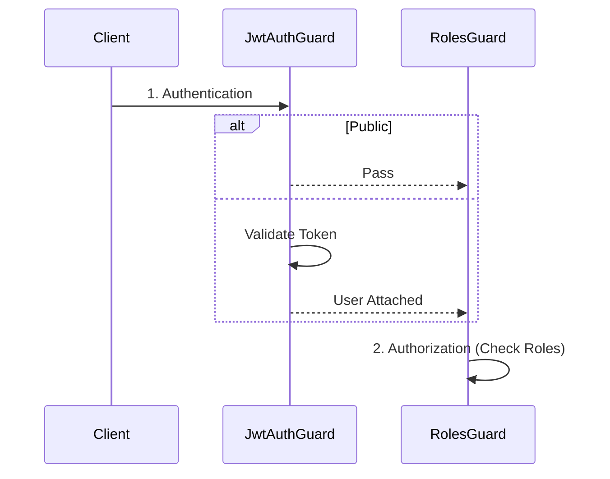

**理由**:
- フレームワークの仕組みに沿った正確な設計
- 各ガードの責務の明確化（認証と認可の分離）

#### クラス図における型表記

**問題**: クラス図などの設計書で `String` のような言語固有のクラス型とプリミティブ型 `string` が混在すると、実装時に混乱する。

**解決策**: TypeScript/JavaScriptのコンテキストでは、プリミティブ型には小文字の `string`, `number`, `boolean` を使用し、コードの実装と一致させる。

**理由**:
- 設計と実装の一貫性維持

### 13-12. RESTful API設計のベストプラクティス（PR #44）

**学習元**: PR #44 - 顧客管理機能の詳細設計書作成（Geminiレビュー指摘）

### 13-13. データベース接続プール設計の一貫性（PR #50）

**学習元**: PR #50 - データベース接続プール実装の詳細設計書作成（Geminiレビュー指摘）

#### レイヤ構成図の一貫性

**問題**: レイヤ構成図において、値オブジェクト（Value Object）がInfrastructure LayerとDomain Layerの両方に記載されていると、混乱を招く。

**解決策**: 
1. **値オブジェクトはDomain Layerに配置**: `ConnectionPoolConfig`のような値オブジェクトはDomain Layerにのみ記載する。
2. **Infrastructure LayerはDomain Layerに依存**: Infrastructure LayerはDomain Layerの値オブジェクトに依存する設計を明確にする。
3. **レイヤ間の依存関係を明確化**: 図で依存方向を明確に示す（Infrastructure → Domain）。

**理由**:
- Onion Architectureの原則に従う（外側のレイヤーが内側のレイヤーに依存）
- 設計書間の一貫性を保つ

#### 環境変数の完全性

**問題**: 設計書内で設定項目として定義されている項目に対応する環境変数が一覧から漏れている。

**解決策**:
1. **設定項目と環境変数の対応表を作成**: すべての設定項目に対応する環境変数を明記する。
2. **設計書間で一貫性を保つ**: README.md、input-output-design.mdなど、すべての設計書で同じ環境変数一覧を使用する。
3. **環境変数の命名規則を統一**: `DB_POOL_` のようなプレフィックスで統一する。

**理由**:
- 設計の完全性と一貫性を保つ
- 実装時の混乱を防ぐ

#### 状態遷移図の明確化

**問題**: 接続プール自体の状態遷移と、プール内の接続の状態遷移が混同されている。

**解決策**:
1. **プールのライフサイクルに焦点**: 接続プール自体の状態遷移（`Uninitialized`, `Initializing`, `Ready`, `ShuttingDown`, `Shutdown`）に焦点を当てる。
2. **接続のライフサイクルは別図で定義**: 接続自体のライフサイクル（`Creating`, `Active`, `Idle`, `Expired`）は別の図で明確に定義する。
3. **図の目的を明確化**: 各図の目的（プールの状態 vs 接続の状態）を明確にする。

**理由**:
- 図の意図を明確にする
- 設計の理解を容易にする

#### エラーハンドリングの一貫性

**問題**: エラー定義と実際のフローが矛盾している（例: `PoolExhaustedError`が定義されているが、実際のフローでは`ConnectionTimeoutError`が発生する）。

**解決策**:
1. **エラー定義とフローの整合性を確認**: 定義したエラーが実際のフローで発生するか確認する。
2. **不要なエラーは削除**: 実際には発生しないエラーは削除する。
3. **エラーの発生条件を明確化**: 各エラーがどのような状況で発生するかを明確に記載する。

**理由**:
- 設計と実装の一貫性を保つ
- 誤解を防ぐ

#### シーケンス図の同期/非同期の明確化

**問題**: シーケンス図において、バックグラウンド処理（定期的な監視プロセス）が同期的なフローに含まれているように見える。

**解決策**:
1. **同期処理と非同期処理を分離**: 同期的なフローと非同期のバックグラウンド処理を明確に分離する。
2. **監視プロセスは別フローで説明**: 定期的な監視プロセスは別のシーケンス図で説明する。
3. **注釈で非同期性を明示**: 必要に応じて注釈で非同期処理であることを明示する。

**理由**:
- フローの理解を正確にする
- 実装時の誤解を防ぐ

#### インターフェースと具象クラスのレイヤー分離

**問題**: Domain Layerのインターフェース（例: `IConnectionPool`）が返す型（例: `Connection`）の所属レイヤーが不明確で、Onion Architectureの原則に反している。

**解決策**:
1. **Domain Layerにインターフェースを定義**: 接続を表すインターフェース（例: `IConnection`）をDomain Layerで定義する。
2. **Infrastructure Layerに具象クラスを配置**: 具象クラス（例: `Connection`）をInfrastructure Layerに配置する。
3. **インターフェースはDomain Layerの型に依存**: Domain Layerのインターフェースは、Domain Layerの型（インターフェースや値オブジェクト）にのみ依存する。

**理由**:
- Onion Architectureの原則に従う（外側のレイヤーが内側のレイヤーに依存）
- レイヤー間の依存関係が明確になる
- テスト時のモック化が容易になる

#### 状態遷移図の明確化（接続のライフサイクル）

**問題**: 状態遷移図で、`Active --> Expired: maxLifetime`という遷移が、アクティブな接続が使用中に`maxLifetime`を超過して`Expired`状態に移行するように誤解される可能性がある。

**解決策**:
1. **遷移条件を明確化**: `maxLifetime`の超過は`releaseConnection`時に評価されることを明確にする。
2. **状態遷移図を修正**: `Active --> Idle: releaseConnection() [not expired]`と`Active --> Expired: releaseConnection() [maxLifetime exceeded]`のように遷移条件を明確化する。
3. **シーケンス図との整合性**: 状態遷移図とシーケンス図の挙動を一致させる。

**理由**:
- 設計の意図を明確にする
- ドキュメント間の整合性を保つ
- 実装時の誤解を防ぐ

#### 接続解放処理の軽量化

**問題**: 接続解放フローで、無効な接続を解放する際に`createConnection()`が同期的に呼び出されるように見え、アプリケーションスレッドに不要な待機時間が発生する可能性がある。

**解決策**:
1. **接続解放処理を軽量化**: `releaseConnection`の役割を、無効な接続を閉じてプールから削除することに限定する。
2. **接続の補充はバックグラウンド処理に**: 接続の補充は`ConnectionPoolMonitor`の`ensureMinConnections()`で非同期に実行する。
3. **シーケンス図から同期処理を削除**: `releaseConnection`フローから`createConnection()`のステップを削除し、監視プロセスに任せることを明記する。

**理由**:
- アプリケーションスレッドの待機時間を削減
- 処理の軽量化
- バックグラウンド処理との責務分離

#### 接続取得フローのエラーハンドリング

**問題**: 接続取得フローで、プールから取得したアイドル接続が`isValid()`チェックで`false`を返した場合の処理が抜けている。

**解決策**:
1. **無効な接続の処理を追加**: `isValid()`が`false`を返した場合、その無効な接続を破棄する。
2. **代替フローの実装**: 別のアイドル接続を探すか、可能であれば新しい接続を作成する。
3. **再帰的な取得処理**: 無効な接続を破棄した後、`getConnection()`を再帰的に呼び出して接続を取得する。

**理由**:
- プール内の唯一のアイドル接続が無効だった場合でも、接続を取得できる
- 堅牢なエラーハンドリング

#### 設計書間の一貫性確保

**問題**: 設計書間で記述が不整合（例: README.mdで同期処理を示唆、sequence-diagrams.mdで非同期処理を記載）。

**解決策**:
1. **すべての設計書で同じ設計を記載**: 同期処理と非同期処理を明確に区別し、すべての設計書で一貫した記述にする。
2. **シーケンス図を基準にする**: シーケンス図で定義されたフローを基準に、他の設計書を修正する。
3. **定期的な整合性チェック**: 設計書間の整合性を定期的に確認する。

**理由**:
- 設計の意図を明確にする
- 実装時の誤解を防ぐ

#### 接続オブジェクトの責務分離

**問題**: 接続オブジェクトに`isActive`プロパティがあると、接続プールとオブジェクトの間で状態の不整合が起きるリスクがある。

**解決策**:
1. **状態管理は接続プールに委ねる**: 接続が使用中（Active）か待機中（Idle）かという状態は、接続プール（`DatabaseConnectionPool`）が管理する。
2. **接続オブジェクトは有効性のみ管理**: 接続オブジェクトは`isValid()`メソッドで自身の有効性を示すのみ。
3. **`isActive`プロパティを削除**: 接続オブジェクトから`isActive`プロパティを削除する。

**理由**:
- 責務の明確化
- 状態の不整合を防ぐ
- 設計の明確化

#### 状態遷移図の明確化（接続プール）

**問題**: 接続プールの状態遷移図で、`Error`状態からの遷移が曖昧（`destroy()`と`immediate shutdown`の2つが定義されている）。

**解決策**:
1. **遷移を一本化**: `Error`状態からの遷移は`destroy()`をトリガーとする`ShuttingDown`への一本にまとめる。
2. **意図を明確化**: 必要に応じて注釈で意図を明確にする。

**理由**:
- 設計の意図を明確にする
- 実装時の誤解を防ぐ

#### 型名の一貫性

**問題**: 設計書間で型名が不整合（例: `Connection`と`IConnection`が混在）。

**解決策**:
1. **Domain Layerのインターフェースは`IConnection`**: Domain Layerのインターフェース（例: `IConnectionPool`）が返す型は、同じくDomain Layerに属する`IConnection`インターフェースを使用する。
2. **Infrastructure Layerの具象クラスは`Connection`**: Infrastructure Layerの具象クラスは`Connection`を使用する。
3. **すべての設計書で統一**: すべての設計書で同じ型名を使用する。

**理由**:
- Onion Architectureの原則に従う
- 設計の一貫性を保つ

#### 設計書間の整合性確保

**問題**: 詳細設計書（README.md、class-diagrams.md、sequence-diagrams.md、input-output-design.md）の間で不整合が発生していた。例えば、検索機能を統合した後も、README.mdに`SearchCustomersUseCase`が残っていたり、シーケンス図に`PUT`メソッドが残っていたりした。

**解決策**:
- 設計変更時は、すべての設計書ファイルを一貫して更新する
- 設計書レビュー時に、各ファイル間の整合性を確認するチェックリストを作成する
- 変更履歴を追跡し、影響範囲を明確にする

**理由**:
- 実装時の混乱を防ぐ
- 手戻りを防ぐ
- 設計書の信頼性向上

### 13-15. リポジトリパターンとパフォーマンス最適化（PR #45）

**学習元**: PR #45 - 顧客管理機能の実装（Geminiレビュー指摘）

#### メールアドレス重複チェックの最適化

**問題**: メールアドレスの重複チェックで全件取得してチェックしていた。顧客数が増えるとパフォーマンスの問題が発生する。

**解決策**:
- リポジトリインターフェースに`findByEmail`メソッドを追加
- リポジトリ実装でメールアドレスを直接検索するロジックを実装
- UseCaseで`findByEmail`を使用して重複チェックを行う

**理由**:
- パフォーマンスの向上（全件取得ではなく直接検索）
- 正確性の向上（大文字小文字を区別しない検索）
- スケーラビリティの向上

#### ドメインエンティティのバリデーションロジックの重複排除

**問題**: `create`メソッドと`update`メソッドで同じバリデーションロジックが重複していた。

**解決策**: バリデーションロジックをプライベート静的メソッドとして抽出し、`create`と`update`の両方で再利用する。

**例**:
```typescript
// ✅ 良い例: バリデーションロジックを抽出
private static validateName(name: string): void {
  if (!name || name.trim().length === 0) {
    throw new Error('Customer name cannot be empty');
  }
  if (name.length > 100) {
    throw new Error('Customer name must be 100 characters or less');
  }
}

public static create(...): Customer {
  Customer.validateName(name);
  // ...
}

public update(...): Customer {
  Customer.validateName(newName);
  // ...
}
```

**理由**:
- コードの重複を削減
- 保守性の向上（バリデーションロジックの変更が1箇所で済む）
- 一貫性の確保

### 13-16. データ整合性とエラーハンドリングの改善（PR #45 - 続き）

**学習元**: PR #45 - 顧客管理機能の実装（Geminiレビュー指摘）

#### 更新時の一意性チェック

**問題**: 顧客更新時にメールアドレスが変更される場合、他の顧客と重複していないかチェックしていなかった。データの整合性を保つために重要。

**解決策**: 更新時にメールアドレスが変更される場合、重複チェックを追加する。

**例**:
```typescript
// ✅ 良い例: 更新時のメールアドレス重複チェック
if (email && email !== existingCustomer.email) {
  const duplicateCustomer = await this.customerRepository.findByEmail(email);
  if (duplicateCustomer && duplicateCustomer.id !== id) {
    throw new ConflictException('Customer with this email already exists');
  }
}
```

**理由**:
- データの整合性を保つ
- 一意性制約の維持
- ユーザーエクスペリエンスの向上（適切なエラーメッセージ）

#### エラーハンドリングの標準化

**問題**: UseCaseで汎用的な`Error`をthrowしていた。NestJSの例外クラスを使用することで、適切なHTTPステータスコードが返される。

**解決策**: NestJSの例外クラス（`BadRequestException`など）を使用する。

**例**:
```typescript
// ❌ 悪い例: 汎用的なError
if (page < 1) {
  throw new Error('Page must be a positive number');
}

// ✅ 良い例: NestJSの例外クラス
if (page < 1) {
  throw new BadRequestException('Page must be a positive number');
}
```

**理由**:
- 適切なHTTPステータスコードが自動的に返される
- エラーレスポンスの一貫性
- フレームワークの標準に準拠

### 13-13. RESTful API設計のベストプラクティス（PR #44 - 続き）

**学習元**: PR #44 - 顧客管理機能の詳細設計書作成（Geminiレビュー指摘）

#### HTTPメソッドの適切な使用

**問題**: 部分更新の動作が定義されているのに`PUT`メソッドを使用している。RESTのセマンティクスでは、リソース全体を置換するのが`PUT`、部分的な変更を行うのが`PATCH`です。

**解決策**:
- 部分更新の場合は`PATCH`メソッドを使用する
- リソース全体の置換が必要な場合は`PUT`メソッドを使用し、仕様を明確化する

**理由**:
- APIの利用者に誤解を与えにくくなる
- RESTfulな設計原則に準拠

#### 検索エンドポイントの統合

**問題**: 検索のために専用の`/search`エンドポイントが定義されているが、より一般的なRESTfulな設計パターンとして、コレクションリソースのエンドポイントにクエリパラメータで検索機能を持たせる方法がある。

**解決策**:
- `GET /api/v1/customers/search`のような専用エンドポイントを作るのではなく、`GET /api/v1/customers?name=xxx&status=ACTIVE`のようにクエリパラメータで検索機能を提供する
- これにより、APIの口が一つにまとまり、よりシンプルで直感的なAPIになる

**理由**:
- RESTfulな設計原則に準拠
- APIの一貫性とシンプルさの向上

#### ルールファイルの重複回避

**問題**: `@start-task`コマンドに関する指示が複数のファイル（`02-code-standards.d/02-task-start.md`、`04-github-integration.d/04-start-task.md`、`05-jira-integration.md`）で重複している。関心事が混在し、メンテナンス性を損なう可能性がある。

**解決策**:
- 指示を`02-code-standards.d/02-task-start.md`のような単一のファイルに集約する
- 他のファイルからはそれを参照する、もしくは簡潔に言及する形にする

**理由**:
- メンテナンス性の向上（変更時の修正箇所が1つだけ）
- DRY原則の遵守
- 関心事の分離

### 13-11. 設定値のハードコーディング回避と命名規則（PR #36）

**学習元**: PR #36 - RBAC実装とRedisセッション管理（Geminiレビュー指摘）

#### 設定値の動的取得

**問題**: ユースケース層（`LoginUseCase`など）でトークンの有効期限などの設定値をハードコーディング（例: `const expiresIn = 1800;`）すると、環境変数や設定ファイルによる変更が反映されず、柔軟性が損なわれる。

**解決策**:
1. **サービス経由の取得**: 設定値を管理するサービス（`JwtService`など）にゲッターメソッドを追加し、そこから値を取得する。
2. **ConfigServiceの利用**: サービス自体も `ConfigService` を注入して環境変数から値を読み込むようにする。

```typescript
// Bad
const expiresIn = 1800;

// Good
const expiresIn = this.jwtService.getExpiresIn();
```

**理由**:
- 環境ごとの設定変更への対応
- 設定の一元管理

#### パラメータの命名規則

**問題**: メソッドの引数名に `pass` のような省略形を使用すると、可読性が低下し、意図が伝わりにくくなる。

**解決策**: `password` のように省略せずに記述する。

**理由**:
- コードの可読性と保守性の向上
- チーム開発における共通認識の維持

### 13-12. バックアップコードのライフサイクル管理と責務分離（PR #37）

**学習元**: PR #37 - MFA機能実装設計（Geminiレビュー指摘）

#### バックアップコードの提供タイミング

**問題**: MFAセットアップ時にバックアップコードを生成して返却すると、検証前にコードが漏洩するリスクがある。また、検証が完了しない場合に不要なコードが生成される。

**解決策**: バックアップコードは検証成功後にのみ生成・永続化し、その時点で一度だけ返却する。

```typescript
// Bad: セットアップ時にバックアップコードを生成
SetupMfaUseCase -> BackupCodeService.generateCodes()
SetupMfaUseCase -> return { qrCodeUrl, backupCodes, tempToken }

// Good: 検証成功後にバックアップコードを生成
VerifyMfaUseCase -> TotpService.verifyToken()
VerifyMfaUseCase -> BackupCodeService.generateCodes() // 検証成功後
VerifyMfaUseCase -> MfaRepository.saveBackupCodes()
VerifyMfaUseCase -> return { message, backupCodes }
```

**理由**:
- セキュリティ向上（検証前のコード漏洩防止）
- リソース効率（検証が完了しない場合の無駄な生成を防止）

#### バックアップコード管理APIの明確化

**問題**: バックアップコードの再生成機能が設計に含まれているが、API仕様が不明確。

**解決策**:
1. **バックアップコード一覧取得API**: 実際のコード値は返さず、使用済み/未使用の状態のみを返却する。
2. **バックアップコード再生成API**: パスワード確認を必須とし、既存コードを無効化してから新規コードを生成する。

**理由**:
- セキュリティ向上（コード値の再表示を防止）
- ユーザビリティ向上（状態確認と再生成の明確な分離）

#### ドメインモデルとインフラストラクチャ層の責務分離

**問題**: `BackupCodeService` がDomain層とInfrastructure層のどちらに属するか不明確。

**解決策**:
- **Domain層**: `BackupCode` Value Object（ビジネスロジック、バリデーション）
- **Infrastructure層**: `BackupCodeService`（技術的な詳細：生成アルゴリズム、ハッシュ化）

```typescript
// Domain Layer - Value Object (ビジネスロジックのみ)
class BackupCode {
  private constructor(private readonly code: string) {}
  static create(code: string): BackupCode { 
    // バリデーション: 形式チェック（例: /^[A-Z0-9]{4}-[A-Z0-9]{4}$/）
    if (!this.isValidFormat(code)) {
      throw new Error('Invalid backup code format');
    }
    return new BackupCode(code);
  }
  getValue(): string { return this.code; }
  equals(other: BackupCode): boolean { return this.code === other.code; }
  private static isValidFormat(code: string): boolean { /* validation logic */ }
}

// Infrastructure Layer - Service (技術的な詳細)
class BackupCodeService {
  // 技術的な実装: ランダム文字列生成アルゴリズム
  generateCodes(count: number): string[] { 
    // 外部ライブラリや技術的な詳細を含む
    return Array.from({ length: count }, () => this.generateRandomCode());
  }
  // 技術的な実装: bcryptハッシュ化
  hashCode(code: string): string { 
    return bcrypt.hashSync(code, 10);
  }
  // 技術的な実装: ハッシュ比較
  verifyCode(code: string, hash: string): boolean { 
    return bcrypt.compareSync(code, hash);
  }
}
```

**理由**:
- Onion Architectureの原則に従った明確な責務分離
- テスト容易性の向上（Domain層の独立性）
- 技術的な詳細の変更がDomain層に影響しない

#### ユースケースの役割の明確化

**問題**: 複数のユースケースが混在し、各ユースケースの責務が不明確になる。

**解決策**: 各ユースケースは単一の責務を持つように設計し、必要に応じて他のユースケースを呼び出す。

```typescript
// Bad: 1つのユースケースが複数の責務を持つ
class VerifyMfaUseCase {
  execute(userId, code, type) {
    // 検証処理
    // バックアップコード生成処理 ← 別の責務
    // 永続化処理
  }
}

// Good: 責務を分離
class VerifyMfaUseCase {
  constructor(
    private generateBackupCodesUseCase: GenerateBackupCodesUseCase
  ) {}
  
  execute(userId, code, type) {
    // 検証処理のみ
    if (this.verifyCode(code)) {
      // 必要に応じて他のユースケースを呼び出す
      if (type === 'SETUP') {
        return this.generateBackupCodesUseCase.execute(userId);
      }
    }
  }
}

class GenerateBackupCodesUseCase {
  execute(userId) {
    // バックアップコード生成・永続化のみ
  }
}
```

**理由**:
- 単一責任の原則（SRP）に従う
- テスト容易性の向上
- 再利用性の向上

### 13-13. TOTP仕様の明確化とデータベース設計の冗長性排除（PR #37）

**学習元**: PR #37 - MFA機能実装設計（Geminiレビュー指摘）

#### TOTPハッシュアルゴリズムの明確化

**問題**: TOTPのアルゴリズム仕様が簡潔すぎて、将来の拡張性や互換性について不明確。

**解決策**: RFC 6238の仕様を明確に記載し、デフォルトアルゴリズムと将来の拡張性について説明を追加する。

```markdown
### TOTP仕様

- **アルゴリズム**: HMAC-SHA1（RFC 6238準拠、デフォルト）
  - 注: RFC 6238ではHMAC-SHA256、HMAC-SHA512もサポートされているが、互換性のためHMAC-SHA1を使用
  - 将来的にアルゴリズムを変更する場合は、OTPAUTH URIの `algorithm` パラメータで指定可能
```

**理由**:
- 実装時の混乱を防止
- 将来の拡張性を考慮した設計の明確化

#### データベース設計の冗長性排除

**問題**: `backup_codes` テーブルに `used` (boolean) と `used_at` (timestamp) の両方があると、データの冗長性が発生し、整合性の問題が生じる可能性がある。

**解決策**: `used` フラグを削除し、`used_at` の有無で使用状態を判定する。

```sql
-- Bad: 冗長な設計
CREATE TABLE backup_codes (
  id UUID PRIMARY KEY,
  user_id UUID NOT NULL,
  code_hash VARCHAR(255) NOT NULL,
  used BOOLEAN NOT NULL DEFAULT false,  -- 冗長
  used_at TIMESTAMP NULL,               -- used_at があれば used = true
  created_at TIMESTAMP NOT NULL
);

-- Good: 冗長性を排除
CREATE TABLE backup_codes (
  id UUID PRIMARY KEY,
  user_id UUID NOT NULL,
  code_hash VARCHAR(255) NOT NULL,
  used_at TIMESTAMP NULL,  -- NULL = 未使用、値あり = 使用済み
  created_at TIMESTAMP NOT NULL
);
```

**理由**:
- データの整合性向上（単一の真実の源）
- ストレージの節約
- クエリの簡素化（`used_at IS NULL` で未使用を判定）

#### 設計書間の一貫性確保

**問題**: クラス図、シーケンス図、API仕様、データベーススキーマの間で不整合があると、実装時に混乱が生じる。

**解決策**: 
1. データベーススキーマ変更時は、関連する全ての設計書を同時に更新する
2. レビュー時に設計書間の整合性を確認する
3. 変更履歴を追跡しやすくするため、設計書を一括で更新する

**理由**:
- 実装時の混乱防止
- 設計の信頼性向上

### 13-14. セキュリティ強化とエラーハンドリングの改善（PR #38）

**学習元**: PR #38 - MFA E2Eテストの修正とバックアップコード検証ロジックの改善（Geminiレビュー指摘）

#### 暗号学的に安全な乱数生成

**問題**: バックアップコードのようなセキュリティ上重要な値の生成に `Math.random()` を使用すると、予測可能な値が生成されるリスクがある。

**解決策**: Node.jsの `crypto` モジュールの `randomInt()` を使用して、暗号学的に安全な乱数を生成する。

```typescript
// Bad: 予測可能な乱数生成
code += characters.charAt(Math.floor(Math.random() * characters.length));

// Good: 暗号学的に安全な乱数生成
import { randomInt } from 'crypto';
code += characters.charAt(randomInt(characters.length));
```

**理由**:
- セキュリティ強化（予測不可能な値の生成）
- 暗号学的に安全な乱数生成のベストプラクティスに準拠

#### タイミング攻撃対策

**問題**: バックアップコード検証時に、有効なコードが見つかるとすぐにループを終了すると、コードの位置によって応答時間が変わり、タイミング攻撃に対して脆弱になる。

**解決策**: `Promise.all` を使用して全ての未使用コードを並行して検証し、応答時間がコードの位置に依存しないようにする。

```typescript
// Bad: 順次検証でタイミング攻撃に脆弱
for (const record of allRecords) {
  if (record.usedAt !== null) continue;
  const isCodeValid = await this.backupCodeService.verify(code, record.codeHash);
  if (isCodeValid) {
    await this.mfaRepository.markBackupCodeAsUsed(userId, record.codeHash);
    break; // 早期終了でタイミング情報が漏洩
  }
}

// Good: 並行検証でタイミング攻撃を緩和
const verificationPromises = allRecords
  .filter((record) => record.usedAt === null)
  .map(async (record) => ({
    isMatch: await this.backupCodeService.verify(code, record.codeHash),
    hash: record.codeHash,
  }));

const verificationResults = await Promise.all(verificationPromises);
const validResult = verificationResults.find((result) => result.isMatch);
if (validResult) {
  await this.mfaRepository.markBackupCodeAsUsed(userId, validResult.hash);
}
```

**理由**:
- セキュリティ強化（タイミング攻撃の緩和）
- 応答時間の一貫性確保

#### NestJSの組み込み例外の使用

**問題**: 汎用的な `Error` クラスを使用すると、コントローラー層でエラーメッセージ文字列に依存した分岐が必要になり、コードの堅牢性と保守性が低下する。

**解決策**: NestJSの組み込み例外（`NotFoundException`, `ConflictException`, `UnauthorizedException`, `BadRequestException` など）を使用する。

```typescript
// Bad: 汎用的なErrorクラス
if (!user) {
  throw new Error('User not found');
}
if (user.mfaEnabled) {
  throw new Error('MFA is already enabled');
}

// Good: NestJSの組み込み例外
import { NotFoundException, ConflictException } from '@nestjs/common';
if (!user) {
  throw new NotFoundException('User not found');
}
if (user.mfaEnabled) {
  throw new ConflictException('MFA is already enabled');
}
```

**理由**:
- エラーハンドリングの一貫性向上
- HTTPステータスコードの自動設定
- コントローラー層でのエラーメッセージ文字列解析が不要

#### ユースケースの自己完結性

**問題**: ユースケースが `userId` を引数に取るが、そのユーザーが存在するかどうかの検証が行われていない場合、後続の処理で予期しないエラーが発生する可能性がある。

**解決策**: ユースケースは自己完結しているべきであり、入力の妥当性を検証する。`IUserRepository` を注入し、`execute` メソッドの冒頭でユーザーの存在確認を行う。

```typescript
// Bad: ユーザー存在確認なし
@Injectable()
export class GenerateBackupCodesUseCase {
  constructor(
    @Inject('IMfaRepository')
    private readonly mfaRepository: IMfaRepository,
  ) {}
  
  public async execute(userId: string): Promise<GenerateBackupCodesResult> {
    const codes = this.backupCodeService.generateCodes();
    // ユーザーが存在しない場合のエラーハンドリングがない
  }
}

// Good: ユーザー存在確認を追加
@Injectable()
export class GenerateBackupCodesUseCase {
  constructor(
    @Inject('IUserRepository')
    private readonly userRepository: IUserRepository,
    @Inject('IMfaRepository')
    private readonly mfaRepository: IMfaRepository,
  ) {}
  
  public async execute(userId: string): Promise<GenerateBackupCodesResult> {
    const user = await this.userRepository.findById(userId);
    if (!user) {
      throw new NotFoundException('User not found');
    }
    const codes = this.backupCodeService.generateCodes();
  }
}
```

**理由**:
- 早期エラー検出
- ユースケースの自己完結性向上
- デバッグの容易性向上

#### 依存性注入の一貫性

**問題**: モジュール内のプロバイダーで、依存性の注入方法に一貫性がない。一部のプロバイダーはクラス名で直接注入されているが、他の多くは文字列トークンを使用している。

**解決策**: クラスベースのDIに統一する。クラス名で直接提供されているプロバイダー（`TotpService`, `QrCodeService`, `BackupCodeService`, `GenerateBackupCodesUseCase` など）は、`@Inject()` デコレータを削除してクラス名で直接注入する。インターフェース（`IUserRepository`, `IMfaRepository` など）やファクトリで提供されるプロバイダー（`PasswordService`, `JwtService` など）は文字列トークンを使用する。

```typescript
// Bad: 文字列トークンとクラス名が混在
@Injectable()
export class SetupMfaUseCase {
  constructor(
    @Inject('IUserRepository')
    private readonly userRepository: IUserRepository,
    @Inject('TotpService')  // クラス名で提供されているのに文字列トークンを使用
    private readonly totpService: TotpService,
    @Inject('QrCodeService')  // クラス名で提供されているのに文字列トークンを使用
    private readonly qrCodeService: QrCodeService,
  ) {}
}

// Good: クラスベースのDIに統一
@Injectable()
export class SetupMfaUseCase {
  constructor(
    @Inject('IUserRepository')  // インターフェースは文字列トークン
    private readonly userRepository: IUserRepository,
    private readonly totpService: TotpService,  // クラス名で直接注入
    private readonly qrCodeService: QrCodeService,  // クラス名で直接注入
  ) {}
}
```

**理由**:
- 型安全性の向上
- コードの簡潔性向上
- 文字列トークンの重複定義の解消
- 保守性の向上

#### 未使用コードの削除

**問題**: 未使用のメソッドやインポートが残っていると、混乱を招き、保守の負担となる。

**解決策**: 未使用のコードは削除する。特に、インターフェースで定義されていないメソッドや、どこからも使用されていないメソッドは削除する。

```typescript
// Bad: 未使用のメソッドが残っている
export class MfaRepository implements IMfaRepository {
  public async findBackupCodeByHash(
    userId: string,
    codeHash: string,
  ): Promise<BackupCodeRecord | null> {
    // このメソッドはインターフェースで定義されておらず、使用されていない
  }
}

// Good: 未使用のメソッドを削除
export class MfaRepository implements IMfaRepository {
  // findBackupCodeByHashメソッドを削除
}
```

**理由**:
- コードの可読性向上
- 保守の負担軽減
- 混乱の防止

#### 冗長なコメントの削除

**問題**: 実装が完了しているにもかかわらず、TODOコメントや冗長なコメントが残っていると、混乱を招く。

**解決策**: 実装が完了している場合は、TODOコメントや冗長なコメントを削除する。

```typescript
// Bad: 実装済みなのにTODOコメントが残っている
} else {
  // ログイン検証成功時は、バックアップコードを使用済みとしてマーク（バックアップコードの場合）
  if (type === MfaVerificationType.BACKUP_CODE) {
    // TODO: 使用したバックアップコードを特定してマーク
    // 現在の実装では、どのハッシュが使用されたかを特定できない
  }
  return { success: true };
}

// Good: 実装済みの場合はコメントを削除
} else {
  // ログイン検証成功時
  // バックアップコードの場合は、上記の検証処理で既に使用済みとしてマークされている
  return { success: true };
}
```

**理由**:
- コードの可読性向上
- 混乱の防止
- 保守の負担軽減

### 13-14. Guardの適用タイミングとログイン時のIP検証（PR #39）

**学習元**: PR #39 - IP AllowList機能の詳細設計（Geminiレビュー指摘）

#### Guardは認証前に動作するため、ログインエンドポイントには適用できない

**問題**: Guardはコントローラーのメソッドが実行される「前」に動作するため、ログインエンドポイントに適用すると、ユーザー認証が完了しておらず`userId`を取得できません。そのため、Guard内でIP検証を行うことは困難です。

**解決策**: ログイン時のIP検証は`LoginUseCase`内で認証成功後に実行する。

```typescript
// Bad: Guardでログイン時のIP検証を試みる（認証前にuserIdが取得できない）
@Injectable()
export class IpAllowListGuard implements CanActivate {
  async canActivate(context: ExecutionContext): Promise<boolean> {
    const userId = request.user?.sub; // ログイン前は取得できない
    // ...
  }
}

// Good: LoginUseCase内で認証成功後にIP検証
@Injectable()
export class LoginUseCase {
  async execute(email: string, password: string, clientIp: string): Promise<LoginResult> {
    // パスワード認証
    const user = await this.userRepository.findByEmail(email);
    // ...
    
    // 認証成功後、IP検証
    const isAllowed = await this.verifyIpAllowListUseCase.execute(user.id, clientIp);
    if (!isAllowed) {
      throw new ForbiddenException('Access denied from this IP address');
    }
    
    // JWTトークン生成
    return { accessToken, ... };
  }
}
```

**理由**:
- Guardの実行タイミングと認証フローの整合性
- 実装時の誤解を防ぐ

#### グローバルガードとして登録する際の注意

**問題**: `IpAllowListGuard`をグローバルガード（`APP_GUARD`）として登録すると、認証前のパブリックなエンドポイント（ログイン画面など）へのアクセスもブロックしてしまいます。

**解決策**: IP検証が必要なエンドポイントにのみ適用するか、`LoginUseCase`内で処理する設計を採用する。

**理由**:
- パブリックエンドポイントへの影響を回避
- 設計の一貫性

#### Value ObjectとServiceの責務分担

**問題**: `IpAddress` Value Objectと`IpAddressService`の間で、責務の重複が見られる。`validate`や`isInRange`といったメソッドが両方のクラスに存在しており、どちらが主たる責務を負うのかが不明確。

**解決策**: Value Objectの関心事をクラス内にカプセル化するため、バリデーション、CIDRパース、範囲チェック（`isInRange`）などのロジックは`IpAddress` Value Objectに集約する。`IpAddressService`は、外部ライブラリとの連携など、よりインフラストラクチャ層に近い純粋な技術的処理に特化させる。

```typescript
// Good: Value Object内にバリデーションと範囲チェックをカプセル化
export class IpAddress {
  private readonly value: string;
  private readonly cidr?: number;

  constructor(value: string) {
    this.validate(value); // Value Object内でバリデーション
    this.value = value;
    this.parseCidr(value); // Value Object内でCIDRパース
  }

  public isInRange(ip: string): boolean {
    // Value Object内で範囲チェック
    // CIDR記法の場合、指定されたIPアドレスが範囲内かチェック
    // 単一IPアドレスの場合は完全一致をチェック
  }

  private validate(value: string): void {
    // IPv4/IPv6形式、CIDR記法の検証
  }
}

// Good: Serviceは外部ライブラリとの連携に特化
@Injectable()
export class IpAddressService {
  public createFromString(value: string): IpAddress {
    // 外部ライブラリ（ipaddr.js等）を使用して検証
    // IpAddress Value Objectのファクトリメソッドとして機能
    return new IpAddress(value);
  }
}
```

**理由**:
- ドメイン駆動設計の原則に沿った設計
- Value Objectの不変性と正当性を維持する責務の明確化
- 設計の一貫性

#### データベースインデックスの最適化

**問題**: `ip_address`カラムに対する個別のインデックス`idx_ip_allowlists_ip_address`は、冗長である可能性があります。`UNIQUE(user_id, ip_address)`制約により、`(user_id, ip_address)`の複合インデックスが既に作成されます。

**解決策**: IPアドレスの重複チェックや検索は、通常`user_id`とセットで行われるため、複合インデックスで効率的に処理できます。単独の`ip_address`インデックスは、全ユーザーを横断してIPアドレスを検索するような特殊なケースでなければ削除する。

**理由**:
- インデックスの冗長性を排除
- スキーマのシンプル化
- パフォーマンスへの影響を最小化

#### APIレスポンス形式の簡素化

**問題**: 一覧取得APIのレスポンス形式について、`ipAllowLists`というキーでラップされていますが、ページネーションのメタデータを含まない場合、よりシンプルな形式も検討の余地がある。

**解決策**: ページネーション（`limit`, `offset`など）のメタデータを含まない場合、クライアント側での扱いを容易にするため、レスポンスボディのルートを直接配列 `[...]` にする。将来的にページネーションを導入する計画がある場合は、オブジェクト形式を維持する。

**理由**:
- クライアント側での扱いの容易さ
- レスポンス形式の簡素化

### 13-15. データベースインデックスの冗長性排除とRESTful API設計（PR #39）

**学習元**: PR #39 - IP AllowList機能の詳細設計（Geminiレビュー指摘）

#### データベースインデックスの冗長性排除

**問題**: `UNIQUE(user_id, ip_address)`制約により、`(user_id, ip_address)`の複合インデックスが既に作成されます。多くのデータベース（PostgreSQLやMySQLなど）では、複合インデックスの先頭カラム（この場合は`user_id`）に対するクエリでも、その複合インデックスが効率的に利用されます。

**解決策**: `user_id`カラムの個別インデックスは冗長であり、削除してもパフォーマンスに影響はありません。

```sql
-- Bad: 冗長なインデックス
CREATE TABLE ip_allowlists (
  user_id UUID NOT NULL,
  ip_address VARCHAR(45) NOT NULL,
  UNIQUE(user_id, ip_address)
);
CREATE INDEX idx_ip_allowlists_user_id ON ip_allowlists(user_id); -- 冗長

-- Good: 複合インデックスのみ
CREATE TABLE ip_allowlists (
  user_id UUID NOT NULL,
  ip_address VARCHAR(45) NOT NULL,
  UNIQUE(user_id, ip_address) -- これにより複合インデックスが作成される
);
```

**理由**:
- ストレージ使用量の削減
- 書き込み（INSERT/UPDATE/DELETE）時のインデックス更新コストの削減
- スキーマの簡素化

#### RESTful API設計: DELETE操作のレスポンス

**問題**: `DELETE`操作の成功時にステータスコード`200 OK`とメッセージを含むJSONボディを返却しているが、クライアントに返すべきコンテンツがない場合、よりRESTfulな設計が推奨される。

**解決策**: `DELETE`操作が成功し、クライアントに返すべきコンテンツがない場合、ステータスコード`204 No Content`と空のボディを返す。

```typescript
// Bad: 200 OK with message
@Delete(':id')
async remove(@Param('id') id: string) {
  await this.removeIpAllowListUseCase.execute(userId, id);
  return { message: 'IP address removed from allowlist successfully' };
}

// Good: 204 No Content
@Delete(':id')
@HttpCode(HttpStatus.NO_CONTENT)
async remove(@Param('id') id: string) {
  await this.removeIpAllowListUseCase.execute(userId, id);
  // 空のボディを返す（何も返さない）
}
```

**理由**:
- クライアントはレスポンスボディをパースする必要がなくなり、処理がシンプルになる
- APIの意図がより明確になる（「削除が成功し、返すコンテンツはない」）
- RESTのベストプラクティスに準拠

#### シーケンス図における責務分担の明確化

**問題**: シーケンス図で`VerifyIpAllowListUseCase`が`IpAddressService`の`isInRange`メソッドを呼び出すように描かれているが、設計方針では`isInRange`のようなドメインロジックは`IpAddress` Value Object内にカプセル化する方針が示されている。

**解決策**: `VerifyIpAllowListUseCase`は、取得した各`IpAddress` Value Objectの`isInRange(clientIp)`メソッドを直接呼び出して検証を行う。

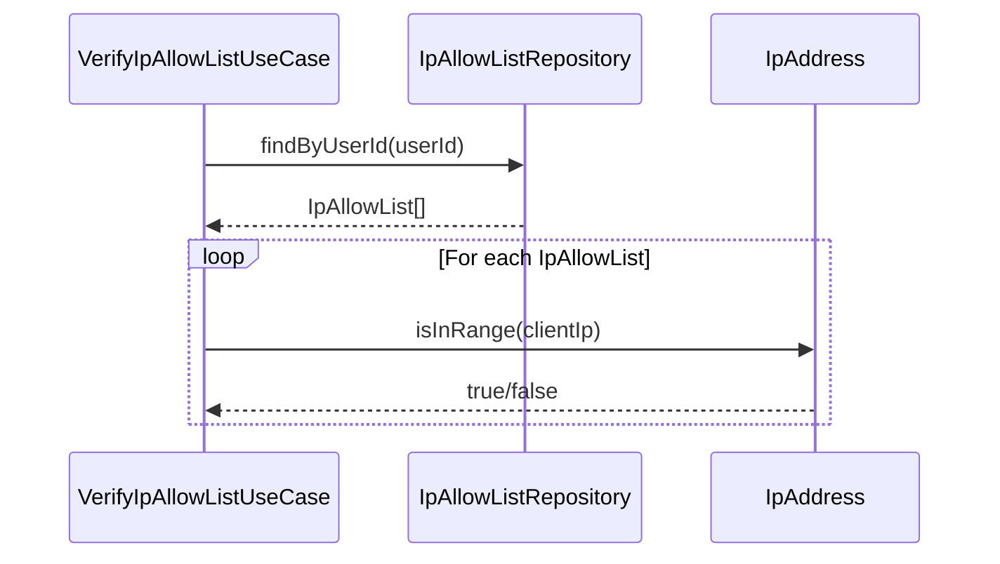

**理由**:
- ドメインロジックがValue Objectに集約される
- `IpAddressService`はVOの生成（ファクトリ）や外部ライブラリとの連携といったインフラ層の責務に特化
- 設計の一貫性を保つ

### 13-16. パスワードポリシー設計におけるValue ObjectとServiceの責務分担（PR #40）

**学習元**: PR #40 - パスワードポリシー機能の詳細設計（Geminiレビュー指摘）

#### Value ObjectとServiceの責務分担

**問題**: `PasswordPolicy` Value Objectと`PasswordPolicyService`の間で、責務の重複が見られる。`validateComplexity`や`checkComplexity`といったメソッドが両方のクラスに存在しており、どちらが主たる責務を負うのかが不明確。

**解決策**: Value Objectの関心事をクラス内にカプセル化するため、バリデーション、複雑さチェック（`validate`、`checkComplexity`）などのロジックは`PasswordPolicy` Value Objectに集約する。`PasswordPolicyService`は、Value Objectの生成（ファクトリメソッド）やパスワード強度スコア計算など、よりインフラストラクチャ層に近い純粋な技術的処理に特化させる。

```typescript
// Good: Value Object内にバリデーションと複雑さチェックをカプセル化
export class PasswordPolicy {
  private readonly minLength: number;
  private readonly maxLength: number;
  private readonly requireUppercase: boolean;
  private readonly requireLowercase: boolean;
  private readonly requireNumbers: boolean;
  private readonly requireSymbols: boolean;
  private readonly historyCount: number;

  constructor(
    minLength: number,
    maxLength: number,
    requireUppercase: boolean,
    requireLowercase: boolean,
    requireNumbers: boolean,
    requireSymbols: boolean,
    historyCount: number,
  ) {
    this.minLength = minLength;
    this.maxLength = maxLength;
    this.requireUppercase = requireUppercase;
    this.requireLowercase = requireLowercase;
    this.requireNumbers = requireNumbers;
    this.requireSymbols = requireSymbols;
    this.historyCount = historyCount;
  }

  public validate(password: string): ComplexityResult {
    // Value Object内でバリデーションと複雑さチェック
    const errors: string[] = [];
    
    if (password.length < this.minLength) {
      errors.push(`Password must be at least ${this.minLength} characters long`);
    }
    if (password.length > this.maxLength) {
      errors.push(`Password must be at most ${this.maxLength} characters long`);
    }
    if (this.requireUppercase && !/[A-Z]/.test(password)) {
      errors.push('Password must contain at least one uppercase letter');
    }
    if (this.requireLowercase && !/[a-z]/.test(password)) {
      errors.push('Password must contain at least one lowercase letter');
    }
    if (this.requireNumbers && !/[0-9]/.test(password)) {
      errors.push('Password must contain at least one number');
    }
    if (this.requireSymbols && !/[!@#$%^&*()_+\-=\[\]{}|;:,.<>?]/.test(password)) {
      errors.push('Password must contain at least one symbol');
    }
    
    return {
      isValid: errors.length === 0,
      errors,
    };
  }
}

// Good: ServiceはValue Objectの生成（ファクトリ）や技術的な処理に特化
@Injectable()
export class PasswordPolicyService {
  public createPasswordPolicy(): PasswordPolicy {
    // 設定値からPasswordPolicy Value Objectを生成
    return new PasswordPolicy(
      parseInt(process.env.PASSWORD_MIN_LENGTH || '8', 10),
      parseInt(process.env.PASSWORD_MAX_LENGTH || '128', 10),
      process.env.PASSWORD_REQUIRE_UPPERCASE !== 'false',
      process.env.PASSWORD_REQUIRE_LOWERCASE !== 'false',
      process.env.PASSWORD_REQUIRE_NUMBERS !== 'false',
      process.env.PASSWORD_REQUIRE_SYMBOLS !== 'false',
      parseInt(process.env.PASSWORD_HISTORY_COUNT || '5', 10),
    );
  }

  public calculateStrengthScore(password: string): number {
    // 技術的なアルゴリズムによる強度スコア計算
    // 長さ、文字種の多様性、一般的なパターンの回避などを考慮
    let score = 0;
    // ... スコア計算ロジック
    return Math.min(100, score);
  }
}
```

**理由**:
- ドメイン駆動設計の原則に沿った設計
- Value Objectの不変性と正当性を維持する責務の明確化
- 設計の一貫性（IP AllowList設計と同様の原則）

#### パスワード履歴管理の責務分担

**問題**: パスワード履歴のチェックが`PasswordPolicyService`に含まれているが、これはRepositoryの責務であるべき。

**解決策**: パスワード履歴の保存・取得・検証は`PasswordHistoryRepository`の責務とする。`PasswordPolicyService`は技術的な処理（強度スコア計算など）に特化する。

```typescript
// Good: Repositoryが履歴管理を担当
@Injectable()
export class PasswordHistoryRepository implements IPasswordHistoryRepository {
  public async checkPasswordInHistory(
    userId: string,
    passwordHash: string,
    count: number,
  ): Promise<boolean> {
    const history = await this.getPasswordHistory(userId, count);
    return history.some((hash) => hash === passwordHash);
  }

  public async deleteOldHistory(userId: string, keepCount: number): Promise<void> {
    // 最新N個を保持し、古い履歴を削除
    // ...
  }
}
```

**理由**:
- 責務の明確化（Repositoryはデータアクセス、Serviceは技術的処理）
- 設計の一貫性

### 13-17. 設計ドキュメントの一貫性確保（PR #40）

**学習元**: PR #40 - パスワードポリシー機能の詳細設計（Geminiレビュー指摘）

#### Value Objectのメソッドの冗長性排除

**問題**: `PasswordPolicy` Value Objectに`validate`と`checkComplexity`の両方が存在し、責務が重複している。

**解決策**: Value Objectのメソッドは一貫性を保つため、`validate`メソッドのみに統一する。`checkComplexity`は削除する。

```typescript
// Bad: 冗長なメソッド
export class PasswordPolicy {
  public validate(password: string): ValidationResult { ... }
  public checkComplexity(password: string): ValidationResult { ... } // 冗長
}

// Good: validateメソッドのみ
export class PasswordPolicy {
  public validate(password: string): ValidationResult { ... }
}
```

**理由**:
- メソッドの一貫性
- 責務の明確化

#### Value Objectの戻り値型の明確化

**問題**: `ComplexityResult`に`strengthScore`が含まれているが、これはValue ObjectではなくServiceが計算する技術的な値である。

**解決策**: Value Objectの戻り値型は`ValidationResult`（`isValid`と`errors`のみ）とし、`strengthScore`はServiceが計算して別途返す。

```typescript
// Bad: Value Objectが技術的な値を含む
export class ValidationResult {
  isValid: boolean;
  errors: string[];
  strengthScore: number; // Serviceが計算する技術的な値
}

// Good: Value Objectはドメインロジックのみ
export class ValidationResult {
  isValid: boolean;
  errors: string[];
}

// Serviceが強度スコアを計算
@Injectable()
export class PasswordPolicyService {
  public calculateStrengthScore(password: string): number {
    // 技術的なアルゴリズム
  }
}
```

**理由**:
- Value Objectの責務の明確化（ドメインロジックのみ）
- Serviceの責務の明確化（技術的な処理）

#### テスト戦略における責務の正確な記述

**問題**: テスト戦略で「PasswordPolicyService: パスワード複雑さチェック」と記述されているが、これはValue Objectの責務である。

**解決策**: テスト戦略では各コンポーネントの実際の責務を正確に記述する。

```markdown
### ユニットテスト

- **PasswordPolicy Value Object**: ポリシー設定のバリデーション、不変性、パスワードの複雑さチェック
- **PasswordPolicyService**: Value Objectの生成（ファクトリ）、パスワード強度スコア計算
```

**理由**:
- テスト戦略の正確性
- 実装者の混乱を防ぐ

#### シーケンス図における参加者の明確化

**問題**: シーケンス図で`PasswordPolicy`や`PasswordService`が欠けており、データフローが不明確。

**解決策**: シーケンス図には、実際に呼び出されるすべての参加者を含める。

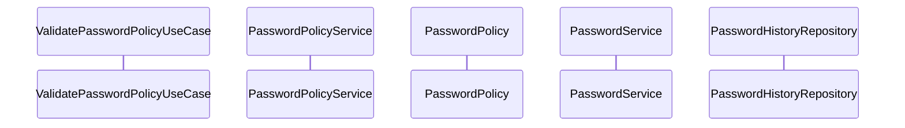

**理由**:
- データフローの明確化
- 設計ドキュメント間の一貫性

#### APIレスポンス形式の一貫性確保

**問題**: パスワード強度チェックAPIのレスポンス形式において、検証失敗時と成功時でレスポンス構造が異なる可能性がある。

**解決策**: APIレスポンス形式は一貫性を保つため、常に同じ構造を返す。検証失敗時でも`isReused`フィールドを含める（`false`を返す）。

```json
// Good: 一貫したレスポンス構造
{
  "isValid": false,
  "errors": [...],
  "strengthScore": 45,
  "isReused": false  // 検証失敗時も含める
}
```

**理由**:
- APIレスポンス形式の一貫性
- クライアント側での処理の簡素化

#### データフロー記述の完全性

**問題**: データフローの記述において、パスワード履歴チェックなどの重要なステップが省略されている。

**解決策**: データフローには、シーケンス図で示されているすべてのステップを含める。

```markdown
### パスワード強度チェックフロー

1. クライアントが `POST /api/v1/auth/password/validate` を呼び出し
2. `PasswordController` がリクエストを受信
3. `ValidatePasswordPolicyUseCase` が実行される
4. パスワードの複雑さチェック（PasswordPolicy Value Object経由）
5. パスワード強度スコアを計算（PasswordPolicyService経由）
6. パスワードをハッシュ化（PasswordService経由）
7. パスワード履歴をチェック（PasswordHistoryRepository経由）
8. 検証結果、強度スコア、再利用フラグを返却
```

**理由**:
- データフロー記述の完全性
- 実装者の理解を助ける

### 13-18. ダッシュボード設計における責務の明確化と依存性逆転の原則（PR #41）

**学習元**: PR #41 - ダッシュボード機能の詳細設計（Geminiレビュー指摘）

#### データ集計ロジックの責務分担

**問題**: データ集計ロジックの所在が、ユースケースとリポジトリの間で曖昧になっている。`DashboardRepository`が集計ロジックを持つのか、`GetDashboardDataUseCase`が持つのかが不明確。

**解決策**: データ集計ロジックはApplication層のUse Caseが担当する。Repositoryはデータの取得のみを担当し、集計は行わない。

```typescript
// Bad: Repositoryが集計ロジックを持つ
@Injectable()
export class DashboardRepository implements IDashboardRepository {
  public async getDashboardData(userId: string): Promise<DashboardData> {
    // 集計ロジックがRepositoryにある（責務が曖昧）
    const user = await this.userRepository.findById(userId);
    const mfaSecret = await this.mfaRepository.getSecret(userId);
    // ...
    return DashboardData.create(...);
  }
}

// Good: Use Caseが集計ロジックを持つ
@Injectable()
export class GetDashboardDataUseCase {
  constructor(
    @Inject('IUserRepository')
    private readonly userRepository: IUserRepository,
    @Inject('IMfaRepository')
    private readonly mfaRepository: IMfaRepository,
    @Inject('IIpAllowListRepository')
    private readonly ipAllowListRepository: IIpAllowListRepository,
  ) {}

  public async execute(userId: string): Promise<DashboardData> {
    // 並列実行で高速化
    const [user, mfaSecret, ipAllowListCount] = await Promise.all([
      this.userRepository.findById(userId),
      this.mfaRepository.getSecret(userId),
      this.ipAllowListRepository.countByUserId(userId),
    ]);

    if (!user) {
      throw new NotFoundException('User not found');
    }

    // 集計ロジックはUse Case内で実行
    return this.aggregateData(user, mfaSecret, ipAllowListCount);
  }

  private aggregateData(
    user: User,
    mfaSecret: string | null,
    ipAllowListCount: number,
  ): DashboardData {
    return DashboardData.create(
      user.id,
      user.email,
      user.role,
      user.mfaEnabled,
      ipAllowListCount,
      user.createdAt,
      null, // lastLoginAt（将来実装）
      null, // loginAttemptCount（将来実装）
    );
  }
}
```

**理由**:
- 責務の明確化（Repositoryはデータ取得、Use Caseはビジネスロジック）
- Onion Architectureの原則に沿った設計

#### 依存性逆転の原則（DIP）の遵守

**問題**: クラス図において、アプリケーション層がインフラストラクチャ層の具象クラス（`DashboardRepository`）に依存しており、依存性逆転の原則に反している。

**解決策**: Application層はDomain層のインターフェース（`IUserRepository`、`IMfaRepository`、`IIpAllowListRepository`）に依存する。具象クラスには依存しない。

```typescript
// Bad: 具象クラスに依存
@Injectable()
export class GetDashboardDataUseCase {
  constructor(
    private readonly dashboardRepository: DashboardRepository, // 具象クラス
  ) {}
}

// Good: インターフェースに依存
@Injectable()
export class GetDashboardDataUseCase {
  constructor(
    @Inject('IUserRepository')
    private readonly userRepository: IUserRepository, // インターフェース
    @Inject('IMfaRepository')
    private readonly mfaRepository: IMfaRepository, // インターフェース
    @Inject('IIpAllowListRepository')
    private readonly ipAllowListRepository: IIpAllowListRepository, // インターフェース
  ) {}
}
```

**理由**:
- 依存性逆転の原則（DIP）の遵守
- テスタビリティの向上
- 実装の交換可能性

#### ドキュメント間の一貫性確保

**問題**: シーケンス図とクラス図で、`DashboardRepository`の扱いが異なっており、設計の意図が不明確になっている。

**解決策**: すべての設計ドキュメントで一貫した設計を反映する。`DashboardRepository`は将来の統計情報永続化のために予約されているが、初期実装では使用しないことを明記する。

```markdown
**注意**: 初期実装では、`GetDashboardDataUseCase`が既存のRepository（`IUserRepository`、`IMfaRepository`、`IIpAllowListRepository`）を直接使用してデータを集計します。`DashboardRepository`は将来の統計情報永続化のために予約されていますが、初期実装では使用しません。
```

**理由**:
- 設計ドキュメント間の一貫性
- 実装者の混乱を防ぐ
- 将来の拡張性を明確化

#### レイヤー構成図における依存関係の明確化

**問題**: README.mdのレイヤー構成図において、初期実装で使用しない`IDashboardRepository`や`DashboardRepository`が含まれており、依存関係が不明確。

**解決策**: レイヤー構成図には、初期実装で実際に使用するコンポーネントのみを含める。将来実装のコンポーネントは別途説明する。

```markdown
### レイヤ構成

```
┌─────────────────────────────────────┐
│  Presentation Layer                 │
│  - DashboardController (New)       │
│  - DTOs (DashboardDto, etc.)       │
└──────────────┬──────────────────────┘
               │ 依存
┌──────────────▼──────────────────────┐
│  Application Layer                  │
│  - GetDashboardDataUseCase (New)   │
└──────────────┬──────────────────────┘
               │ 依存
┌──────────────▼──────────────────────┐
│  Domain Layer                       │
│  - DashboardData Value Object (New)│
│  - IUserRepository (Existing)      │
│  - IMfaRepository (Existing)        │
│  - IIpAllowListRepository (Future)  │
└──────────────┬──────────────────────┘
               │ 依存
┌──────────────▼──────────────────────┐
│  Infrastructure Layer               │
│  - UserRepository (Existing)       │
│  - MfaRepository (Existing)        │
│  - IpAllowListRepository (Future)  │
└─────────────────────────────────────┘
```

**注意**: 初期実装では、`GetDashboardDataUseCase`が既存のRepositoryインターフェースを直接使用します。`IDashboardRepository`と`DashboardRepository`は将来の統計情報永続化のために予約されていますが、初期実装では使用しません。
```

**理由**:
- レイヤー構成図の明確化
- 初期実装のスコープの明確化
- 実装者の混乱を防ぐ

#### 将来実装フィールドの明確化

**問題**: `lastLoginAt`や`loginAttemptCount`などのフィールドが、Value ObjectやDTOに含まれているが、初期実装のスコープに含まれるかどうかの記述が揺れている。

**解決策**: 初期実装で含まれるフィールドと将来実装で追加されるフィールドを明確に分けて記述する。初期実装では、将来実装のフィールドは`null`を返すことを明記する。

```markdown
#### 初期実装で含まれるフィールド

- `userId`: ユーザーID
- `email`: メールアドレス
- `role`: ユーザーロール
- `mfaEnabled`: MFA有効化状態
- `ipAllowListCount`: IP AllowList数（初期実装では0を返す）
- `accountCreatedAt`: アカウント作成日時

#### 将来実装で追加されるフィールド

- `lastLoginAt`: 最終ログイン日時（初期実装では`null`を返す）
- `loginAttemptCount`: ログイン試行回数（初期実装では`null`を返す）
```

**理由**:
- 初期実装のスコープの明確化
- 実装者の混乱を防ぐ
- 将来の拡張性を明確化

### 13-19. ダッシュボード設計におけるデータ取得の最適化とスタブ実装の明確化（PR #41）

**学習元**: PR #41 - ダッシュボード機能の詳細設計（Geminiレビュー指摘）

#### MFA状態取得の最適化

**問題**: MFA有効状態の取得ロジックについて、`IMfaRepository.getSecret(userId)`を呼び出す現在の設計は冗長である可能性がある。`User`エンティティに既に`mfaEnabled`プロパティが存在するため、別途Repositoryを呼び出す必要はない。

**解決策**: MFA状態は`User`エンティティの`mfaEnabled`プロパティから直接取得する。`IMfaRepository`を呼び出す必要はない。

```typescript
// Bad: 冗長なRepository呼び出し
@Injectable()
export class GetDashboardDataUseCase {
  constructor(
    @Inject('IUserRepository')
    private readonly userRepository: IUserRepository,
    @Inject('IMfaRepository')
    private readonly mfaRepository: IMfaRepository, // 不要
  ) {}

  public async execute(userId: string): Promise<DashboardData> {
    const [user, mfaSecret] = await Promise.all([
      this.userRepository.findById(userId),
      this.mfaRepository.getSecret(userId), // 冗長
    ]);
    
    // mfaSecretがnullでないかチェックしてmfaEnabledを判定
    const mfaEnabled = mfaSecret !== null;
    // ...
  }
}

// Good: Userエンティティのプロパティを直接使用
@Injectable()
export class GetDashboardDataUseCase {
  constructor(
    @Inject('IUserRepository')
    private readonly userRepository: IUserRepository,
    @Inject('IIpAllowListRepository')
    private readonly ipAllowListRepository: IIpAllowListRepository,
  ) {}

  public async execute(userId: string): Promise<DashboardData> {
    const [user, ipAllowListCount] = await Promise.all([
      this.userRepository.findById(userId),
      this.ipAllowListRepository.countByUserId(userId),
    ]);

    if (!user) {
      throw new NotFoundException('User not found');
    }

    // UserエンティティのmfaEnabledプロパティを直接使用
    return this.aggregateData(user, ipAllowListCount);
  }

  private aggregateData(user: User, ipAllowListCount: number): DashboardData {
    return DashboardData.create(
      user.id,
      user.email,
      user.role,
      user.mfaEnabled, // Userエンティティから直接取得
      ipAllowListCount,
      user.createdAt,
      null, // lastLoginAt（将来実装）
      null, // loginAttemptCount（将来実装）
    );
  }
}
```

**理由**:
- 冗長なRepository呼び出しの排除
- パフォーマンスの向上（並列実行のオーバーヘッド削減）
- 設計の簡素化

#### スタブ実装の明確化

**問題**: `IIpAllowListRepository`の初期実装における扱いについて、`(Future)`という表記が混乱を招く可能性がある。初期実装で使用する場合は、スタブ実装であることを明確にする必要がある。

**解決策**: 初期実装で使用するが、実際の機能が未実装の場合は、スタブ実装として明確に記述する。

```typescript
// Good: スタブ実装として明確に記述
@Injectable()
export class IpAllowListRepository implements IIpAllowListRepository {
  /**
   * IP AllowList数を取得する（スタブ実装）
   * 初期実装では常に0を返す
   * TODO: IP AllowList機能実装後に実際のカウントを返す
   */
  public async countByUserId(userId: string): Promise<number> {
    // スタブ実装: 初期実装では常に0を返す
    return 0;
  }
}
```

設計ドキュメントでは以下のように記述：

```markdown
- **IpAllowListRepository (Stub)**: IP AllowList数の取得（初期実装ではスタブ実装で0を返す）
```

**理由**:
- 初期実装のスコープの明確化
- 実装者の混乱を防ぐ
- スタブ実装であることの明示

---

### PR #42 レビューからの学習

#### テストコードでの型安全性の向上

**問題**: テストコードで`as any`を使用すると型安全性が損なわれる。Jestのモックオブジェクトを作成する際に、適切な型付けを行うべき。

**解決策**: `as jest.Mocked<T>`を使用して型安全性を保つ。

```typescript
// Bad: 型安全性が損なわれる
mockUserRepository = {
  findByEmail: jest.fn(),
  findById: jest.fn(),
  save: jest.fn(),
} as any;

// Good: 適切な型付け
mockUserRepository = {
  findByEmail: jest.fn(),
  findById: jest.fn(),
  save: jest.fn(),
} as jest.Mocked<IUserRepository>;
```

**理由**:
- 型安全性の向上
- IDEの補完機能が正しく動作する
- コンパイル時のエラー検出が可能

#### 実行時間に依存するテストの安定性

**問題**: 実行時間に依存するテストは、実行環境（特にCI環境）によって失敗する可能性があり、不安定（flaky）になりがち。マージンが小さすぎると、環境の変動で失敗する可能性がある。

**解決策**: 実行時間のテストでは、十分なマージンを設定する。

```typescript
// Bad: マージンが小さすぎる（CI環境で失敗する可能性）
expect(duration).toBeLessThan(20);

// Good: 十分なマージンを設定
expect(duration).toBeLessThan(50);
```

**理由**:
- CI環境などでの実行時間の変動に対応
- テストの安定性向上
- フレーキーテストの防止

#### 不要なインポートの削除

**問題**: 使用されていないインポートが残っていると、コードの可読性が低下し、依存関係が不明確になる。

**解決策**: 使用されていないインポートは削除する。

```typescript
// Bad: 使用されていないインポート
import { UserRole } from '../../domain/entities/user-role.enum';

export class DashboardDto {
  public readonly role: string; // UserRoleではなくstringを使用
  // ...
}

// Good: 不要なインポートを削除
export class DashboardDto {
  public readonly role: string;
  // ...
}
```

**理由**:
- コードの可読性向上
- 依存関係の明確化
- バンドルサイズの削減（ビルドツールによる最適化が効く場合）

### 13-19. E2Eテスト間でのRedis状態管理（PR #42）

**学習元**: PR #42 - Dashboard実装とテストスクリプト改善（E2Eテストの修正）

#### E2Eテスト間でのRedis状態の分離

**問題**: 複数のE2Eテストスイートが同じRedisインスタンスを使用する場合、テスト間で状態（特にトークンブラックリスト）が共有され、予期しない動作を引き起こす可能性がある。例えば、`auth.e2e-spec.ts`のログアウトテストでブラックリストに登録されたトークンが、`mfa.e2e-spec.ts`のテストに影響を与える。

**解決策**: 各テストスイートの`beforeAll`でRedisの状態をクリア（`flushdb`）して、テスト間の状態を分離する。

```typescript
// Bad: テスト間でRedisの状態が共有される
beforeAll(async () => {
  // Redis接続を待つ
  const testClient = new Redis({
    host: redisHost,
    port: redisPort,
    connectTimeout: 1000,
    lazyConnect: true,
  });
  await testClient.connect();
  await testClient.ping();
  await testClient.quit();
  // ブラックリストが残っている可能性がある
});

// Good: テスト開始時にRedisの状態をクリア
beforeAll(async () => {
  // Redis接続を待つ
  const testClient = new Redis({
    host: redisHost,
    port: redisPort,
    connectTimeout: 1000,
    lazyConnect: true,
  });
  await testClient.connect();
  await testClient.ping();
  // テスト間でRedisの状態が共有されないように、ブラックリストをクリア
  await testClient.flushdb();
  await testClient.quit();
});
```

**理由**:
- テスト間の独立性の確保
- 予期しないテスト失敗の防止
- テストの再現性向上
- CI環境での安定性向上

#### E2Eテストでのトークン管理

**問題**: E2Eテストで、前のテストで使用したトークンがブラックリストに登録されている可能性があるため、同じトークンを再利用すると401エラーが発生する。

**解決策**: 各テストで必要なトークンをその場で取得し、テスト間でのトークンの共有を避ける。また、テスト開始時にRedisの状態をクリアすることで、ブラックリストの影響を排除する。

```typescript
// Bad: 前のテストで取得したトークンを再利用
it('正常系: MFAセットアップ検証に成功する', async () => {
  // 前のテストで取得したトークンを使用（ブラックリストに登録されている可能性がある）
  const setupResponse = await request(app.getHttpServer())
    .post('/api/v1/auth/mfa/setup')
    .set('Authorization', `Bearer ${accessToken}`) // 前のテストのトークン
    .expect(200);
});

// Good: 各テストで新しいトークンを取得
it('正常系: MFAセットアップ検証に成功する', async () => {
  // 新しいトークンを取得
  const loginResponse = await request(app.getHttpServer())
    .post('/api/v1/auth/login')
    .send({
      email: 'user@example.com',
      password: 'password123',
    })
    .expect(200);

  const freshToken = loginResponse.body.accessToken;

  // 新しいトークンを使用
  const setupResponse = await request(app.getHttpServer())
    .post('/api/v1/auth/mfa/setup')
    .set('Authorization', `Bearer ${freshToken}`)
    .expect(200);
});
```

**理由**:
- テスト間の独立性の確保
- トークンの有効性の保証
- 予期しないテスト失敗の防止

### 13-12. 依存関係の逆転原則（DIP）の遵守（PR #43）

**学習元**: PR #43 - MWD-32: パスワードポリシー機能実装（Geminiレビュー指摘）

#### ドメイン層のインターフェースがインフラ層に依存しない

**問題**: ドメイン層のインターフェース（`IPasswordHistoryRepository`）が、インフラ層のサービス（`PasswordService`）に依存しているため、依存関係の逆転原則（DIP）に違反している。

**解決策**: ドメイン層のインターフェースからインフラ層への依存を削除し、比較ロジックをユースケース層に移動する。

```typescript
// Bad: ドメイン層のインターフェースがインフラ層に依存
export interface IPasswordHistoryRepository {
  checkPasswordInHistoryByPlainText(
    userId: string,
    password: string,
    passwordService: { compare: (password: string, hash: string) => Promise<boolean> }, // インフラ層への依存
    count: number,
  ): Promise<boolean>;
}

// Good: ドメイン層のインターフェースはインフラ層に依存しない
export interface IPasswordHistoryRepository {
  getPasswordHistory(userId: string, count: number): Promise<string[]>;
}

// ユースケース層で比較ロジックを実装
export class ChangePasswordUseCase {
  // パスワード履歴をチェック（平文パスワードを使用してbcrypt.compareで比較）
  // ドメイン層はインフラ層に依存しないため、ユースケース層で比較ロジックを実装
  const history = await this.passwordHistoryRepository.getPasswordHistory(userId, policy.historyCount);
  let isReused = false;
  for (const hash of history) {
    const isMatch = await this.passwordService.compare(newPassword, hash);
    if (isMatch) {
      isReused = true;
      break;
    }
  }
}
```

**理由**:
- 依存関係の逆転原則（DIP）の遵守
- ドメイン層の独立性の確保
- アーキテクチャの一貫性の維持

#### E2EテストのデバッグログとsetTimeoutの削除

**問題**: E2Eテストに多くのデバッグログ（`console.log`）が含まれており、テストコードが読みにくくなっている。また、`setTimeout`に依存したテストは不安定になる可能性がある。

**解決策**: デバッグログを削除し、`setTimeout`を削除または最小限にする。エラーハンドリングのログは必要最小限に留める。

```typescript
// Bad: 多くのデバッグログとsetTimeout
beforeEach(async () => {
  await testClient.flushdb();
  await new Promise((resolve) => setTimeout(resolve, 100)); // 不安定
  console.log(`[GET /api/v1/auth/password/policy] beforeEach: flushdb実行前`);
  console.log(`[GET /api/v1/auth/password/policy] beforeEach: ログイン前のブラックリストキー数 = ${keys.length}`);
  // ... 多くのデバッグログ
});

// Good: デバッグログを削除し、setTimeoutを削除
beforeEach(async () => {
  if (testClient) {
    try {
      await testClient.flushdb();
    } catch (error) {
      // Redis flushdb失敗時は続行
    }
  }
  
  const loginRes = await request(app.getHttpServer())
    .post('/api/v1/auth/login')
    .send({
      email: 'user@example.com',
      password: 'password123',
    })
    .expect(200);
  
  policyToken = loginRes.body.accessToken;
  expect(policyToken).toBeDefined();
  
  // 生成したトークンが既にブラックリストに登録されている場合、削除
  if (testClient && policyToken) {
    const isBlacklisted = await testClient.get(`blacklist:${policyToken}`);
    if (isBlacklisted) {
      await testClient.del(`blacklist:${policyToken}`);
    }
  }
});
```

**理由**:
- テストコードの可読性向上
- テストの安定性向上（`setTimeout`に依存しない）
- 本番環境に近いテストコード

#### 一時的なドキュメントファイルの削除

**問題**: 開発中の一時的なドキュメントファイル（`docs/e2e-token-timeline.md`など）がリポジトリに残っている。

**解決策**: 一時的なドキュメントファイルは、開発完了後に削除するか、正式なドキュメントとして整理する。

**理由**:
- リポジトリの整理
- 不要なファイルの削除
- ドキュメントの一貫性の維持

### 13-12. 依存関係の逆転原則（DIP）の遵守（PR #43）

**学習元**: PR #43 - MWD-32: パスワードポリシー機能実装（Geminiレビュー指摘）

#### ドメイン層のインターフェースがインフラ層に依存しない

**問題**: ドメイン層のインターフェース（`IPasswordHistoryRepository`）が、インフラ層のサービス（`PasswordService`）に依存しているため、依存関係の逆転原則（DIP）に違反している。

**解決策**: ドメイン層のインターフェースからインフラ層への依存を削除し、比較ロジックをユースケース層に移動する。

```typescript
// Bad: ドメイン層のインターフェースがインフラ層に依存
export interface IPasswordHistoryRepository {
  checkPasswordInHistoryByPlainText(
    userId: string,
    password: string,
    passwordService: { compare: (password: string, hash: string) => Promise<boolean> }, // インフラ層への依存
    count: number,
  ): Promise<boolean>;
}

// Good: ドメイン層のインターフェースはインフラ層に依存しない
export interface IPasswordHistoryRepository {
  getPasswordHistory(userId: string, count: number): Promise<string[]>;
}

// ユースケース層で比較ロジックを実装
export class ChangePasswordUseCase {
  // パスワード履歴をチェック（平文パスワードを使用してbcrypt.compareで比較）
  // ドメイン層はインフラ層に依存しないため、ユースケース層で比較ロジックを実装
  const history = await this.passwordHistoryRepository.getPasswordHistory(userId, policy.historyCount);
  let isReused = false;
  for (const hash of history) {
    const isMatch = await this.passwordService.compare(newPassword, hash);
    if (isMatch) {
      isReused = true;
      break;
    }
  }
}
```

**理由**:
- 依存関係の逆転原則（DIP）の遵守
- ドメイン層の独立性の確保
- アーキテクチャの一貫性の維持

#### E2EテストのデバッグログとsetTimeoutの削除

**問題**: E2Eテストに多くのデバッグログ（`console.log`）が含まれており、テストコードが読みにくくなっている。また、`setTimeout`に依存したテストは不安定になる可能性がある。

**解決策**: デバッグログを削除し、`setTimeout`を削除または最小限にする。エラーハンドリングのログは必要最小限に留める。

```typescript
// Bad: 多くのデバッグログとsetTimeout
beforeEach(async () => {
  await testClient.flushdb();
  await new Promise((resolve) => setTimeout(resolve, 100)); // 不安定
  console.log(`[GET /api/v1/auth/password/policy] beforeEach: flushdb実行前`);
  console.log(`[GET /api/v1/auth/password/policy] beforeEach: ログイン前のブラックリストキー数 = ${keys.length}`);
  // ... 多くのデバッグログ
});

// Good: デバッグログを削除し、setTimeoutを削除
beforeEach(async () => {
  if (testClient) {
    try {
      await testClient.flushdb();
    } catch (error) {
      // Redis flushdb失敗時は続行
    }
  }
  
  const loginRes = await request(app.getHttpServer())
    .post('/api/v1/auth/login')
    .send({
      email: 'user@example.com',
      password: 'password123',
    })
    .expect(200);
  
  policyToken = loginRes.body.accessToken;
  expect(policyToken).toBeDefined();
  
  // 生成したトークンが既にブラックリストに登録されている場合、削除
  if (testClient && policyToken) {
    const isBlacklisted = await testClient.get(`blacklist:${policyToken}`);
    if (isBlacklisted) {
      await testClient.del(`blacklist:${policyToken}`);
    }
  }
});
```

**理由**:
- テストコードの可読性向上
- テストの安定性向上（`setTimeout`に依存しない）
- 本番環境に近いテストコード

#### 一時的なドキュメントファイルの削除

**問題**: 開発中の一時的なドキュメントファイル（`docs/e2e-token-timeline.md`など）がリポジトリに残っている。

**解決策**: 一時的なドキュメントファイルは、開発完了後に削除するか、正式なドキュメントとして整理する。

**理由**:
- リポジトリの整理
- 不要なファイルの削除
- ドキュメントの一貫性の維持

#### テストでのフェイクタイマーの使用

**問題**: テストで`setTimeout`に依存しており、テストの実行時間に依存するため不安定になる可能性がある。

**解決策**: Jestのフェイクタイマー（`jest.useFakeTimers()`、`jest.setSystemTime()`、`jest.advanceTimersByTime()`）を使用して、時間を制御する。

**例**:
```typescript
// ❌ 悪い例: setTimeoutに依存
await repository.savePasswordHistory(userId, passwordHash1);
await new Promise((resolve) => setTimeout(resolve, 10));
await repository.savePasswordHistory(userId, passwordHash2);

// ✅ 良い例: フェイクタイマーを使用
jest.useFakeTimers();
const baseTime = new Date('2024-01-01T00:00:00Z').getTime();
jest.setSystemTime(baseTime);

await repository.savePasswordHistory(userId, passwordHash1);
jest.advanceTimersByTime(10);
await repository.savePasswordHistory(userId, passwordHash2);

jest.useRealTimers();
```

**理由**:
- テストの安定性向上（実行時間に依存しない）
- テストの実行速度向上（実際の時間を待たない）
- テストの再現性向上（時間を制御できる）
- テストの可読性向上（意図が明確）

**注意点**:
- テスト終了時に`jest.useRealTimers()`を呼び出して、フェイクタイマーを無効化する
- 非同期処理とフェイクタイマーの組み合わせに注意する（`jest.runAllTimersAsync()`など）

#### 重複コードの共通化（プライベートメソッドの抽出）

**問題**: 複数のユースケースで同じロジック（パスワード履歴チェックなど）が重複していた。

**解決策**: 重複しているロジックをプライベートメソッドとして抽出し、各ユースケース内で再利用する。

**例**:
```typescript
// ❌ 悪い例: 重複コード
// ChangePasswordUseCase内
const history = await this.passwordHistoryRepository.getPasswordHistory(userId, policy.historyCount);
let isReused = false;
for (const hash of history) {
  const isMatch = await this.passwordService.compare(newPassword, hash);
  if (isMatch) {
    isReused = true;
    break;
  }
}

// ValidatePasswordPolicyUseCase内（同じロジックが重複）
const history = await this.passwordHistoryRepository.getPasswordHistory(userId, policy.historyCount);
let isReused = false;
for (const hash of history) {
  const isMatch = await this.passwordService.compare(password, hash);
  if (isMatch) {
    isReused = true;
    break;
  }
}

// ✅ 良い例: プライベートメソッドとして抽出
private async checkPasswordInHistory(
  userId: string,
  password: string,
  historyCount: number,
): Promise<boolean> {
  const history = await this.passwordHistoryRepository.getPasswordHistory(
    userId,
    historyCount,
  );
  for (const hash of history) {
    const isMatch = await this.passwordService.compare(password, hash);
    if (isMatch) {
      return true;
    }
  }
  return false;
}
```

**理由**:
- コードの重複を削減（DRY原則）
- 保守性の向上（変更が1箇所で済む）
- 可読性の向上（意図が明確）
- テストの容易性（ロジックが1箇所に集約）

#### 定数の共有（Domain層からInfrastructure層へのエクスポート）

**問題**: `PasswordPolicyService`（Infrastructure層）で、`PasswordPolicy` Value Object（Domain層）と同じ正規表現パターンが重複していた。

**解決策**: Domain層の定数をエクスポートし、Infrastructure層で再利用する。

**例**:
```typescript
// ✅ Domain層: password-policy.value-object.ts
export const SYMBOL_PATTERN = /[!@#$%^&*()_+\-=\[\]{}|;:,.<>?]/;

// ✅ Infrastructure層: password-policy.service.ts
import { PasswordPolicy, SYMBOL_PATTERN } from '../../domain/value-objects/password-policy.value-object';

// 使用
if (SYMBOL_PATTERN.test(password)) diversityScore += 10;
```

**理由**:
- コードの重複を削減
- 一貫性の確保（同じパターンを使用）
- 保守性の向上（変更が1箇所で済む）
- Domain層の定数をInfrastructure層で使用することは問題ない（依存方向が正しい）

#### リポジトリ内の重複ロジックの共通化

**問題**: `PasswordHistoryRepository`の`getPasswordHistory`と`deleteOldHistory`の両方で、同じソートロジックが重複していた。

**解決策**: ソートロジックをプライベートメソッドとして抽出し、両方のメソッドで再利用する。

**例**:
```typescript
// ❌ 悪い例: 重複コード
public async getPasswordHistory(userId: string, count: number): Promise<string[]> {
  const history = this.historyStore.get(userId)!;
  const sortedHistory = [...history].sort(
    (a, b) => b.createdAt.getTime() - a.createdAt.getTime(),
  );
  return sortedHistory.slice(0, count).map((entry) => entry.passwordHash);
}

public async deleteOldHistory(userId: string, keepCount: number): Promise<void> {
  const history = this.historyStore.get(userId)!;
  const sortedHistory = [...history].sort(
    (a, b) => b.createdAt.getTime() - a.createdAt.getTime(),
  );
  const keptHistory = sortedHistory.slice(0, keepCount);
  this.historyStore.set(userId, keptHistory);
}

// ✅ 良い例: 共通メソッドとして抽出
private getSortedHistory(history: PasswordHistoryEntry[]): PasswordHistoryEntry[] {
  return [...history].sort((a, b) => b.createdAt.getTime() - a.createdAt.getTime());
}

public async getPasswordHistory(userId: string, count: number): Promise<string[]> {
  const history = this.historyStore.get(userId)!;
  const sortedHistory = this.getSortedHistory(history);
  return sortedHistory.slice(0, count).map((entry) => entry.passwordHash);
}

public async deleteOldHistory(userId: string, keepCount: number): Promise<void> {
  const history = this.historyStore.get(userId)!;
  const sortedHistory = this.getSortedHistory(history);
  const keptHistory = sortedHistory.slice(0, keepCount);
  this.historyStore.set(userId, keptHistory);
}
```

**理由**:
- コードの重複を削減
- 保守性の向上（ソートロジックの変更が1箇所で済む）
- パフォーマンスの最適化が容易（将来的にキャッシュなどを追加する場合）
- 可読性の向上（意図が明確）

### 13-20. 設計書と既存実装の整合性確保（PR #46）

**学習元**: PR #46 - ユーザー管理機能の詳細設計書作成（Geminiレビュー指摘）

#### 設計書で使用するメソッドが既存実装に存在するか確認する

**問題**: 設計書（クラス図、シーケンス図など）で使用しているメソッド（例: `updateEmail`、`updateRole`）が、既存のエンティティに実装されていない場合、実装時に混乱が生じる。

**解決策**:
1. **設計書作成前に既存実装を確認**: 設計書を作成する前に、既存のエンティティやリポジトリの実装を確認し、使用可能なメソッドを把握する。
2. **実装時の注意事項を明記**: 設計書で使用しているが既存実装に存在しないメソッドについては、実装時に追加が必要であることを明記する。
3. **クラス図の正確性**: クラス図には既存のメソッドも含めて正確に記載し、追加が必要なメソッドと区別する。

**例**:
```markdown
### 実装時の注意事項

#### User Entityの拡張

既存のUser Entityには以下のメソッドが実装されていますが、本機能の実装には追加のメソッドが必要です：

- **既存メソッド**: `create`, `reconstruct`, `updatePassword`, `enableMfa`, `disableMfa`
- **追加が必要**: `updateEmail`, `updateRole`

これらのメソッドは、既存の`updatePassword`メソッドと同様に、新しいUserエンティティを返す不変性を保つ実装とします。
```

**理由**:
- 実装時の混乱を防ぐ
- 設計書の信頼性向上
- 実装者の理解を助ける
- 手戻りを防ぐ

#### シーケンス図におけるデータフローの正確性

**問題**: シーケンス図で、リポジトリから返された`savedUser`をコントローラーに返すべき箇所で、元の`user`を返している場合がある。また、リポジトリの`update`メソッドに渡す引数が`user`になっているが、実際には`updatedUser`を渡すべき。

**解決策**: シーケンス図では、エンティティの不変性を保つため、以下の点に注意する：
1. エンティティの更新メソッド（`updateEmail`、`updateRole`など）は新しいエンティティを返す
2. リポジトリの`update`メソッドには`updatedUser`を渡す
3. リポジトリから返された`savedUser`をコントローラーに返す

**例**:
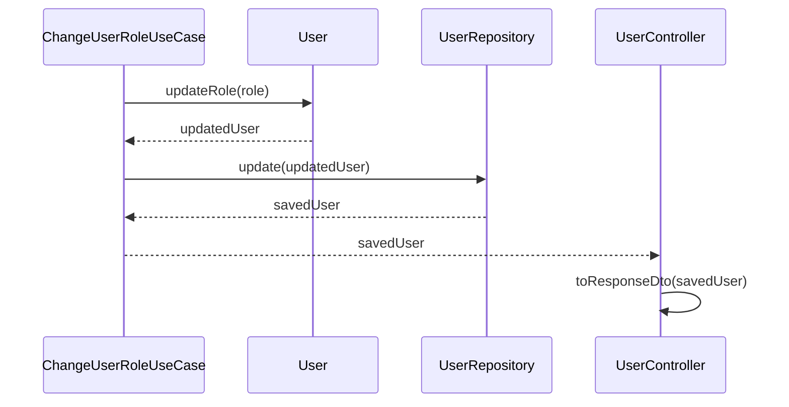

**理由**:
- エンティティの不変性とデータフローが明確になる
- 実装時の混乱を防ぐ
- 設計書の正確性向上

#### 設計書における型定義の明確化

**問題**: クラス図で使用されている型（例: `UserListQuery`、`UserListResult`）がクラス図内で定義されていない場合、レイヤー間のデータの流れが不明確になる。

**解決策**: クラス図には、すべての型（Value Object、DTO、Query、Resultなど）を明示的に定義する。

**例**:
```mermaid
class UserListQuery {
    <<Value Object>>
    +string? email
    +UserRole? role
    +number page
    +number limit
}

class UserListResult {
    <<Value Object>>
    +User[] users
    +number total
    +number page
    +number limit
}
```

**理由**:
- レイヤー間のデータの流れが明確になる
- 実装時の混乱を防ぐ
- 設計書の完全性向上

#### 既存インターフェースの変更点の明記

**問題**: 既存のインターフェース（例: `IUserRepository`）を変更する場合、変更点（メソッドの追加、削除、変更）が設計書に明記されていないと、実装者が混乱する。

**解決策**: 既存インターフェースからの変更点を明記する。

**例**:
```markdown
**既存インターフェースからの変更点**:
- `save(user: User): Promise<void>` は、より責務が明確な `create(user: User): Promise<User>` と `update(user: User): Promise<User>` に置き換えられます
- `create`と`update`は、保存されたエンティティを返すため、戻り値が`Promise<User>`に変更されます
- 既存の`save`メソッドは非推奨となり、将来的に削除される予定です
```

**理由**:
- 変更の意図が明確になる
- 実装者の理解を助ける
- 設計書の信頼性向上

#### API仕様の具体性向上

**問題**: API仕様で「パスワードポリシーに準拠」と記載されているが、具体的なポリシー（最小長、最大長、文字種の要件など）が明記されていない場合、APIを利用する開発者が困る。

**解決策**: API仕様には、具体的な要件を明記する。

**例**:
```markdown
- `password`: パスワード（パスワードポリシーに準拠）
  - 最小長: 8文字以上
  - 最大長: 128文字以下
  - 大文字、小文字、数字、記号を含むことが推奨されます（パスワードポリシー設定により必須要件が異なる場合があります）
```

**理由**:
- APIを利用する開発者の理解を助ける
- 実装時の混乱を防ぐ
- API仕様の完全性向上

#### パフォーマンス考慮事項の明記

**問題**: 設計書で部分一致検索などのパフォーマンスに影響を与える可能性がある機能を定義する場合、将来のデータベース実装時の考慮事項が明記されていない。

**解決策**: パフォーマンスに影響を与える可能性がある機能については、将来の実装時の考慮事項を明記する。

**例**:
```markdown
- `email`: メールアドレス（部分一致検索、オプション）
  - **注意**: 部分一致検索（`LIKE '%...%'`）は、データ量が増加した場合にパフォーマンスに影響を与える可能性があります。将来的なデータベース実装時には、PostgreSQLのtrigramインデックスなどの最適化を検討してください。
```

**理由**:
- 将来の実装時の考慮事項が明確になる
- パフォーマンス問題の早期発見
- 設計書の堅牢性向上

#### 用語の明確化

**問題**: 設計書で「ステータス値」という用語を使用すると、HTTPステータスコードと混同される可能性がある。

**解決策**: より具体的な用語を使用する（例: 「ロールの値」、「roleフィールドの定義」）。

**理由**:
- 誤解を防ぐ
- 設計書の明確性向上

#### シーケンス図での実装時の注意事項の明記

**問題**: シーケンス図で使用しているメソッドが既存実装に存在しない場合、実装者がどのように対応すべきかが不明確。

**解決策**: シーケンス図にNoteを追加し、実装時に追加が必要なメソッドであることを明記する。

**例**:
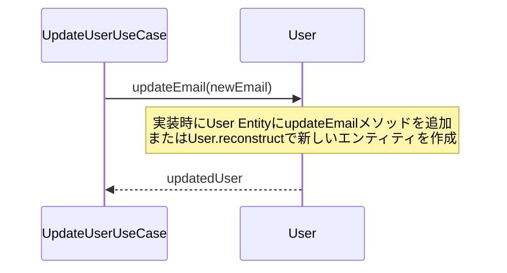

**理由**:
- 実装時の対応方法が明確になる
- 設計書の一貫性を保つ
- 実装者の混乱を防ぐ

---

## 12. コードの簡潔化とNestJSベストプラクティス

### リポジトリの`update`メソッドの簡潔化

**問題**: リポジトリの`update`メソッドで、既に存在チェックを行っているにもかかわらず、再度`if (existingUser)`チェックを行っている。また、メールアドレスが変更されない場合の防御的なコードが不要な場合がある。

**解決策**: 
1. 既に`this.users.has(user.id)`で存在チェックを行っている場合、`this.users.get(user.id)`は常に`User`オブジェクトを返すため、`if (existingUser)`チェックは不要。非nullアサーション（`!`）を使用する。
2. メールアドレスが変更されない場合の`else`ブロックは、他の部分（`create`や`constructor`）が正しく実装されていれば不要。削除することで、メソッドの主目的がより明確になる。

**例**:
```typescript
// ❌ 冗長なチェック
async update(user: User): Promise<User> {
  if (!this.users.has(user.id)) {
    throw new Error(`User with id ${user.id} not found`);
  }
  const existingUser = this.users.get(user.id);
  if (existingUser) {
    if (existingUser.email.toLowerCase() !== user.email.toLowerCase()) {
      // ...
    } else {
      // 防御的なコード（不要な場合がある）
      if (!this.emailToIdMap.has(user.email.toLowerCase())) {
        this.emailToIdMap.set(user.email.toLowerCase(), user.id);
      }
    }
  }
  // ...
}

// ✅ 簡潔化
async update(user: User): Promise<User> {
  if (!this.users.has(user.id)) {
    throw new Error(`User with id ${user.id} not found`);
  }
  const existingUser = this.users.get(user.id)!;
  if (existingUser.email.toLowerCase() !== user.email.toLowerCase()) {
    // 古いメールアドレスのマッピングを削除
    this.emailToIdMap.delete(existingUser.email.toLowerCase());
    // 新しいメールアドレスのマッピングを追加
    this.emailToIdMap.set(user.email.toLowerCase(), user.id);
  }
  // ...
}
```

**理由**:
- コードが簡潔になり、可読性が向上する
- メソッドの主目的が明確になる
- 不要な防御的コードを削除することで、パフォーマンスが向上する可能性がある

### コントローラーでのDTOオブジェクトの直接渡し

**問題**: コントローラーでUseCaseを呼び出す際に、DTOオブジェクトの各プロパティを個別に渡しているが、DTOとUseCaseが期待する型が互換性がある場合、DTOオブジェクトを直接渡すことができる。

**解決策**: DTOとUseCaseが期待する型が互換性がある場合、DTOオブジェクトを直接渡す。

**例**:
```typescript
// ❌ 各プロパティを個別に渡す
public async findAll(@Query() query: UserListQueryDto): Promise<UserListResponseDto> {
  const result = await this.getUserListUseCase.execute({
    email: query.email,
    role: query.role,
    page: query.page,
    limit: query.limit,
  });
  // ...
}

// ✅ DTOオブジェクトを直接渡す
public async findAll(@Query() query: UserListQueryDto): Promise<UserListResponseDto> {
  const result = await this.getUserListUseCase.execute(query);
  // ...
}
```

**理由**:
- コードが簡潔になり、可読性が向上する
- プロパティの追加・削除時の修正箇所が減る
- 型安全性が保たれる

### NestJSモジュールの`exports`でのトークン指定

**問題**: NestJSモジュールにおいて、`exports`配列でプロバイダを再定義するのは冗長。`providers`配列で定義したプロバイダをエクスポートする場合は、そのトークン（文字列トークンの場合）を指定するのが一般的。

**解決策**: `exports`配列では、プロバイダを再定義するのではなく、トークンを指定する。

**例**:
```typescript
// ❌ プロバイダを再定義
@Module({
  providers: [
    {
      provide: 'IUserRepository',
      useClass: UserRepository,
    },
  ],
  exports: [
    {
      provide: 'IUserRepository',
      useClass: UserRepository,
    },
  ],
})

// ✅ トークンを指定
@Module({
  providers: [
    {
      provide: 'IUserRepository',
      useClass: UserRepository,
    },
  ],
  exports: [
    'IUserRepository',
  ],
})
```

**理由**:
- コードがクリーンになり、NestJSのベストプラクティスに沿った形になる
- プロバイダ定義の重複を避けられる
- メンテナンス性が向上する

### リポジトリの`delete`メソッドの戻り値設計

**問題**: Use Case層で`findById`で存在確認してから`delete`を呼び出すと、リポジトリへのアクセスが2回発生し、非効率。また、実際のデータベース環境では競合状態（Race Condition）を引き起こす可能性がある。

**解決策**: `delete`メソッドの戻り値を`Promise<void>`から`Promise<boolean>`（削除が成功したかどうか）に変更し、Use Case側でその結果をハンドルする。

**例**:
```typescript
// ❌ 非効率な実装
public async execute(id: string): Promise<void> {
  // ユーザーの存在確認（1回目のアクセス）
  const user = await this.userRepository.findById(id);
  if (!user) {
    throw new NotFoundException('User not found');
  }
  // ユーザーを削除（2回目のアクセス）
  await this.userRepository.delete(id);
}

// ✅ 効率的な実装
public async execute(id: string): Promise<void> {
  const wasDeleted = await this.userRepository.delete(id);
  if (!wasDeleted) {
    throw new NotFoundException('User not found');
  }
}

// リポジトリインターフェース
export interface IUserRepository {
  /**
   * ユーザーを削除する
   * @param id ユーザーID
   * @returns 削除が成功した場合true、ユーザーが見つからない場合false
   */
  delete(id: string): Promise<boolean>;
}

// リポジトリ実装
async delete(id: string): Promise<boolean> {
  const user = this.users.get(id);
  if (!user) {
    return false;
  }
  // 削除処理
  this.users.delete(id);
  return true;
}
```

**理由**:
- リポジトリへのアクセスが1回で済み、パフォーマンスが向上する
- 競合状態のリスクを軽減できる
- コードがシンプルになり、可読性が向上する

### Use Case層でのバリデーション重複の回避

**問題**: Use Case層でページネーションパラメータなどのバリデーションを行っているが、DTO層（`class-validator`）で既にバリデーションが行われている場合、重複している。

**解決策**: NestJSの`ValidationPipe`がグローバルに適用されている場合、DTOでのバリデーションがコントローラー層で自動的に実行されるため、Use Case層でのバリデーションは不要。バリデーションはプレゼンテーション層の責務とする。

**例**:
```typescript
// ❌ 重複したバリデーション
public async execute(query: UserListQuery): Promise<UserListResult> {
  const page = query.page ?? 1;
  const limit = query.limit ?? 10;
  
  // DTO層で既にバリデーション済みなのに、再度バリデーション
  if (page < 1) {
    throw new BadRequestException('Page must be a positive number');
  }
  if (limit < 1 || limit > 100) {
    throw new BadRequestException('Limit must be between 1 and 100');
  }
  
  return await this.userRepository.findAll({ ... });
}

// ✅ バリデーションを削除
public async execute(query: UserListQuery): Promise<UserListResult> {
  // デフォルト値の設定のみ
  const page = query.page ?? 1;
  const limit = query.limit ?? 10;
  
  // バリデーションはDTO層（UserListQueryDto）でclass-validatorにより実行される
  return await this.userRepository.findAll({
    email: query.email,
    role: query.role,
    page,
    limit,
  });
}
```

**理由**:
- コードの重複をなくし、保守性が向上する
- 関心事を分離する（バリデーションはプレゼンテーション層の責務）
- Use Case層ではバリデーション済みのクリーンなデータが渡されることを期待できる

### Use Caseのメソッドシグネチャ設計（コマンドオブジェクトパターン）

**問題**: Use Caseの`execute`メソッドで、DTOから各プロパティを個別に渡していると、将来的にDTOにプロパティが追加された場合、Use Caseのメソッドシグネチャを変更する必要があり、修正箇所が増える。

**解決策**: Use CaseがDTOのような単一のコマンドオブジェクトを受け取るように設計する。これにより、将来的にDTOにプロパティが追加されても、Use Caseのメソッドシグネチャを変更する必要がなくなり、修正箇所を最小限に抑えることができる。

**例**:
```typescript
// ❌ 各プロパティを個別に渡す
public async execute(
  email: string,
  password: string,
  role: UserRole = UserRole.SERVICE_MEMBER,
): Promise<User> {
  // ...
}

// コントローラー側
const user = await this.createUserUseCase.execute(
  createUserDto.email,
  createUserDto.password,
  createUserDto.role,
);

// ✅ コマンドオブジェクトを受け取る
public async execute(command: {
  email: string;
  password: string;
  role?: UserRole;
}): Promise<User> {
  // ...
}

// コントローラー側
const user = await this.createUserUseCase.execute(createUserDto);
```

**理由**:
- 保守性が向上する（DTOにプロパティが追加されても、Use Caseのシグネチャを変更する必要がない）
- コードが簡潔になる
- 型安全性が保たれる

### Use Caseでの不要な更新処理の回避

**問題**: Use Caseで、値が提供されない、または変更がない場合でもリポジトリの`update`メソッドが呼び出されている。これにより、不要なリポジトリへのアクセスが発生する。

**解決策**: 値の変更がある場合のみ更新処理を行うように修正する。これにより、意図が明確になり、不要なリポジトリへのアクセスを避けることができる。

**例**:
```typescript
// ❌ 変更がない場合でもupdateが呼び出される
public async execute(id: string, email?: string): Promise<User> {
  const existingUser = await this.userRepository.findById(id);
  if (!existingUser) {
    throw new NotFoundException('User not found');
  }

  // メールアドレスが変更される場合、重複チェック
  if (email && email !== existingUser.email) {
    // ...
  }

  // 変更がない場合でもupdateが呼び出される
  const updatedUser = email ? existingUser.updateEmail(email) : existingUser;
  return await this.userRepository.update(updatedUser);
}

// ✅ 変更がある場合のみupdateを呼び出す
public async execute(id: string, email?: string): Promise<User> {
  const existingUser = await this.userRepository.findById(id);
  if (!existingUser) {
    throw new NotFoundException('User not found');
  }

  // メールアドレスが変更される場合のみ更新処理を行う
  if (email && email !== existingUser.email) {
    // 重複チェック
    const duplicateUser = await this.userRepository.findByEmail(email);
    if (duplicateUser && duplicateUser.id !== id) {
      throw new ConflictException('User with this email already exists');
    }

    // ユーザー情報を更新
    const updatedUser = existingUser.updateEmail(email);
    return await this.userRepository.update(updatedUser);
  }

  // メールアドレスが提供されない、または変更がない場合は既存のユーザーを返す
  return existingUser;
}
```

**理由**:
- 意図が明確になる
- 不要なリポジトリへのアクセスを避けることができる
- パフォーマンスが向上する可能性がある

---

## 22. 詳細設計書の品質向上（PR #48）

**学習元**: PR #48 - FQDN管理機能の詳細設計書作成（Geminiレビュー指摘）

### 22-1. バリデーションルールの矛盾解消 🟡 High

**問題**: バリデーションルールの記述と無効な例が矛盾している場合、実装時に混乱を招く。

**解決策**:
- バリデーションルールの記述と無効な例を整合させる
- ルールを具体的で明確な表現にする（例: 「少なくとも1つのラベルが必要」→「少なくとも2つのラベルが必要、少なくとも1つのピリオドを含む必要がある」）

**実装例**:
```markdown
# ❌ 悪い例: 矛盾がある
5. **形式**: `label1.label2.label3` の形式（少なくとも1つのラベルが必要）

**無効な例**:
- `example` (TLDがない)

# ✅ 良い例: 明確で矛盾がない
5. **形式**: `label1.label2.label3` の形式（少なくとも2つのラベルが必要、少なくとも1つのピリオドを含む必要がある）

**無効な例**:
- `example` (TLDがない、ピリオドを含まない)
```

**理由**:
- 実装時の混乱を避ける
- 設計の意図が明確になる

### 22-2. クラス図における型定義の完全性 🟡 Medium

**問題**: クラス図で使用されている型（`FqdnListQuery`、`FqdnListResult`など）が定義されていない場合、設計の完全性が損なわれる。

**解決策**:
- クラス図で使用されているすべての型を定義する
- Value Objectとして明示的に追加する
- プロパティと説明を記載する

**実装例**:
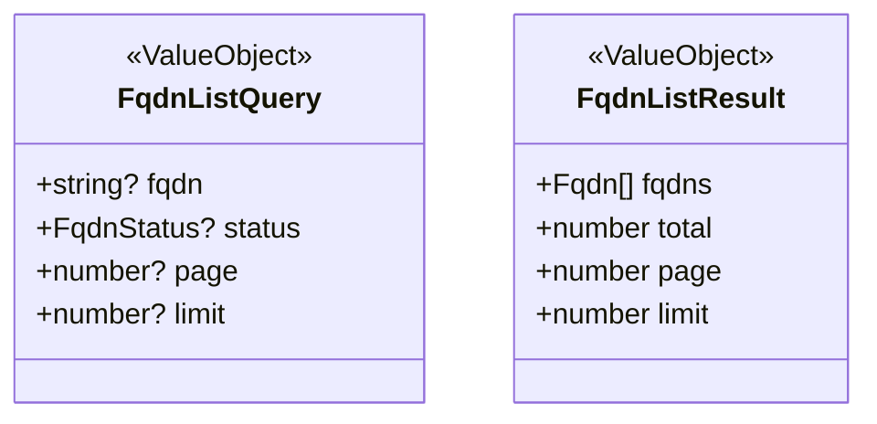

**理由**:
- ApplicationレイヤーとDomainレイヤーでどのようなデータがやり取りされるかが明確になる
- 設計の完全性が向上する

### 22-3. 命名規則の一貫性 🟡 Medium

**問題**: メソッド名やクラス名が実際の動作と一致しない場合（例: `Toggle`という名前だが実際は特定の値に設定する）、混乱を招く。

**解決策**:
- メソッド名やクラス名は実際の動作を正確に反映する
- `Toggle`（反転）ではなく、`Update`（更新）を使用する
- コントローラーのメソッド名も同様に一貫性を保つ

**実装例**:
```typescript
// ❌ 悪い例: 名前と動作が不一致
class ToggleFqdnStatusUseCase {
  execute(id: string, status: FqdnStatus): Promise<Fqdn> {
    // リクエストで指定された特定の値に設定する（トグルではない）
  }
}

// ✅ 良い例: 名前と動作が一致
class UpdateFqdnStatusUseCase {
  execute(id: string, status: FqdnStatus): Promise<Fqdn> {
    // リクエストで指定された特定の値に更新する
  }
}
```

**理由**:
- 処理フローの理解が容易になる
- コードの可読性が向上する

### 22-4. クラス図における型の明記 🟡 Medium

**問題**: クラス図でメソッドの引数に型が指定されていない場合、設計の明確さが損なわれる。

**解決策**:
- クラス図のメソッド定義に型を明記する
- 実装コードと一致させる

**実装例**:
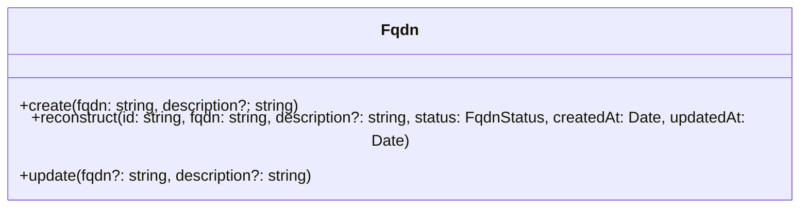

**理由**:
- コードの可読性が向上する
- 設計の明確さが向上する

### 22-5. バリデーションルールの明確化 🟡 Medium

**問題**: バリデーションルールの記述が曖昧な場合（例: 「大文字は使用不可、小文字に変換される」）、2つの解釈が可能になる。

**解決策**:
- バリデーションルールを具体的に記述する
- 大文字を含む入力の扱いを明確にする（受け入れるか、エラーとするか）
- 正規化処理がある場合は明記する

**実装例**:
```markdown
# ❌ 悪い例: 曖昧な記述
- `EXAMPLE.COM` (大文字は使用不可、小文字に変換される)

# ✅ 良い例: 明確な記述
- `EXAMPLE.COM` (大文字を含むFQDNは受け入れ、内部で小文字に正規化して扱う)
```

**理由**:
- 実装時の混乱を避ける
- 設計の意図が明確になる

**参照**: PR #48 - FQDN管理機能の詳細設計書作成（Geminiレビュー指摘）

### 22-6. 設計書内の矛盾の解消 🟡 High

**問題**: 設計書内で矛盾した記述がある場合（例: ある場所で「受け入れる」と記載されているのに、別の場所で「無効な例」として挙げられている）、実装時に混乱を招く。

**解決策**:
- 設計書全体を通して一貫性を保つ
- 矛盾する記述を削除または修正する
- 注釈として別途記載する場合は、無効な例から削除する

**実装例**:
```markdown
# ❌ 悪い例: 矛盾がある
## バリデーションルール
- 大文字を含むFQDNは受け入れ、内部で小文字に正規化して扱う

## 無効な例
- `EXAMPLE.COM` (大文字を含むFQDNは受け入れ、内部で小文字に正規化して扱う)

# ✅ 良い例: 一貫性がある
## バリデーションルール
- 大文字を含むFQDNは受け入れ、内部で小文字に正規化して扱う

## 無効な例
- `-example.com` (先頭がハイフン)
- `example-.com` (末尾がハイフン)

**注**: 大文字を含むFQDN（例: `EXAMPLE.COM`）は受け入れ、内部で小文字に正規化して扱います。これはドメイン名がケースインセンシティブであるためです。
```

**理由**:
- 実装時の混乱を避ける
- 設計の意図が明確になる

### 22-7. 設計書全体での命名の一貫性 🟡 Medium

**問題**: クラス図、クラス説明、シーケンス図などで命名が統一されていない場合、実装時に混乱を招く。

**解決策**:
- 設計書全体で命名を統一する
- クラス図、クラス説明、シーケンス図、READMEなどすべての箇所で同じ名前を使用する

**実装例**:
```markdown
# ❌ 悪い例: 命名が統一されていない
## クラス図
class UpdateFqdnStatusUseCase { ... }

## クラス説明
- **ToggleFqdnStatusUseCase**: FQDN有効/無効化処理

# ✅ 良い例: 命名が統一されている
## クラス図
class UpdateFqdnStatusUseCase { ... }

## クラス説明
- **UpdateFqdnStatusUseCase**: FQDNステータス更新処理
```

**理由**:
- 実装時の混乱を避ける
- 設計の一貫性が保たれる

### 22-8. クラス図とシーケンス図の整合性 🟡 Medium

**問題**: クラス図の戻り値の型とシーケンス図の動作が一致しない場合（例: クラス図では`Promise<Fqdn | null>`だが、シーケンス図では例外をスローする）、実装時に混乱を招く。

**解決策**:
- クラス図の戻り値の型をシーケンス図の動作と一致させる
- 例外をスローする場合は、戻り値から`null`を除外する
- 例外をスローする旨を明記する

**実装例**:
```mermaid
# ❌ 悪い例: 戻り値と動作が不一致
classDiagram
    class GetFqdnByIdUseCase {
        +execute(id: string): Promise~Fqdn | null~
    }

sequenceDiagram
    GetFqdnByIdUseCase->>FqdnRepository: findById(id)
    alt FQDNが見つからない
        FqdnRepository-->>GetFqdnByIdUseCase: null
        GetFqdnByIdUseCase-->>FqdnController: NotFoundException
    end

# ✅ 良い例: 戻り値と動作が一致
classDiagram
    class GetFqdnByIdUseCase {
        +execute(id: string): Promise~Fqdn~
    }

sequenceDiagram
    GetFqdnByIdUseCase->>FqdnRepository: findById(id)
    alt FQDNが見つからない
        FqdnRepository-->>GetFqdnByIdUseCase: null
        GetFqdnByIdUseCase-->>FqdnController: NotFoundException
    end
```

**理由**:
- 実装時の混乱を避ける
- 既存の実装パターン（GetCustomerByIdUseCaseなど）と一貫性が保たれる
- コントローラー層でのエラーハンドリングがシンプルになる

**参照**: PR #48 - FQDN管理機能の詳細設計書作成（Geminiレビュー指摘 第2弾）

### 22-9. プレゼンテーション層とアプリケーション層の責務分離 🟡 Medium

**問題**: アプリケーション層のUseCaseでドメインのValue Objectを直接受け取る場合、プレゼンテーション層からドメイン層への依存が生じ、責務の分離が曖昧になる。

**解決策**:
- プレゼンテーション層からアプリケーション層へ渡されるデータはDTOにマッピングされたプリミティブ型（enum）を使用する
- 既存の実装パターン（例: `CustomerStatusEnum`）に倣う
- Value Objectとenumの名前が重複しないようにする（例: `FqdnStatus` Value Objectと`FqdnStatusEnum` enum）

**実装例**:
```typescript
// ❌ 悪い例: Value Objectを直接受け取る
class UpdateFqdnStatusUseCase {
  execute(id: string, status: FqdnStatus): Promise<Fqdn> {
    // FqdnStatusはValue Object（ドメイン層）
  }
}

// ✅ 良い例: enumを使用する
class UpdateFqdnStatusUseCase {
  execute(id: string, status: FqdnStatusEnum): Promise<Fqdn> {
    // FqdnStatusEnumはenum（プリミティブ型）
  }
}
```

**理由**:
- ドメインオブジェクトがプレゼンテーション層に漏れ出すことを防ぐ
- 責務の分離がより明確になる
- 既存の実装パターンとの一貫性が保たれる

### 22-10. クラス図における戻り値の型定義 🟡 Medium

**問題**: クラス図でメソッドの戻り値の型が指定されていない場合、設計の明確さが損なわれる。

**解決策**:
- クラス図のメソッド定義に戻り値の型を明記する
- 静的メソッド（ファクトリメソッド）には`<<static>>`を明記する

**実装例**:
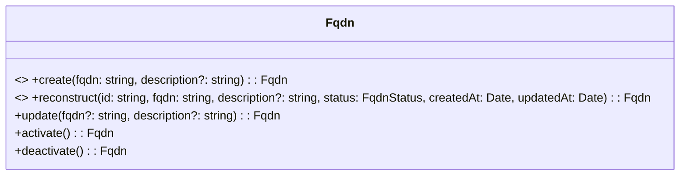

**理由**:
- 設計の明確さが向上する
- 実装時の混乱を避ける

### 22-11. Value Objectの不変性保証 🟡 Medium

**問題**: Value Objectに公開メソッドとして`validate()`が定義されている場合、不正な状態のオブジェクトが生成される可能性がある。

**解決策**:
- 静的ファクトリメソッド`create`を定義し、その中で検証を行う
- コンストラクタは`private`にする（クラス図では明示しないが、実装時に考慮）
- 既存の実装パターン（例: `CustomerStatus`）に倣う

**実装例**:
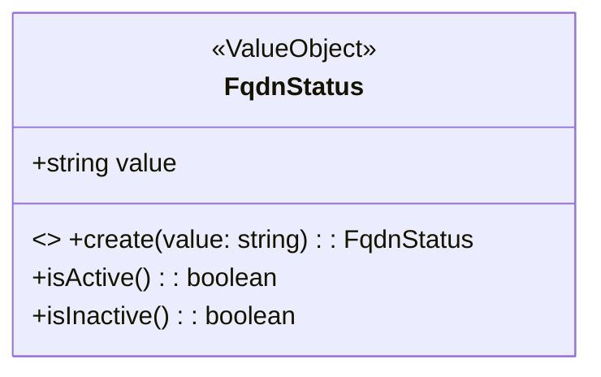

**理由**:
- Value Objectの不変性が保証される
- 不正な状態のオブジェクトが生成されるのを防ぐ

### 22-12. 設計書全体での用語の一貫性 🟡 Medium

**問題**: 設計書内で用語が統一されていない場合（例: 「切り替え」と「更新」が混在）、実装時に混乱を招く。

**解決策**:
- 設計書全体で用語を統一する
- タイトル、説明、シーケンス図などすべての箇所で同じ用語を使用する
- 実際の動作を正確に表す用語を選択する（例: 状態を反転させる場合は「切り替え」、指定された値に設定する場合は「更新」）

**実装例**:
```markdown
# ❌ 悪い例: 用語が統一されていない
## エンドポイント
### 6. FQDNステータス切り替え

## シーケンス図
## FQDNステータス切り替えフロー

## ユースケース
- **UpdateFqdnStatusUseCase**: FQDNステータス更新処理

# ✅ 良い例: 用語が統一されている
## エンドポイント
### 6. FQDNステータス更新

## シーケンス図
## FQDNステータス更新フロー

## ユースケース
- **UpdateFqdnStatusUseCase**: FQDNステータス更新処理
```

**理由**:
- 実装時の混乱を避ける
- 設計の一貫性が保たれる

### 22-13. シーケンス図における静的メソッド呼び出しの明示 🟡 Medium

**問題**: シーケンス図で静的メソッド（ファクトリメソッド）の呼び出しが通常のメソッド呼び出しと区別されていない場合、実装者が設計意図を誤解する可能性がある。

**解決策**:
- 静的メソッドの呼び出しは`ClassName.methodName(...)`のように表現する
- これにより、クラスから直接呼び出していることが分かる

**実装例**:
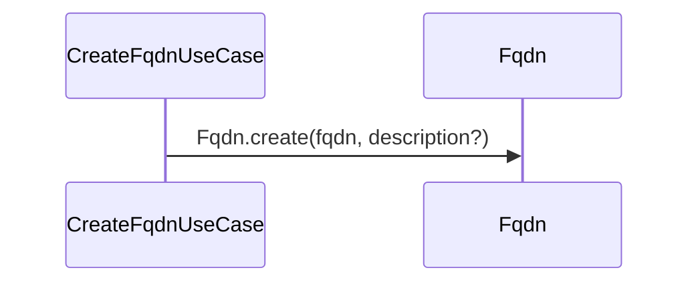

**理由**:
- 実装者が設計意図を誤解するのを防ぐ
- 静的メソッドであることが明確になる

**参照**: PR #48 - FQDN管理機能の詳細設計書作成（Geminiレビュー指摘 第3弾）

### 22-14. ドメインエンティティにおけるValue Objectの使用 🟡 Medium

**問題**: ドメインエンティティのプロパティの型がenum（プリミティブ型）になっている場合、ドメインの振る舞いをカプセル化できず、ドメイン駆動設計の原則に反する。

**解決策**:
- ドメインエンティティのプロパティの型はValue Objectを使用する
- 既存の実装パターン（例: `Customer`エンティティの`status`プロパティは`CustomerStatus`値オブジェクト）に倣う
- クラス図とメソッドシグネチャで一貫性を保つ

**実装例**:
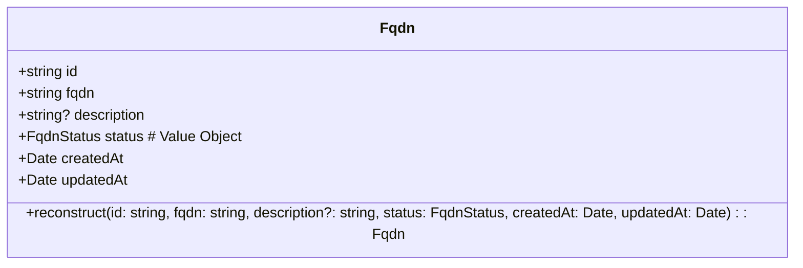

**理由**:
- ドメインの振る舞いをカプセル化できる
- ドメイン駆動設計の原則に従う
- 既存の実装パターンとの一貫性が保たれる

### 22-15. シーケンス図における変数名の一貫性 🟡 Medium

**問題**: シーケンス図で定義されていない変数名が使われている場合、実装時に混乱を招く。

**解決策**:
- シーケンス図で使用する変数名は、メソッドの引数名や既に定義されている変数名と一致させる
- 一貫性を保ち、混乱を避ける

**実装例**:
```mermaid
# ❌ 悪い例: 定義されていない変数名
UpdateFqdnUseCase->>FqdnRepository: findByFqdn(newFqdn)

# ✅ 良い例: メソッドの引数名と一致
UpdateFqdnUseCase->>FqdnRepository: findByFqdn(fqdn)
```

**理由**:
- 実装時の混乱を避ける
- 設計の一貫性が保たれる

**参照**: PR #48 - FQDN管理機能の詳細設計書作成（Geminiレビュー指摘 第4弾）

### 23. テストコードの保守性とNestJSモジュールのカプセル化（PR #49）

**学習元**: PR #49 - FQDN管理機能の実装（Geminiレビュー指摘）

#### 23-1. E2Eテストでの重複ロジック削除 🟡 High

**問題**: E2Eテストで、各テストケース内でリポジトリをクリアするロジックが繰り返し記述されており、`beforeEach`フックと重複している。これはテストの可読性と保守性を低下させる。

**解決策**:
1. **`beforeEach`フックで統一**: 各`describe`ブロックの`beforeEach`でリポジトリをクリアするロジックを定義し、各テストケース内の重複ロジックを削除する。
2. **リポジトリに`clear`メソッドを追加**: テスト間で状態をリセットできるように、インメモリリポジトリに`clear`メソッドを追加する。

**実装例**:
```typescript
// ✅ 良い例: beforeEachで統一
describe('POST /api/v1/fqdns', () => {
  beforeEach(async () => {
    const fqdnRepository = app.get<IFqdnRepository>('IFqdnRepository') as any;
    if (fqdnRepository && typeof fqdnRepository.clear === 'function') {
      fqdnRepository.clear();
    }
  });

  it('正常系: FQDNを作成できる', async () => {
    // 重複ロジックなし
    const response = await request(app.getHttpServer())
      .post('/api/v1/fqdns')
      .set('Authorization', `Bearer ${accessToken}`)
      .send({ fqdn: 'test.com' })
      .expect(201);
  });
});

// ❌ 悪い例: 各テストケース内で重複
it('正常系: FQDNを作成できる', async () => {
  // 重複ロジック
  const fqdnRepository = app.get<IFqdnRepository>('IFqdnRepository') as any;
  if (fqdnRepository && typeof fqdnRepository.clear === 'function') {
    fqdnRepository.clear();
  }
  // ...
});
```

**理由**:
- テストコードの可読性と保守性が向上する
- DRY原則に従う
- テストの意図が明確になる

#### 23-2. 重複チェック条件の簡素化 🟡 Medium

**問題**: `UpdateFqdnUseCase`で、FQDNの重複チェック時に`duplicateFqdn.id !== id`のチェックが不要。外側の`if (normalizedFqdn !== existingFqdn.fqdn)`でFQDNが実際に変更される場合のみこのブロックに入るため、`findByFqdn`で見つかるエンティティは必ず現在のエンティティとは別のものになる。

**解決策**: 不要な条件チェックを削除し、コードを簡素化する。

**実装例**:
```typescript
// ✅ 良い例: 簡素化された条件
if (fqdn) {
  const normalizedFqdn = fqdn.trim().toLowerCase();
  if (normalizedFqdn !== existingFqdn.fqdn) {
    const duplicateFqdn = await this.fqdnRepository.findByFqdn(normalizedFqdn);
    if (duplicateFqdn) {
      throw new ConflictException('FQDN already exists');
    }
  }
}

// ❌ 悪い例: 不要な条件チェック
if (duplicateFqdn && duplicateFqdn.id !== id) {
  throw new ConflictException('FQDN already exists');
}
```

**理由**:
- コードが簡潔になり、可読性が向上する
- 不要な条件チェックを削除することで、ロジックが明確になる

#### 23-3. NestJSモジュールのカプセル化 🟡 Medium

**問題**: `FqdnModule`の`exports`配列が`providers`配列のコピーのようになっており、モジュールのカプセル化を損なっている。`FqdnModule`はFQDN機能をカプセル化しており、他のモジュールで明示的に必要とされていない限り、すべてのプロバイダーをエクスポートする必要はない。

**解決策**: 他のモジュールで明示的に必要とされていない限り、`exports`配列を削除する。

**実装例**:
```typescript
// ✅ 良い例: カプセル化されたモジュール
@Module({
  controllers: [FqdnController],
  providers: [
    CreateFqdnUseCase,
    UpdateFqdnUseCase,
    // ...
  ],
  // exports配列なし（他のモジュールで必要とされていない場合）
})
export class FqdnModule {}

// ❌ 悪い例: 不要なexports
@Module({
  controllers: [FqdnController],
  providers: [
    CreateFqdnUseCase,
    UpdateFqdnUseCase,
    // ...
  ],
  exports: [
    // providersのコピー（不要）
    CreateFqdnUseCase,
    UpdateFqdnUseCase,
    // ...
  ],
})
export class FqdnModule {}
```

**理由**:
- モジュールのカプセル化が保たれる
- 不要な依存関係を避けることができる
- NestJSのベストプラクティスに従う

#### 23-4. 未使用変数の削除 🟡 Medium

**問題**: テストコードで宣言されているが使用されていない変数（例: `createdFqdnId`）が存在する。

**解決策**: 未使用の変数を削除する。

**理由**:
- コードの可読性が向上する
- 不要なコードを削除することで、意図が明確になる

**参照**: PR #49 - FQDN管理機能の実装（Geminiレビュー指摘）

### 24. データベース接続プール実装における重要な設計原則（PR #51）

**学習元**: PR #51 - データベース接続プールのユニットテストとE2Eテスト実装（Geminiレビュー指摘）

#### 24-1. 接続解放時の待機キュー処理 🟠 Critical

**問題**: `releaseConnection`メソッド内で、接続がアイドルプールに返却された後、`processWaitingQueue()`が呼び出されていない。これにより、接続を待機しているクライアント（`waitingQueue`内）は、新しい接続が利用可能になっても通知されず、不必要にタイムアウトまで待機してしまいます。これは接続スターベーションを引き起こす重大なバグです。

**解決策**: 接続がアイドル状態になった直後に`processWaitingQueue()`を呼び出すように修正する。無効な接続を破棄した後も、待機中のリクエストを処理する。

**実装例**:
```typescript
// ✅ 良い例: 接続解放後に待機キューを処理
async releaseConnection(connection: IConnection): Promise<void> {
  // ... バリデーション ...
  
  const isValid = await connection.isValid();
  if (isValid) {
    // 接続の有効期限をチェック
    const now = Date.now();
    const connectionAge = now - poolConnection.createdAt.getTime();
    if (connectionAge > this.config.maxLifetime) {
      await this.removeInvalidConnection(poolConnection);
      this.processWaitingQueue(); // 無効な接続を破棄した後も待機キューを処理
      return;
    }

    this.addToIdle(poolConnection);
    poolConnection.updateLastUsedAt();
    this.processWaitingQueue(); // 接続がアイドル状態になった直後に待機キューを処理
  } else {
    await this.removeInvalidConnection(poolConnection);
    this.processWaitingQueue(); // 無効な接続を破棄した後も待機キューを処理
  }
}
```

**理由**:
- 接続スターベーションの防止
- 待機中のクライアントへの即座の通知
- パフォーマンスの向上

#### 24-2. NestJS DI設定での単一インスタンス保証 🟠 Critical

**問題**: `DatabaseModule`でのDI設定に問題があり、複数の接続プールインスタンスが生成される可能性があります。`DatabaseConnectionPool`と`IConnectionPool`の両方を`useFactory`でプロバイドしているため、それぞれが注入されるたびに新しい`DatabaseConnectionPool`インスタンスが生成されてしまいます。

**解決策**: まず`DatabaseConnectionPool`をプロバイドし、次に`useExisting`を使用して`IConnectionPool`をそのエイリアスとして登録する。

**実装例**:
```typescript
// ✅ 良い例: useExistingを使用して単一インスタンスを保証
@Module({
  providers: [
    {
      provide: ConnectionPoolConfig,
      useFactory: (): ConnectionPoolConfig => {
        return ConnectionPoolConfig.fromEnvironment();
      },
    },
    ConnectionPoolFactory,
    {
      provide: DatabaseConnectionPool,
      useFactory: (
        config: ConnectionPoolConfig,
        factory: ConnectionPoolFactory,
      ): DatabaseConnectionPool => {
        return factory.create(config);
      },
      inject: [ConnectionPoolConfig, ConnectionPoolFactory],
    },
    {
      provide: 'IConnectionPool',
      useExisting: DatabaseConnectionPool, // 既存のインスタンスを参照
    },
  ],
  exports: ['IConnectionPool', ConnectionPoolConfig, DatabaseConnectionPool, ConnectionPoolFactory],
})
export class DatabaseModule {}
```

**理由**:
- アプリケーション内で単一の接続プールインスタンスを保証
- リソース管理の問題を回避
- 予期せぬ動作を防止

#### 24-3. インターフェースと具象クラスの抽象化の維持 🟡 High

**問題**: `ConnectionPool`は`IConnection`インターフェースを介して接続を操作すべきですが、`updateLastUsedAt()`メソッドを呼び出すために具象クラス`Connection`にダウンキャストしています。これは抽象化の原則に違反しており、将来のメンテナンスを困難にします。

**解決策**: `updateLastUsedAt()`メソッドを`IConnection`インターフェースに追加する。また、`lastUsedAt`プロパティの`readonly`指定を削除して、その可変性をインターフェースレベルで明確にする。

**実装例**:
```typescript
// ✅ 良い例: インターフェースにメソッドを追加
export interface IConnection {
  readonly id: string;
  readonly createdAt: Date;
  lastUsedAt: Date; // readonlyを削除

  isValid(): Promise<boolean>;
  close(): Promise<void>;
  updateLastUsedAt(): void; // インターフェースに追加
}
```

**理由**:
- 抽象化の原則に従う
- 将来のメンテナンスが容易になる
- インターフェースと実装の一貫性を保つ

#### 24-4. 再帰呼び出しのループ化 🟡 High

**問題**: 無効なアイドル接続が見つかった場合に`getConnection()`を再帰的に呼び出していますが、プール内の多数の接続が同時に無効になった場合、スタックオーバーフローを引き起こす危険性があります。

**解決策**: この再帰呼び出しを`while`ループに置き換える。ループ内で有効なアイドル接続が見つかるまで試行し、見つからなければループを抜けて新しい接続を作成するか待機するロジックに移行する。

**実装例**:
```typescript
// ✅ 良い例: whileループを使用
async getConnection(): Promise<IConnection> {
  // ... バリデーション ...

  // アイドル接続を取得（有効な接続が見つかるまでループ）
  while (true) {
    const idleConnection = this.getIdleConnection();
    if (!idleConnection) {
      break; // アイドル接続が存在しない場合はループを抜ける
    }

    const isValid = await idleConnection.isValid();
    if (isValid) {
      this.removeFromIdle(idleConnection);
      this.addToActive(idleConnection);
      idleConnection.updateLastUsedAt();
      return idleConnection;
    } else {
      // 無効な接続を破棄して次の接続を試す
      await this.removeInvalidConnection(idleConnection);
      // ループを継続して次のアイドル接続を確認
    }
  }

  // アイドル接続が存在しない場合の処理...
}
```

**理由**:
- スタックオーバーフローのリスクを回避
- より安全で堅牢な実装
- パフォーマンスの向上

#### 24-5. テストでの監視処理の検証 🟡 Medium

**問題**: 監視プロセスのテストが、監視処理が実際に実行されたことを検証していません。`expect(pool).toBeDefined()`というアサーションは、テストの動作を保証するには不十分です。

**解決策**: `jest.spyOn`を使用して`pool.cleanupIdleConnections`などのメソッドをスパイし、`jest.advanceTimersByTime`の後にこれらのメソッドが呼び出されたことを`expect(...).toHaveBeenCalled()`で検証する。

**実装例**:
```typescript
// ✅ 良い例: スパイを使用して監視処理を検証
it('正常系: 定期的に監視処理を実行する', async () => {
  const cleanupIdleSpy = jest.spyOn(pool, 'cleanupIdleConnections' as any);
  const cleanupExpiredSpy = jest.spyOn(pool, 'cleanupExpiredConnections' as any);
  const ensureMinSpy = jest.spyOn(pool, 'ensureMinConnections' as any);

  monitor.start();

  // 監視間隔（config.monitorInterval）を進める
  jest.advanceTimersByTime(config.monitorInterval);

  // 非同期処理の完了を待つ
  await Promise.resolve();
  await Promise.resolve();

  // 監視処理が実行されることを確認
  expect(cleanupIdleSpy).toHaveBeenCalled();
  expect(cleanupExpiredSpy).toHaveBeenCalled();
  expect(ensureMinSpy).toHaveBeenCalled();
});
```

**理由**:
- テストの信頼性が大幅に向上
- 監視処理が実際に実行されることを保証
- テストの意図が明確になる

#### 24-6. 設定値のハードコーディング回避 🟡 Medium

**問題**: 監視間隔（`MONITOR_INTERVAL_MS`）が5秒にハードコードされています。この値を`ConnectionPoolConfig`の一部として設定可能にすることで、柔軟性が向上し、環境ごとに最適な値に調整できるようになります。

**解決策**: 監視間隔を`ConnectionPoolConfig`の一部として設定可能にする。`ConnectionPoolConfig`に`monitorInterval`プロパティを追加し、環境変数`DB_POOL_MONITOR_INTERVAL`から読み込む。

**実装例**:
```typescript
// ✅ 良い例: ConnectionPoolConfigから監視間隔を取得
export class ConnectionPoolConfig {
  public readonly monitorInterval: number;
  
  // ...
  
  public static fromEnvironment(): ConnectionPoolConfig {
    const monitorInterval = parseInt(process.env.DB_POOL_MONITOR_INTERVAL || '5000', 10);
    // ...
  }
}

// ConnectionPoolMonitor
start(): void {
  const monitorInterval = this.config.monitorInterval; // 設定から取得
  this.intervalId = setInterval(() => {
    this.monitor().catch((error) => {
      this.logger.error('Error in connection pool monitor', error);
    });
  }, monitorInterval);
}
```

**理由**:
- 環境ごとに最適な値に調整可能
- 柔軟性の向上
- 設定の一元管理

#### 24-7. 空のメソッドの削除 🟡 Medium

**問題**: `removeFromActive`メソッドは現在空であり、コメントで「何もしない」と説明されています。メソッド名がその動作を示唆していないため、これは非常に紛らわしいです。

**解決策**: このメソッドは実際には状態を変更しないため、コードの可読性と保守性を向上させるために、このメソッドを削除し、`releaseConnection`からの呼び出しも削除する。接続がアクティブかどうかは`idleConnections`に含まれているかどうかで判断されているため、このメソッドがなくてもロジックは成立する。

**理由**:
- コードの可読性と保守性の向上
- 紛らわしいメソッドの削除
- ロジックの明確化

#### 24-8. テストでのフェイクタイマーの使用 🟡 Medium

**問題**: `updateLastUsedAt`のテストで`setTimeout`を使用していますが、これは実行環境によっては不安定になり、テストが失敗する（flaky test）原因となります。また、現在の実装では`done`コールバックが使われていないため、アサーションが実行される前にテストが終了してしまいます。

**解決策**: `jest.useFakeTimers()`と`jest.advanceTimersByTime()`を使用して時間を正確に制御することで、より信頼性の高いテストに修正する。

**実装例**:
```typescript
// ✅ 良い例: フェイクタイマーを使用
describe('updateLastUsedAt', () => {
  beforeEach(() => {
    jest.useFakeTimers();
  });

  afterEach(() => {
    jest.useRealTimers();
  });

  it('正常系: 最終使用日時を更新できる', () => {
    const originalLastUsedAt = connection.lastUsedAt;

    jest.advanceTimersByTime(10);

    connection.updateLastUsedAt();
    expect(connection.lastUsedAt.getTime()).toBeGreaterThan(originalLastUsedAt.getTime());
  });
});
```

**理由**:
- テストの安定性向上（実行時間に依存しない）
- テストの再現性向上（時間を制御できる）
- テストの実行速度向上（実際の時間を待たない）

**参照**: PR #51 - データベース接続プールのユニットテストとE2Eテスト実装（Geminiレビュー指摘）

#### 24-9. 待機キューの処理ロジックの修正 🟠 Critical

**問題**: `processWaitingQueue`の実装に重大なバグがあります。`processWaitingQueue`は`this.getConnection()`を呼び出しますが、`getConnection`は内部で`waitForConnection`を呼び出す可能性があります。`waitForConnection`は新しい待機リクエストをキューに追加します。しかし、`processWaitingQueue`の先頭で`shift()`された元のリクエストはキューに戻されないため、永久に解決されないままハングしてしまいます。

**解決策**: `processWaitingQueue`が`getConnection`を呼び出すのをやめ、待機中のリクエストにアイドル接続を直接割り当てるロジックに置き換える。

**実装例**:
```typescript
// ✅ 良い例: アイドル接続を直接割り当てる
private processWaitingQueue(): void {
  if (this.waitingQueue.length === 0 || this.idleConnections.length === 0) {
    return;
  }

  const request = this.waitingQueue.shift();
  if (!request) {
    return;
  }

  const idleConnection = this.idleConnections.shift();
  if (!idleConnection) {
    // アイドル接続がなかったのでリクエストをキューに戻す
    this.waitingQueue.unshift(request);
    return;
  }

  clearTimeout(request.timeout);

  // 非同期で接続の有効性を確認し、リクエストを解決
  (async () => {
    try {
      if (await idleConnection.isValid()) {
        this.addToActive(idleConnection);
        idleConnection.updateLastUsedAt();
        request.resolve(idleConnection);
        // 次の待機リクエストを処理するために再帰的に呼び出す
        this.processWaitingQueue();
      } else {
        // 無効な接続だったので破棄し、リクエストをキューに戻して再試行
        await this.removeInvalidConnection(idleConnection);
        this.waitingQueue.unshift(request);
        // 次の待機リクエストを処理するために再帰的に呼び出す
        this.processWaitingQueue();
      }
    } catch (error) {
      request.reject(error);
      await this.removeInvalidConnection(idleConnection).catch((e) =>
        this.logger.error('Failed to remove connection on error', e),
      );
      // エラーが発生した場合も、次の待機リクエストを処理するために再帰的に呼び出す
      this.processWaitingQueue();
    }
  })();
}
```

**理由**:
- リクエストのハングを防止
- 待機キューの処理ロジックが明確になる
- 接続の直接割り当てにより、パフォーマンスが向上

#### 24-10. 接続破棄時の待機キュー処理 🟠 Critical

**問題**: 最大生存期間を超えた接続を破棄した後に、`processWaitingQueue()`を呼び出す必要があります。現在、この呼び出しが欠落しているため、プールが最大接続数に達している場合に待機中のクライアントは、接続が利用可能になっても通知されません。

**解決策**: 接続を破棄した後、`processWaitingQueue()`を呼び出すように修正する。

**実装例**:
```typescript
// ✅ 良い例: 接続破棄後に待機キューを処理
if (connectionAge > this.config.maxLifetime) {
  // 最大生存時間を超過している場合は破棄
  await this.removeInvalidConnection(poolConnection);
  // 待機中のリクエストを処理
  this.processWaitingQueue();
  return;
}
```

**理由**:
- 接続スターベーションの防止
- 待機中のクライアントへの即座の通知
- パフォーマンスの向上

**参照**: PR #51 - データベース接続プールのユニットテストとE2Eテスト実装（Geminiレビュー指摘 第2弾）

#### 24-11. 接続の重複追加バグの修正 🟡 High

**問題**: `getConnection()`メソッドで、新しい接続を作成した際に`addToActive(connection)`の後に`this.connections.push(connection)`を実行しているが、`addToActive`メソッドがすでに`connections`配列への接続の追加を処理しているため、接続が重複して登録されてしまいます。これにより、接続数のカウントが不正確になり、プールの動作に予期せぬ問題を引き起こす可能性があります。

**解決策**: `addToActive`メソッドが既に`connections`配列に追加しているため、`this.connections.push(connection)`の行を削除する。

**実装例**:
```typescript
// ✅ 良い例: addToActiveのみを使用
if (this.connections.length < this.config.maxConnections) {
  try {
    const connection = await this.createConnection();
    this.addToActive(connection); // addToActiveが既にconnectionsに追加している
    return connection;
  } catch (error) {
    // ...
  }
}
```

**理由**:
- 接続の重複登録を防止
- 接続数のカウントの正確性を保証
- プールの動作の安定性向上

#### 24-12. 接続ステータス取得のパフォーマンス最適化 🟡 Medium

**問題**: `activeConnections`の計算が非効率です。現在の実装では、`connections`配列の各要素に対して`isActive`メソッドが呼び出され、その中で`idleConnections`配列の線形検索が行われるため、計算量がO(N*M)となってしまいます。

**解決策**: アクティブな接続数は、プール内の総接続数からアイドル接続数を引くことで、より効率的にO(1)で計算できる。

**実装例**:
```typescript
// ✅ 良い例: O(1)で計算
getStatus(): ConnectionPoolStatus {
  const activeConnections = this.connections.length - this.idleConnections.length;
  const idleConnections = this.idleConnections.length;
  const waitingRequests = this.waitingQueue.length;
  // ...
}
```

**理由**:
- パフォーマンスの向上（O(N*M)からO(1)へ）
- 計算の簡潔性
- スケーラビリティの向上

#### 24-13. テストコードのprocess.env操作の改善 🟡 Medium

**問題**: テストの信頼性と保守性を向上させるため、`process.env`の操作方法を改善する必要があります。現在、各`it`ブロック内で`process.env`を直接変更・復元していますが、このアプローチにはテストが途中で失敗した場合に`process.env`が元の状態に復元されないリスクがあります。

**解決策**: `beforeEach`と`afterAll`フックを使用して、環境変数のセットアップとクリーンアップを一元管理する。

**実装例**:
```typescript
// ✅ 良い例: beforeEachとafterAllで一元管理
describe('fromEnvironment', () => {
  const originalEnv = process.env;

  beforeEach(() => {
    process.env = { ...originalEnv };
  });

  afterAll(() => {
    process.env = originalEnv;
  });

  it('環境変数から接続プール設定を作成できる', () => {
    process.env.DB_POOL_MAX_CONNECTIONS = '10';
    // ... 他の環境変数の設定
    
    const config = ConnectionPoolConfig.fromEnvironment();
    // ... アサーション
  });

  it('環境変数が設定されていない場合、デフォルト値を使用する', () => {
    delete process.env.DB_POOL_MAX_CONNECTIONS;
    // ... 他に削除する環境変数

    const config = ConnectionPoolConfig.fromEnvironment();
    // ... アサーション
  });
});
```

**理由**:
- テストの信頼性向上（テストが途中で失敗しても`process.env`が復元される）
- コードの可読性向上（環境変数の管理が一元化される）
- 保守性の向上（環境変数のセットアップとクリーンアップが明確になる）

**参照**: PR #51 - データベース接続プールのユニットテストとE2Eテスト実装（Geminiレビュー指摘 第3弾）
