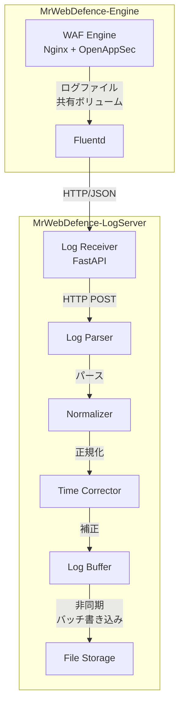
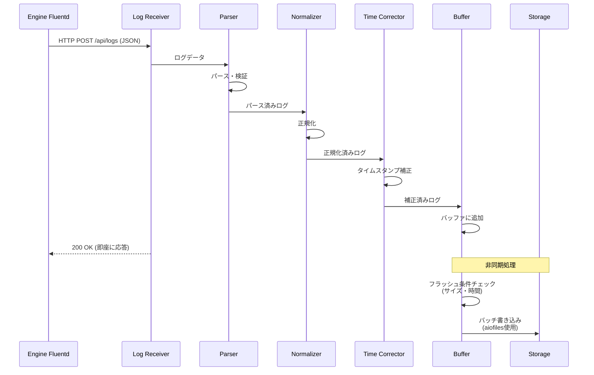
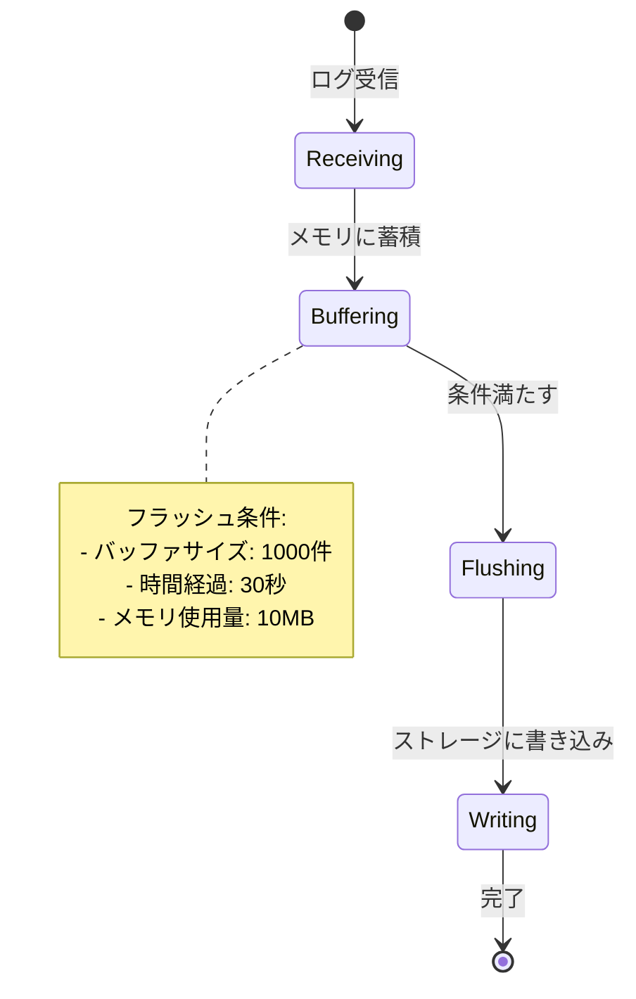

# Task 8.1: ログ収集機能実装 - 設計書

**Issue**: MWD-53  
**作成日**: 2026-02-17  
**更新日**: 2026-02-17 (Engine側設計書を反映)  
**ステータス**: Design Phase

---

## 📋 目次

1. [概要](#概要)
2. [参照設計書](#参照設計書)
3. [システムアーキテクチャ](#システムアーキテクチャ)
4. [ログ収集フロー](#ログ収集フロー)
5. [コンポーネント設計](#コンポーネント設計)
6. [データ構造](#データ構造)
7. [実装計画](#実装計画)
8. [テスト計画](#テスト計画)

---

## 概要

### なぜやるか

WAFエンジン（MrWebDefence-Engine）から転送されるログを受信し、パース・正規化・保存する機能が必要。

### 何をやるか

- **ログ受信エンドポイント実装**（HTTP）
- **ログパース・正規化ロジック実装**
- **ログタイムスタンプ補正機能実装**
- **ログバッファリング機能実装**
- **ストレージ実装**（初期: ファイルベース）

### 受け入れ条件

- [ ] ログ受信エンドポイントが正常に動作する
- [ ] ログパース・正規化が正常に動作する
- [ ] ログタイムスタンプ補正が正常に動作する
- [ ] ログバッファリングが正常に動作する
- [ ] ストレージへの保存が正常に動作する

---

## 参照設計書

本設計は、MrWebDefence-Engineのログ転送設計と連携します：

- **[MWD-40: Fluentd設定ファイルのモジュール化計画](https://github.com/kencom2400/MrWebDefence-Engine/blob/main/docs/design/MWD-40-fluentd-modularization-plan.md)**
  - Engine側のFluentd設定構造
  - label/includeを使ったモジュール化方針
  
- **[MWD-40: ログ転送機能実装 実装設計書](https://github.com/kencom2400/MrWebDefence-Engine/blob/main/docs/design/MWD-40-implementation-plan.md)**
  - ログ形式、タグ設計
  - メタデータ構造（customer_name、fqdn、year/month/day/hour等）
  - 転送エンドポイント仕様
  
- **[MWD-40: ログ連携方法比較検討](https://github.com/kencom2400/MrWebDefence-Engine/blob/main/docs/design/MWD-40-log-integration-analysis.md)**
  - 共有ボリューム方式 vs ログドライバ方式
  - 推奨方式: 共有ボリューム方式（デフォルト）

---

## システムアーキテクチャ

### 全体構成



### Engine側からの転送形式

Engine側のFluentdから以下の形式でログが転送されます：

#### Nginxアクセスログ

**タグ**: `nginx.access`（Engine側のタグ設計に準拠）

**レコード構造**:
```json
{
  "time": "2026-02-17T13:30:00+09:00",
  "remote_addr": "192.168.1.100",
  "request": "GET /api/users HTTP/1.1",
  "status": 200,
  "body_bytes_sent": 1234,
  "request_time": 0.123,
  "host": "example.com",
  "customer_name": "customer-a",
  "log_type": "nginx",
  "hostname": "waf-engine-01",
  "fqdn": "example.com",
  "year": "2026",
  "month": "02",
  "day": "17",
  "hour": "13",
  "minute": "30",
  "second": "45"
}
```

#### OpenAppSec検知ログ

**タグ**: `openappsec.detection`（Engine側のタグ設計に準拠）

**レコード構造**:
```json
{
  "time": "2026-02-17T13:30:00+09:00",
  "host": "example.com",
  "protectionName": "Threat Prevention Basic",
  "signature": "SQL Injection Attempt",
  "ruleName": "rule_001",
  "sourceIP": "192.168.1.100",
  "requestUri": "/admin/login",
  "log_type": "openappsec",
  "source": "waf-engine",
  "hostname": "waf-engine-01",
  "customer_name": "customer-a",
  "fqdn": "example.com",
  "year": "2026",
  "month": "02",
  "day": "17",
  "hour": "13",
  "minute": "30",
  "second": "45"
}
```

### 技術スタック

- **ログ受信**: Python (FastAPI)
- **データ処理**: Python
- **非同期I/O**: aiofiles, asyncio
- **ストレージ**: File System（初期）/ Database（将来）

---

## ログ収集フロー

### シーケンス図



### フロー説明

1. **ログ受信**: Engine FluentdからHTTP POSTでログを受信（JSON形式）
2. **パース**: JSON形式のログをパース・必須フィールド検証
3. **正規化**: LogServerの内部データモデル（LogEntry）に変換
4. **タイムスタンプ補正**: タイムゾーン変換、欠損補完、未来時刻補正
5. **バッファリング**: メモリバッファに追加後、**即座に200 OKを返す**（非同期処理）
6. **永続化**: バックグラウンドで非同期にストレージに保存（フラッシュ条件: サイズ・時間）

---

## コンポーネント設計

### 1. Log Receiver（受信エンドポイント）

#### APIエンドポイント

**POST /api/logs**

Engine Fluentdから以下の形式でログを受信：

- **単一ログ**: 1つのJSONオブジェクト
- **バッチログ**: JSONオブジェクトの配列

リクエスト例（単一ログ）:
```json
{
  "time": "2026-02-17T13:30:00.123+09:00",
  "log_type": "nginx",
  "hostname": "waf-engine-01",
  "customer_name": "customer-a",
  "fqdn": "example.com",
  "remote_addr": "192.168.1.100",
  "request": "GET /api/users HTTP/1.1",
  "status": 200
}
```

リクエスト例（バッチログ）:
```json
[
  { "time": "...", "log_type": "nginx", ... },
  { "time": "...", "log_type": "nginx", ... },
  { "time": "...", "log_type": "openappsec", ... }
]
```

レスポンス:
```json
{
  "status": "success",
  "received": 3,
  "timestamp": "2026-02-17T13:30:00.456+09:00"
}
```

**GET /health**

ヘルスチェックエンドポイント：

```json
{
  "status": "healthy",
  "buffer_size": 42,
  "timestamp": "2026-02-17T13:30:00.123Z"
}
```

#### 実装例

```python
from fastapi import FastAPI, HTTPException
from pydantic import BaseModel
from typing import List, Dict, Any, Union
from datetime import datetime
from contextlib import asynccontextmanager

@asynccontextmanager
async def lifespan(app: FastAPI):
    """アプリケーションのライフサイクル管理"""
    # 起動時
    print("🚀 MrWebDefence Log Server starting...")
    yield
    # 終了時
    print("🛑 MrWebDefence Log Server shutting down...")
    await log_buffer.close()  # バッファをフラッシュ

app = FastAPI(
    title="MrWebDefence Log Server",
    description="WAFログ収集・管理サーバー",
    version="0.1.0",
    lifespan=lifespan,
)

class EngineLog(BaseModel):
    """Engine側から送信されるログ"""
    time: str
    log_type: str
    hostname: str
    customer_name: str
    fqdn: str
    # その他のフィールドは動的に受け付ける
    
    class Config:
        extra = "allow"  # 追加フィールドを許可

@app.post("/api/logs")
async def receive_logs(logs: Union[EngineLog, List[EngineLog]]):
    """
    Engine Fluentdからログを受信
    
    - 単一ログまたはバッチログを受け付け
    - パース・正規化・補正後、バッファに追加
    - 即座に200 OKを返す（ストレージ書き込みは非同期）
    - バッファが満杯の場合は503 Service Unavailableを返す
    """
    # 単一ログの場合はリストに変換
    if not isinstance(logs, list):
        logs = [logs]
    
    try:
        # パース・正規化・補正
        processed_logs = []
        for log in logs:
            try:
                # Engine側のログをパース
                parsed = parser.parse(log.dict())
                
                # 正規化
                log_entry = normalizer.normalize(parsed)
                
                # タイムスタンプ補正
                log_entry = time_corrector.correct(log_entry)
                
                processed_logs.append(log_entry)
            except ValueError as e:
                # 個別ログのパースエラーはログに記録して続行
                logger.warning(f"Failed to parse log: {e}, log: {log.dict()}")
                continue
        
        # すべてのログがパース失敗した場合
        if not processed_logs:
            raise HTTPException(
                status_code=400,
                detail="All logs failed to parse"
            )
        
        # バッファに追加（非同期、即座にリターン）
        await log_buffer.add_batch(processed_logs)
        
        return {
            "status": "success",
            "received": len(processed_logs),
            "timestamp": datetime.utcnow().isoformat()
        }
    except BufferFullError as e:
        # バッファ満杯の場合は503を返す（バックプレッシャー）
        logger.warning(f"Buffer full: {e}")
        raise HTTPException(
            status_code=503,
            detail=f"Buffer is full, please retry later: {str(e)}"
        )
    except HTTPException:
        # HTTPExceptionはそのまま再送出
        raise
    except Exception as e:
        # 予期しないエラーはログに記録
        logger.error(f"Unexpected error in receive_logs: {e}", exc_info=True)
        raise HTTPException(status_code=500, detail="Internal server error")

@app.get("/health")
async def health_check():
    """ヘルスチェック"""
    return {
        "status": "healthy",
        "buffer_size": log_buffer.size(),
        "timestamp": datetime.utcnow().isoformat()
    }
```

### 2. Log Parser

#### 役割

Engine側から送信されるログを検証・パース：

- JSON形式の検証
- 必須フィールドの確認（time、log_type、hostname、fqdn）
- データ型の検証
- 不正なデータの拒否

#### 実装例

```python
class LogParser:
    """Engine側のログをパース"""
    
    # 必須フィールド
    REQUIRED_FIELDS = ['time', 'log_type', 'hostname', 'fqdn']
    
    # フィールド値の最大長（DoS攻撃対策）
    MAX_FIELD_LENGTH = 1024
    MAX_MESSAGE_LENGTH = 10240  # 10KB
    
    def parse(self, engine_log: dict) -> dict:
        """
        Engine側のログを検証・パース
        
        Args:
            engine_log: Engine側のログ辞書
            
        Returns:
            検証済みログ辞書
            
        Raises:
            ValueError: 必須フィールドが欠けている、または不正な値の場合
        """
        # 必須フィールドの確認
        for field in self.REQUIRED_FIELDS:
            if field not in engine_log or engine_log[field] is None:
                raise ValueError(f"Missing required field: {field}")
        
        # フィールド値の型と長さの検証（セキュリティ対策）
        for field in self.REQUIRED_FIELDS:
            value = engine_log[field]
            if not isinstance(value, str):
                raise ValueError(f"Field {field} must be a string, got {type(value)}")
            if len(value) > self.MAX_FIELD_LENGTH:
                raise ValueError(f"Field {field} exceeds maximum length of {self.MAX_FIELD_LENGTH}")
        
        # メッセージフィールドの長さ検証（存在する場合）
        if 'message' in engine_log and isinstance(engine_log['message'], str):
            if len(engine_log['message']) > self.MAX_MESSAGE_LENGTH:
                raise ValueError(f"Message exceeds maximum length of {self.MAX_MESSAGE_LENGTH}")
        
        return engine_log
```

### 3. Normalizer（正規化）

#### 役割

Engine側のログをLogServerの内部データモデル（LogEntry）に変換：

- タイムスタンプのdatetime変換
- ログレベルの正規化
- メッセージの抽出
- メタデータの整理

#### 実装例

```python
class LogNormalizer:
    """Engine側のログをLogServerのデータモデルに正規化"""
    
    LEVEL_MAP = {
        "debug": "debug",
        "info": "info",
        "warn": "warning",
        "warning": "warning",
        "error": "error",
        "critical": "critical",
    }
    
    def normalize(self, engine_log: dict) -> LogEntry:
        """
        Engine側のログを正規化
        
        Args:
            engine_log: パース済みログ辞書
            
        Returns:
            正規化されたLogEntry
        """
        # タイムスタンプをdatetimeに変換
        timestamp = self._parse_timestamp(engine_log.get("time"))
        
        # ログレベルの正規化（存在する場合）
        level = self._normalize_level(engine_log.get("level", "info"))
        
        # メッセージの抽出
        message = self._extract_message(engine_log)
        
        return LogEntry(
            timestamp=timestamp,
            level=level,
            message=message,
            source=engine_log.get("hostname"),
            hostname=engine_log.get("hostname"),
            metadata={
                "log_type": engine_log.get("log_type"),
                "customer_name": engine_log.get("customer_name"),
                "fqdn": engine_log.get("fqdn"),
                "year": engine_log.get("year"),
                "month": engine_log.get("month"),
                "day": engine_log.get("day"),
                "hour": engine_log.get("hour"),
                "minute": engine_log.get("minute"),
                "second": engine_log.get("second"),
                # Engine側のその他のフィールドをそのまま保持
                "original_fields": {
                    k: v for k, v in engine_log.items() 
                    if k not in ['time', 'log_type', 'hostname', 'customer_name', 'fqdn']
                }
            }
        )
    
    def _parse_timestamp(self, time_str: str) -> datetime:
        """タイムスタンプをdatetimeに変換"""
        from dateutil import parser as date_parser
        
        try:
            dt = date_parser.parse(time_str)
            if dt.tzinfo is None:
                dt = dt.replace(tzinfo=timezone.utc)
            return dt
        except (ValueError, TypeError):
            return datetime.now(timezone.utc)
    
    def _normalize_level(self, level: str) -> str:
        """ログレベルを正規化"""
        level_lower = str(level).lower().strip()
        return self.LEVEL_MAP.get(level_lower, "info")
    
    def _extract_message(self, engine_log: dict) -> str:
        """ログメッセージを抽出"""
        log_type = engine_log.get("log_type")
        
        if log_type == "nginx":
            # Nginxログの場合: requestフィールドをメッセージとして使用
            return engine_log.get("request", "")
        elif log_type == "openappsec":
            # OpenAppSecログの場合: signatureをメッセージとして使用
            return engine_log.get("signature", "WAF Detection")
        else:
            # その他: message フィールドまたは空文字列
            return engine_log.get("message", "")
```

### 4. Time Corrector（タイムスタンプ補正）

Engine側から送信されるタイムスタンプは既に正しい形式ですが、以下の補正を行います：

```python
class TimeCorrector:
    """タイムスタンプを補正する"""
    
    def __init__(
        self, 
        max_future_offset_minutes: int = 5, 
        old_log_days: int = 7
    ) -> None:
        self.max_future_offset = timedelta(minutes=max_future_offset_minutes)
        self.old_log_threshold = timedelta(days=old_log_days)
    
    def correct(self, log_entry: LogEntry) -> LogEntry:
        """
        タイムスタンプを補正
        
        1. タイムゾーン情報がない場合はUTCと仮定
        2. タイムスタンプがない場合は受信時刻を使用
        3. 未来のタイムスタンプ（5分以上）は受信時刻に補正
        4. 古すぎるタイムスタンプ（7日以上前）は警告
        """
        now = datetime.now(timezone.utc)
        
        if log_entry.timestamp is None:
            log_entry.timestamp = now
            log_entry.metadata['timestamp_source'] = 'server'
            return log_entry
        
        # タイムゾーン情報の補完
        if log_entry.timestamp.tzinfo is None:
            log_entry.timestamp = log_entry.timestamp.replace(tzinfo=timezone.utc)
            log_entry.metadata['timezone_assumed'] = True
        
        # 未来のタイムスタンプチェック（5分以上未来）
        if log_entry.timestamp > now + self.max_future_offset:
            log_entry.metadata['timestamp_corrected'] = True
            log_entry.metadata['original_timestamp'] = log_entry.timestamp.isoformat()
            log_entry.timestamp = now
        
        # 古すぎるタイムスタンプの警告（7日以上前）
        if log_entry.timestamp < now - self.old_log_threshold:
            log_entry.metadata['timestamp_warning'] = 'old_timestamp'
        
        return log_entry
```

### 5. Log Buffer（バッファリング）

#### バッファリング戦略



#### 実装方針

- **メモリバッファ**: 最大1000件または10MB
- **フラッシュタイミング**: 
  - バッファ満杯時（1000件または10MB）
  - 30秒経過時
  - シャットダウン時
- **バックプレッシャー（背圧）**: 
  - バッファが90%以上満杯の場合、新規ログを拒否（HTTP 503）
  - Engine Fluentdにリトライを促す
  - メモリ枯渇を防止
- **非同期処理**: ストレージ書き込みは非同期で実行（イベントループをブロックしない）

#### 実装例

```python
class BufferFullError(Exception):
    """バッファが満杯の場合に発生する例外"""
    pass

class LogBuffer:
    """ログをメモリ上でバッファリングする"""
    
    def __init__(
        self,
        max_size: int = 1000,
        max_age_seconds: int = 30,
        max_memory_mb: int = 10,
        storage=None,
    ) -> None:
        self.buffer: List[LogEntry] = []
        self.max_size = max_size
        self.max_age_seconds = max_age_seconds
        self.max_memory_bytes = max_memory_mb * 1024 * 1024
        self.storage = storage
        self.lock = asyncio.Lock()
        self.last_flush = datetime.now(timezone.utc)

    async def add_batch(self, log_entries: List[LogEntry]) -> None:
        """
        ログエントリをバッファに追加
        
        Raises:
            BufferFullError: バッファが満杯の場合
        """
        async with self.lock:
            # バッファ満杯チェック（バックプレッシャー）
            if self._is_buffer_full(len(log_entries)):
                raise BufferFullError(
                    f"Buffer is full: {len(self.buffer)} entries, "
                    f"{self._get_buffer_size_bytes()} bytes"
                )
            
            self.buffer.extend(log_entries)
            
            # 自動フラッシュ条件チェック
            if self._should_flush():
                await self.flush()
    
    def _is_buffer_full(self, additional_entries: int = 0) -> bool:
        """
        バッファが満杯か判定（バックプレッシャー用）
        
        Args:
            additional_entries: 追加しようとしているエントリ数
            
        Returns:
            バッファが満杯の場合True
        """
        # エントリ数チェック（余裕を持たせて90%で満杯とみなす）
        if (len(self.buffer) + additional_entries) >= self.max_size * 0.9:
            return True
        
        # メモリサイズチェック（概算）
        current_size = self._get_buffer_size_bytes()
        if current_size >= self.max_memory_bytes * 0.9:
            return True
        
        return False
    
    def _get_buffer_size_bytes(self) -> int:
        """
        バッファのメモリサイズを概算（バイト）
        
        より正確な見積もりのため、各エントリのJSONサイズを計算
        """
        if not self.buffer:
            return 0
        
        # サンプルベースの見積もり（パフォーマンスとのバランス）
        # 最初の10エントリの平均サイズから全体を推定
        sample_size = min(10, len(self.buffer))
        total_sample_size = 0
        
        for entry in self.buffer[:sample_size]:
            # JSON文字列のサイズを計算
            try:
                json_str = json.dumps(entry.to_dict(), ensure_ascii=False)
                total_sample_size += len(json_str.encode('utf-8'))
            except Exception:
                # エラー時は安全側の見積もり（1エントリ=2KB）
                total_sample_size += 2048
        
        # 平均サイズを計算して全体を推定
        avg_size = total_sample_size / sample_size if sample_size > 0 else 2048
        return int(avg_size * len(self.buffer))
    
    def _should_flush(self) -> bool:
        """フラッシュすべきか判定"""
        # サイズチェック
        if len(self.buffer) >= self.max_size:
            return True
        
        # メモリサイズチェック
        if self._get_buffer_size_bytes() >= self.max_memory_bytes:
            return True
        
        # 時間チェック
        age = (datetime.now(timezone.utc) - self.last_flush).total_seconds()
        if age >= self.max_age_seconds:
            return True
        
        return False
    
    def size(self) -> int:
        """現在のバッファサイズを取得"""
        return len(self.buffer)
    
    async def flush(self) -> None:
        """バッファをストレージに書き込む（非同期）"""
        if not self.buffer or self.storage is None:
            return
        
        async with self.lock:
            logs_to_write = self.buffer.copy()
            self.buffer.clear()
            self.last_flush = datetime.now(timezone.utc)
        
        # ストレージに非同期書き込み
        await self.storage.write_batch(logs_to_write)
    
    async def close(self) -> None:
        """シャットダウン時にバッファをフラッシュ"""
        await self.flush()
```

### 6. Storage（ストレージ）

#### ファイルベース（初期実装）

Engine側の設計を参考に、ログを構造化して保存：

**ディレクトリ構造**:
```
logs/
├── {customer_name}/
│   ├── {log_type}/
│   │   ├── {fqdn}/
│   │   │   ├── {year}/
│   │   │   │   ├── {month}/
│   │   │   │   │   ├── {day}/
│   │   │   │   │   │   ├── {hour}.log
```

**例**:
```
logs/
├── customer-a/
│   ├── nginx/
│   │   ├── example.com/
│   │   │   ├── 2026/
│   │   │   │   ├── 02/
│   │   │   │   │   ├── 17/
│   │   │   │   │   │   ├── 13.log
│   │   │   │   │   │   ├── 14.log
│   ├── openappsec/
│   │   ├── example.com/
│   │   │   ├── 2026/
│   │   │   │   ├── 02/
│   │   │   │   │   ├── 17/
│   │   │   │   │   │   ├── 13.log
```

**ファイル形式**: JSON Lines（1行1ログエントリ）

```jsonl
{"log_id":"uuid","timestamp":"2026-02-17T13:30:00.123Z","level":"info","source":"waf-engine-01","message":"GET /api/users HTTP/1.1","metadata":{...}}
{"log_id":"uuid","timestamp":"2026-02-17T13:30:01.234Z","level":"warning","source":"waf-engine-01","message":"Rate limit exceeded","metadata":{...}}
```

#### 非同期I/O実装

**重要**: 非同期I/Oを使用してイベントループのブロックを回避

```python
import aiofiles
from pathlib import Path
from typing import List

class FileStorage:
    """ファイルベースのストレージ（非同期I/O）"""
    
    def __init__(self, base_path: str = "logs") -> None:
        self.base_path = Path(base_path)
    
    def _get_log_file_path(self, log_entry: LogEntry) -> Path:
        """
        ログファイルのパスを生成
        
        パス構造: 
        logs/{customer_name}/{log_type}/{fqdn}/{year}/{month}/{day}/{hour}.log
        
        例:
        logs/customer-a/nginx/example.com/2026/02/17/13.log
        """
        ts = log_entry.timestamp
        metadata = log_entry.metadata
        
        customer_name = metadata.get('customer_name', 'default')
        log_type = metadata.get('log_type', 'unknown')
        fqdn = metadata.get('fqdn', 'unknown')
        
        return (
            self.base_path 
            / customer_name 
            / log_type 
            / fqdn
            / str(ts.year)
            / f"{ts.month:02d}"
            / f"{ts.day:02d}"
            / f"{ts.hour:02d}.log"
        )
    
    async def write_batch(self, log_entries: List[LogEntry]) -> None:
        """
        ログエントリをバッチで書き込む（非同期I/O）
        
        Args:
            log_entries: ログエントリのリスト
        """
        # ファイル別にグルーピング
        grouped: dict[Path, List[LogEntry]] = {}
        for entry in log_entries:
            path = self._get_log_file_path(entry)
            if path not in grouped:
                grouped[path] = []
            grouped[path].append(entry)
        
        # ファイルごとに書き込み（非同期）
        for path, entries in grouped.items():
            await self._write_to_file(path, entries)
    
    async def _write_to_file(self, path: Path, log_entries: List[LogEntry]) -> None:
        """
        指定されたファイルにログエントリを書き込む（非同期）
        
        Args:
            path: ファイルパス
            log_entries: ログエントリのリスト
        """
        # ディレクトリを作成
        path.parent.mkdir(parents=True, exist_ok=True)
        
        # aiofilesを使用した非同期ファイルI/O
        async with aiofiles.open(path, 'a', encoding='utf-8') as f:
            for entry in log_entries:
                line = json.dumps(entry.to_dict(), ensure_ascii=False) + '\n'
                await f.write(line)
```

---

## データ構造

### 正規化後のログエントリ

```python
from dataclasses import dataclass, field
from datetime import datetime, timezone
from typing import Optional, Dict, Any
import uuid

@dataclass
class LogEntry:
    """正規化後のログエントリ"""
    
    # 必須フィールド
    timestamp: datetime      # UTCタイムスタンプ
    level: str              # ログレベル (debug, info, warning, error, critical)
    message: str            # ログメッセージ
    
    # オプションフィールド
    source: Optional[str] = None          # ログソース（waf-engine-01等）
    hostname: Optional[str] = None        # ホスト名
    
    # メタデータ（Engine側から送信された情報を保持）
    metadata: Dict[str, Any] = field(default_factory=dict)
    # metadata例:
    # {
    #   "log_type": "nginx" | "openappsec",
    #   "customer_name": "customer-a",
    #   "fqdn": "example.com",
    #   "year": "2026",
    #   "month": "02",
    #   "day": "17",
    #   "hour": "13",
    #   "minute": "30",
    #   "second": "45",
    #   "original_fields": {
    #     ... Engine側のその他のフィールド
    #   }
    # }
    
    # 内部管理
    received_at: datetime = field(default_factory=lambda: datetime.now(timezone.utc))
    log_id: str = field(default_factory=lambda: str(uuid.uuid4()))
    
    def to_dict(self) -> dict:
        """辞書形式に変換"""
        return {
            "log_id": self.log_id,
            "timestamp": self.timestamp.isoformat(),
            "level": self.level,
            "message": self.message,
            "source": self.source,
            "hostname": self.hostname,
            "metadata": self.metadata,
            "received_at": self.received_at.isoformat(),
        }
```

---

## 実装計画

### Phase 1: プロジェクト構造の作成

#### 1.1 ディレクトリ構造

```
MrWebDefence-LogServer/
├── src/
│   ├── __init__.py
│   ├── models.py        # データモデル（LogEntry）
│   ├── server/          # Webサーバー（FastAPI）
│   │   ├── __init__.py
│   │   └── app.py       # FastAPIアプリケーション
│   ├── parser/          # ログパーサー
│   │   ├── __init__.py
│   │   ├── log_parser.py
│   │   └── normalizer.py
│   ├── corrector/       # タイムスタンプ補正
│   │   ├── __init__.py
│   │   └── time_corrector.py
│   ├── buffer/          # バッファリング
│   │   ├── __init__.py
│   │   └── log_buffer.py
│   └── storage/         # ストレージ
│       ├── __init__.py
│       ├── file_storage.py
│       └── db_storage.py (将来)
├── config/
│   └── server.yaml      # サーバー設定
├── tests/
│   ├── unit/
│   ├── integration/
│   └── fixtures/
│       ├── nginx_log_samples.json
│       └── openappsec_log_samples.json
├── docs/
│   └── design/
│       └── MWD-53-log-collection.md
├── scripts/
│   ├── dev-server.sh
│   └── run-tests.sh
├── pyproject.toml
├── .gitignore
└── README.md
```

#### 1.2 依存関係

```toml
[tool.poetry]
name = "mrwebdefence-logserver"
version = "0.1.0"
description = "MrWebDefence Log Collection and Management Server"

[tool.poetry.dependencies]
python = "^3.12"
fastapi = "^0.109.0"
uvicorn = {extras = ["standard"], version = "^0.27.0"}
pydantic = "^2.6.0"
python-dateutil = "^2.8.2"
pyyaml = "^6.0.1"
aiofiles = "^23.2.1"  # 非同期ファイルI/O

[tool.poetry.group.dev.dependencies]
pytest = "^8.0.0"
pytest-asyncio = "^0.23.0"
black = "^24.1.0"
flake8 = "^7.0.0"
mypy = "^1.8.0"
httpx = "^0.26.0"  # テスト用HTTP クライアント
```

### Phase 2: データモデル実装

`src/models.py`にLogEntryデータクラスを実装（前述の実装を使用）

### Phase 3: Log Receiver実装

`src/server/app.py`にFastAPIアプリケーションを実装（前述の実装を使用）

### Phase 4: Parser & Normalizer実装

- `src/parser/log_parser.py`: Engine側のログをパース
- `src/parser/normalizer.py`: LogEntryに正規化

### Phase 5: Time Corrector実装

`src/corrector/time_corrector.py`にタイムスタンプ補正を実装

### Phase 6: Buffer実装

`src/buffer/log_buffer.py`にバッファリング機能を実装

### Phase 7: Storage実装

`src/storage/file_storage.py`にファイルストレージを実装（aiofiles使用）

---

## テスト計画

### Unit Tests

#### 1. Log Parser Tests (`tests/unit/test_log_parser.py`)
- Engine側のログ形式のパース
- 必須フィールドの検証
- 不正なフォーマットのエラーハンドリング

#### 2. Normalizer Tests (`tests/unit/test_normalizer.py`)
- Engine側のログからLogEntryへの変換
- タイムスタンプのパース
- メッセージの抽出（log_type別）
- メタデータの整理

#### 3. Time Corrector Tests (`tests/unit/test_time_corrector.py`)
- タイムゾーン補正
- 未来のタイムスタンプ補正
- タイムスタンプ欠損時の補完

#### 4. Buffer Tests (`tests/unit/test_log_buffer.py`)
- バッファリング動作
- 自動フラッシュ（サイズ・時間）
- シャットダウン時のフラッシュ

#### 5. Storage Tests (`tests/unit/test_file_storage.py`)
- ファイル書き込み（非同期I/O）
- ディレクトリ作成（Engine側の構造に準拠）
- バッチ書き込み

### Integration Tests

#### 1. API Endpoint Tests (`tests/integration/test_api.py`)
- Engine側のログ受信（単一ログ）
- バッチログ受信
- エラーケース（必須フィールド欠如等）

#### 2. End-to-End Tests (`tests/integration/test_e2e.py`)
- Engine Fluentd → Log Server → Storage
- 大量ログの処理
- エラーリカバリー

### テストデータ（Fixtures）

#### Nginxログサンプル (`tests/fixtures/nginx_log_samples.json`)

```json
[
  {
    "time": "2026-02-17T13:30:00+09:00",
    "remote_addr": "192.168.1.100",
    "request": "GET /api/users HTTP/1.1",
    "status": 200,
    "body_bytes_sent": 1234,
    "request_time": 0.123,
    "host": "example.com",
    "customer_name": "customer-a",
    "log_type": "nginx",
    "hostname": "waf-engine-01",
    "fqdn": "example.com",
    "year": "2026",
    "month": "02",
    "day": "17",
    "hour": "13"
  }
]
```

#### OpenAppSecログサンプル (`tests/fixtures/openappsec_log_samples.json`)

```json
[
  {
    "time": "2026-02-17T13:30:00+09:00",
    "host": "example.com",
    "protectionName": "Threat Prevention Basic",
    "signature": "SQL Injection Attempt",
    "ruleName": "rule_001",
    "sourceIP": "192.168.1.100",
    "requestUri": "/admin/login",
    "log_type": "openappsec",
    "source": "waf-engine",
    "hostname": "waf-engine-01",
    "customer_name": "customer-a",
    "fqdn": "example.com",
    "year": "2026",
    "month": "02",
    "day": "17",
    "hour": "13"
  }
]
```

---

## 非機能要件

### パフォーマンス

- **スループット**: 1000 logs/sec以上
- **レイテンシ**: 
  - 受信からバッファ追加まで: 10ms以内
  - バッファからストレージまで: 100ms以内（バックグラウンド処理）
- **メモリ使用量**: 100MB以内（バッファ含む）
- **同時接続数**: 100接続以上

### 信頼性

- **データロス**: ゼロ（シャットダウン時もバッファをフラッシュ）
- **可用性**: 99.9%以上
- **再起動時間**: 5秒以内
- **エラーリカバリー**: 自動リトライ、エラーログ出力

### セキュリティ

- **入力検証**: 
  - 必須フィールドの存在確認
  - フィールド値の型チェック（文字列型の確認）
  - フィールド値の長さ制限（DoS攻撃対策）
    - 通常フィールド: 最大1KB
    - メッセージフィールド: 最大10KB
- **認証**: APIキーベースの認証（環境変数で管理、将来実装）
- **暗号化**: TLS/SSL対応（オプション）
- **レート制限**: 過負荷防止（将来実装）
- **エラー情報の制限**: 詳細なエラー情報を外部に漏らさない（Internal server errorとして返す）

### 運用性

- **ヘルスチェック**: GET /health
- **モニタリング**: バッファサイズ、受信ログ数
- **ログ出力**: 構造化ログ（JSON形式）
- **設定管理**: YAMLファイルによる設定

---

## 設定ファイル

### server.yaml

```yaml
server:
  host: 0.0.0.0
  http_port: 8080
  workers: 4

buffer:
  max_size: 1000           # バッファの最大サイズ（件数）
  max_age_seconds: 30      # バッファの最大保持時間（秒）
  max_memory_mb: 10        # バッファの最大メモリ使用量（MB）

storage:
  type: file
  base_path: logs
  # ディレクトリ構造: {customer_name}/{log_type}/{fqdn}/{year}/{month}/{day}/{hour}.log

time_correction:
  max_future_offset_minutes: 5    # 未来のタイムスタンプ許容範囲（分）
  old_log_warning_days: 7         # 古いログ警告閾値（日）

logging:
  level: info
  format: json
```

---

## 運用

### 起動方法

```bash
# 開発環境
poetry run python -m src.server.app

# 本番環境（4ワーカー）
poetry run uvicorn src.server.app:app \
  --host 0.0.0.0 \
  --port 8080 \
  --workers 4
```

### ログファイルの確認

```bash
# ログディレクトリ構造を確認
ls -R logs/

# 特定のログファイルを確認
cat logs/customer-a/nginx/example.com/2026/02/17/13.log | jq .

# ログエントリ数をカウント
find logs/ -type f -name "*.log" -exec wc -l {} + | tail -1
```

### モニタリング

```bash
# ヘルスチェック
curl http://localhost:8080/health

# バッファサイズの監視
watch -n 5 'curl -s http://localhost:8080/health | jq .buffer_size'
```

### ログアーカイブ

Engine側のlogrotate設定（毎日ローテート）と連携し、古いログをアーカイブ：

```bash
# 30日以上前のログを圧縮
find logs/ -type f -name "*.log" -mtime +30 -exec gzip {} \;

# 90日以上前のログを削除
find logs/ -type f -name "*.log.gz" -mtime +90 -delete
```

---

## 将来の拡張

### 短期（Phase 2）

1. **認証機能**: APIキーベースの認証
2. **メトリクスエンドポイント**: Prometheusメトリクス出力
3. **ログ検索API**: 基本的なログ検索機能

### 中期（Phase 3）

1. **データベースストレージ**: PostgreSQL, TimescaleDB対応
2. **ログ集約**: 複数のEngine instanceからのログ受信
3. **アラート機能**: 特定パターン検出時の通知

### 長期（Phase 4）

1. **Elasticsearch連携**: ログ検索・可視化
2. **Grafana/Kibana連携**: ダッシュボード
3. **分散処理**: 複数ノードでの負荷分散
4. **Kubernetes対応**: Helm Chart、StatefulSet

---

## Engine側との連携仕様

### 1. HTTPエンドポイント

**URL**: `http://log-server:8080/api/logs`（Docker Compose環境）

**メソッド**: POST

**Content-Type**: application/json

**Body**: 単一ログまたはログの配列

### 2. Engine側のFluentd設定例

```aconf
# Engine側（docker/fluentd/fluent.conf）

<match {nginx,openappsec}.**>
  @type http
  endpoint http://log-server:8080/api/logs
  http_method post
  <headers>
    Content-Type application/json
  </headers>
  <buffer>
    @type file
    path /var/log/fluentd/buffer
    flush_interval 5s
    retry_type exponential_backoff
    retry_wait 1s
    retry_max_interval 60s
    retry_timeout 60m
  </buffer>
  <format>
    @type json
  </format>
</match>
```

### 3. Engine側のタグ設計との対応

Engine側のタグ設計（シンプルなタグ構造）を維持：

| Engine側タグ | LogServer受信内容 | LogServer内部処理 |
|-------------|-------------------|------------------|
| `nginx.access` | `log_type: "nginx"` | メッセージ: `request`フィールド |
| `nginx.error` | `log_type: "nginx"` | メッセージ: `message`フィールド |
| `openappsec.detection` | `log_type: "openappsec"` | メッセージ: `signature`フィールド |

### 4. メタデータフィールドの保持

Engine側から送信されたすべてのメタデータフィールドを保持：

- `customer_name`: 顧客名
- `fqdn`: FQDN
- `hostname`: ホスト名
- `year`, `month`, `day`, `hour`, `minute`, `second`: タイムスタンプ情報
- その他のフィールド: `metadata.original_fields`に保存

---

## 参考資料

### Engine側設計書

- [MWD-40: Fluentd設定ファイルのモジュール化計画](https://github.com/kencom2400/MrWebDefence-Engine/blob/main/docs/design/MWD-40-fluentd-modularization-plan.md)
- [MWD-40: ログ転送機能実装 実装設計書](https://github.com/kencom2400/MrWebDefence-Engine/blob/main/docs/design/MWD-40-implementation-plan.md)
- [MWD-40: ログ連携方法比較検討](https://github.com/kencom2400/MrWebDefence-Engine/blob/main/docs/design/MWD-40-log-integration-analysis.md)

### 技術ドキュメント

- [FastAPI Documentation](https://fastapi.tiangolo.com/)
- [aiofiles Documentation](https://github.com/Tinche/aiofiles)
- [Pydantic Documentation](https://docs.pydantic.dev/)
- [Fluentd公式ドキュメント](https://docs.fluentd.org/)
