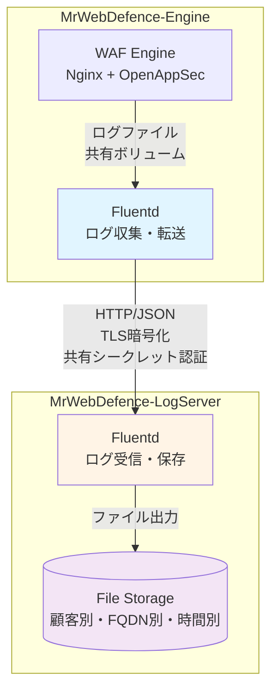
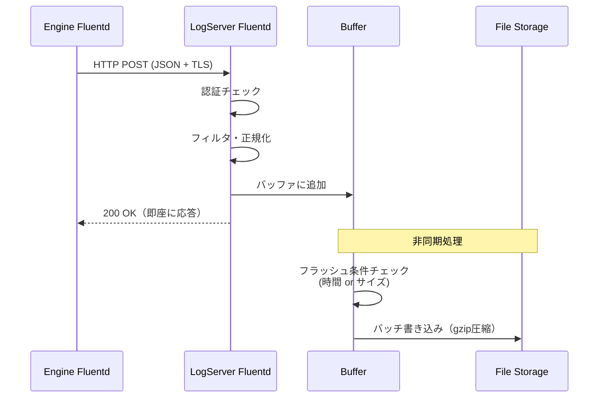

# Task 8.1: ログ収集機能実装 - 設計書（Fluentdベース）

**Issue**: MWD-53  
**作成日**: 2026-02-17  
**更新日**: 2026-02-17 (Fluentdベース設計)  
**ステータス**: Design Phase

---

## 📋 目次

1. [概要](#概要)
2. [技術選定の理由](#技術選定の理由)
3. [参照設計書](#参照設計書)
4. [システムアーキテクチャ](#システムアーキテクチャ)
5. [Fluentd設定設計](#fluentd設定設計)
6. [ファイルストレージ設計](#ファイルストレージ設計)
7. [セキュリティ設計](#セキュリティ設計)
8. [運用設計](#運用設計)
9. [実装計画](#実装計画)
10. [テスト計画](#テスト計画)
11. [非機能要件](#非機能要件)

---

## 概要

### なぜやるか

WAFエンジン（MrWebDefence-Engine）から転送されるログを受信し、正規化・保存する機能が必要。

### 何をやるか

- **Fluentd受信サーバーの構築**（Engine Fluentdからのログ受信）
- **ログ正規化・フィルタリング設定**（Fluentdプラグイン）
- **ファイルストレージ設定**（顧客別・FQDN別・時間別）
- **認証・暗号化対応**（TLS、共有シークレット）

### 受け入れ条件

- [ ] Engine FluentdからLogServer Fluentdへのログ転送が正常に動作する
- [ ] ログが正しいディレクトリ構造で保存される（顧客別・FQDN別・時間別）
- [ ] TLS暗号化通信が動作する
- [ ] 認証機能が動作する
- [ ] ログローテーション・圧縮が動作する

---

## 技術選定の理由

### Fluentdを選択した理由

| 観点 | Fluentd | Python/FastAPI（旧設計） |
|------|---------|-------------------------|
| **実装の複雑性** | ✅ 設定ファイルのみ | ❌ コード開発・テスト・デバッグが必要 |
| **車輪の再発明** | ✅ 既存機能を活用 | ❌ バッファリング・リトライ・ファイル出力を再実装 |
| **運用負荷** | ✅ 低（設定変更のみ） | ❌ 高（デプロイ・依存関係管理・監視） |
| **パフォーマンス** | ✅ C実装、高速・低メモリ | ⚠️ Python、メモリ効率が低い |
| **実績** | ✅ 大規模本番環境で実績豊富 | ⚠️ 自社開発のため実績なし |
| **拡張性** | ✅ プラグイン豊富（ES、S3等） | ⚠️ 自社で実装が必要 |
| **統一性** | ✅ Engine側もFluentd | ⚠️ 異なる技術スタック |
| **カスタムロジック** | ⚠️ Rubyプラグインが必要 | ✅ 自由に実装可能 |

### 結論

**LogServerはFluentdで構築する**

**理由**:
1. **シンプル**: ログ収集・保存のみの機能であり、カスタムビジネスロジックは不要
2. **実績**: 枯れた技術で本番環境での信頼性が高い
3. **保守性**: 設定ファイルのみで管理でき、長期的な保守が容易
4. **一貫性**: Engine側もFluentdなので、設定・運用ノウハウを共有できる

**将来の拡張方針**:
- ログ分析機能は別サービス（API Server）で実装
- Fluentdは「ログ収集基盤」として堅牢に構築
- 必要に応じてFluentdプラグイン（Ruby）でカスタム処理を追加

---

## 参照設計書

本設計は、MrWebDefence-Engineのログ転送設計と連携します：

- **[MWD-40: Fluentd設定ファイルのモジュール化計画](https://github.com/kencom2400/MrWebDefence-Engine/blob/main/docs/design/MWD-40-fluentd-modularization-plan.md)**
  - Engine側のFluentd設定構造
  - label/includeを使ったモジュール化方針
  
- **[MWD-40: ログ転送機能実装 実装設計書](https://github.com/kencom2400/MrWebDefence-Engine/blob/main/docs/design/MWD-40-implementation-plan.md)**
  - ログ形式、タグ設計
  - メタデータ構造（customer_name、fqdn、year/month/day/hour等）
  - 転送エンドポイント仕様
  
- **[MWD-40: ログ連携方法比較検討](https://github.com/kencom2400/MrWebDefence-Engine/blob/main/docs/design/MWD-40-log-integration-analysis.md)**
  - 共有ボリューム方式 vs ログドライバ方式
  - 推奨方式: 共有ボリューム方式（デフォルト）

---

## システムアーキテクチャ

### 全体構成



### コンポーネント

| コンポーネント | 役割 | 実装 |
|---|---|---|
| **Engine Fluentd** | ログ収集・前処理・転送 | 既存（MWD-40で実装済み）|
| **LogServer Fluentd** | ログ受信・正規化・保存 | **今回実装** |
| **File Storage** | ログファイル永続化 | ファイルシステム |

### データフロー



---

## Fluentd設定設計

### ディレクトリ構造

```
config/fluentd/
├── fluent.conf                 # メイン設定ファイル
├── conf.d/
│   ├── 01-source.conf         # 入力設定（HTTP受信）
│   ├── 02-filter.conf         # フィルタ・正規化
│   └── 03-output.conf         # 出力設定（ファイル）
└── plugins/
    └── (将来のカスタムプラグイン)
```

### 1. メイン設定ファイル（fluent.conf）

```xml
# Fluentd Configuration for MrWebDefence-LogServer
# Version: 1.0
# Updated: 2026-02-17

# ログレベル
<system>
  log_level info
  workers 2
</system>

# 設定ファイルの読み込み
@include conf.d/*.conf
```

### 2. 入力設定（01-source.conf）

Engine FluentdからHTTP経由でログを受信：

```xml
# ログ受信エンドポイント
<source>
  @type http
  @id input_http_logserver
  
  # バインド設定
  port 8888
  bind 0.0.0.0
  
  # TLS暗号化
  <transport tls>
    version TLSv1_3,TLSv1_2
    ciphers ECDHE-RSA-AES256-GCM-SHA384:ECDHE-RSA-AES128-GCM-SHA256:ECDHE-ECDSA-AES256-GCM-SHA384:ECDHE-ECDSA-AES128-GCM-SHA256
    
    # サーバー証明書
    cert_path /etc/fluentd/certs/logserver.crt
    private_key_path /etc/fluentd/certs/logserver.key
    
    # クライアント証明書検証（mTLS）
    client_cert_auth true
    ca_path /etc/fluentd/certs/ca.crt
  </transport>
  
  # パース設定
  <parse>
    @type json
    time_key time
    time_format %Y-%m-%dT%H:%M:%S%z
    keep_time_key true
  </parse>
  
  # レート制限（DoS対策）
  add_http_headers true
  add_remote_addr true
  
  # Body size制限（10MB）
  body_size_limit 10m
  keepalive_timeout 10s
  
  # 共有シークレット認証
  <security>
    self_hostname logserver-01
    shared_key "#{ENV['FLUENTD_SHARED_KEY']}"
  </security>
</source>

# モニタリング用エンドポイント
<source>
  @type monitor_agent
  @id input_monitor_agent
  bind 0.0.0.0
  port 24220
</source>

# Prometheusメトリクス
<source>
  @type prometheus
  @id input_prometheus
  bind 0.0.0.0
  port 24231
  metrics_path /metrics
</source>

# ヘルスチェック用エンドポイント
<source>
  @type http
  @id input_http_healthcheck
  port 8889
  bind 127.0.0.1
  
  <parse>
    @type none
  </parse>
</source>
```

### 3. フィルタ設定（02-filter.conf）

受信したログを正規化し、メタデータを追加：

```xml
# 全ログ共通の処理
<filter **>
  @type record_transformer
  @id filter_add_metadata
  enable_ruby true
  
  <record>
    # LogServer側のメタデータを追加
    received_at ${Time.now.utc.strftime('%Y-%m-%dT%H:%M:%S.%LZ')}
    logserver_hostname ${Socket.gethostname}
    
    # タイムスタンプの正規化（存在しない場合は現在時刻）
    normalized_time ${record["time"] || Time.now.utc.strftime('%Y-%m-%dT%H:%M:%S.%LZ')}
  </record>
</filter>

# Nginxログのフィルタリング
<filter nginx.**>
  @type record_transformer
  @id filter_nginx
  enable_ruby true
  
  <record>
    # ログタイプの確認
    log_type ${record["log_type"] || "nginx"}
    
    # 必須フィールドの検証（存在しない場合はプレースホルダー）
    customer_name ${record["customer_name"] || "unknown"}
    fqdn ${record["fqdn"] || "unknown"}
    
    # Path Traversal対策（危険な文字列を除去）
    safe_customer_name ${(record["customer_name"] || "unknown").gsub(/[^a-zA-Z0-9_-]/, '_')}
    safe_fqdn ${(record["fqdn"] || "unknown").gsub(/[^a-zA-Z0-9._-]/, '_')}
  </record>
</filter>

# OpenAppSecログのフィルタリング
<filter openappsec.**>
  @type record_transformer
  @id filter_openappsec
  enable_ruby true
  
  <record>
    log_type ${record["log_type"] || "openappsec"}
    customer_name ${record["customer_name"] || "unknown"}
    fqdn ${record["fqdn"] || "unknown"}
    safe_customer_name ${(record["customer_name"] || "unknown").gsub(/[^a-zA-Z0-9_-]/, '_')}
    safe_fqdn ${(record["fqdn"] || "unknown").gsub(/[^a-zA-Z0-9._-]/, '_')}
    
    # セキュリティイベントの重要度マッピング
    severity ${record["severity"] || "info"}
  </record>
</filter>

# 不正なログを除外（customer_nameやfqdnが不明なもの）
<filter **>
  @type grep
  @id filter_exclude_invalid
  
  <exclude>
    key customer_name
    pattern /^unknown$/
  </exclude>
  
  <exclude>
    key fqdn
    pattern /^unknown$/
  </exclude>
</filter>
```

### 4. 出力設定（03-output.conf）

顧客別・FQDN別・時間別にファイル出力。共通設定をlabelでまとめてDRYに保つ：

```xml
# ログをストレージラベルにルーティング
<match {nginx,openappsec}.**>
  @type relabel
  @label @log_storage
</match>

# 共通のファイルストレージ設定
<label @log_storage>
  <match **>
    @type file
    @id output_file_storage
    
    # 動的なファイルパス: /var/log/mrwebdefence/{customer_name}/{log_type}/{fqdn}/{year}/{month}/{day}/{hour}.log.gz
    # tag_parts[0] で "nginx" または "openappsec" を取得
    path /var/log/mrwebdefence/${safe_customer_name}/${log_type}/${safe_fqdn}/%Y/%m/%d/%H
    path_suffix ".log"
    
    # バッファ設定（共通）
    <buffer safe_customer_name,log_type,safe_fqdn,time>
      @type file
      path /var/log/fluentd/buffer/storage
      
      # 時間ベースのチャンキング（1時間ごと）
      timekey 1h
      timekey_wait 10s
      timekey_use_utc true
      timekey_zone "+0900"
      
      # バッファサイズ制限（DoS対策）
      chunk_limit_size 256m
      total_limit_size 2g
      
      # フラッシュ設定
      flush_mode interval
      flush_interval 10s
      flush_at_shutdown true
      flush_thread_count 2
      
      # リトライ設定
      retry_type exponential_backoff
      retry_timeout 1h
      retry_max_interval 30s
      retry_wait 10s
      
      # オーバーフロー時の動作
      overflow_action block
    </buffer>
    
    # ファイル出力形式（JSON Lines）
    <format>
      @type json
    </format>
    
    # ファイル圧縮
    compress gzip
    
    # タイムスタンプ挿入
    <inject>
      time_key timestamp
      time_type string
      time_format %Y-%m-%dT%H:%M:%S.%LZ
      timezone UTC
    </inject>
  </match>
</label>

# 処理できなかったログを別ファイルに出力（デバッグ用）
<match **>
  @type file
  @id output_unmatched
  
  path /var/log/fluentd/unmatched/unmatched
  path_suffix ".log"
  
  <buffer time>
    @type file
    path /var/log/fluentd/buffer/unmatched
    timekey 1h
    timekey_wait 10s
    flush_interval 10s
  </buffer>
  
  <format>
    @type json
  </format>
</match>
```

---

## ファイルストレージ設計

### ディレクトリ構造

Engine側の設計と同じ構造を採用：

```
/var/log/mrwebdefence/
├── {customer_name}/              # 顧客名（サニタイズ済み）
│   ├── nginx/                    # ログタイプ
│   │   └── {fqdn}/              # FQDN（サニタイズ済み）
│   │       └── 2026/            # 年
│   │           └── 02/          # 月
│   │               └── 17/      # 日
│   │                   ├── 00.log.gz  # 時間（00-23）
│   │                   ├── 01.log.gz
│   │                   └── ...
│   └── openappsec/
│       └── {fqdn}/
│           └── ...

# バッファディレクトリ
/var/log/fluentd/buffer/
├── storage/               # 共通バッファ（チャンクキーでデータを分離）
└── unmatched/            # 処理できなかったログのバッファ

# 処理できなかったログ
/var/log/fluentd/unmatched/
```

### ファイル命名規則

| 要素 | 形式 | 例 |
|------|------|-----|
| **顧客名** | `[a-zA-Z0-9_-]+` | `customer-a` |
| **FQDN** | `[a-zA-Z0-9._-]+` | `example.com` |
| **年** | `YYYY` | `2026` |
| **月** | `MM` | `02` |
| **日** | `DD` | `17` |
| **時** | `HH` | `13` |
| **ファイル名** | `HH.log.gz` | `13.log.gz` |

### ファイルローテーション

**自動ローテーション**: Fluentdの`timekey`で1時間ごとに自動分割

- **分割間隔**: 1時間（`timekey 1h`）
- **待機時間**: 10秒（`timekey_wait 10s`）
- **圧縮**: gzip（`compress gzip`）
- **タイムゾーン**: JST（`timekey_zone "+0900"`）

---

## セキュリティ設計

### 1. TLS暗号化（mTLS）

Engine Fluentd ↔ LogServer Fluentd間の通信を相互TLS（mTLS）で暗号化：

```xml
<source>
  @type http
  <transport tls>
    version TLSv1_3,TLSv1_2
    ciphers ECDHE-RSA-AES256-GCM-SHA384:ECDHE-RSA-AES128-GCM-SHA256:ECDHE-ECDSA-AES256-GCM-SHA384:ECDHE-ECDSA-AES128-GCM-SHA256
    
    # サーバー証明書
    cert_path /etc/fluentd/certs/logserver.crt
    private_key_path /etc/fluentd/certs/logserver.key
    
    # クライアント証明書検証（mTLS）
    client_cert_auth true
    ca_path /etc/fluentd/certs/ca.crt
  </transport>
</source>
```

### 2. 共有シークレット認証

```xml
<source>
  @type http
  <security>
    self_hostname logserver-01
    shared_key "#{ENV['FLUENTD_SHARED_KEY']}"
  </security>
</source>
```

Engine側の設定：

```xml
<match **>
  @type http
  endpoint https://logserver:8888/
  
  <auth>
    method shared_key
    shared_key "#{ENV['FLUENTD_SHARED_KEY']}"
  </auth>
</match>
```

### 3. Path Traversal対策

Fluentdのfilterで危険な文字列をサニタイズ：

```ruby
safe_customer_name ${(record["customer_name"] || "unknown").gsub(/[^a-zA-Z0-9_-]/, '_')}
safe_fqdn ${(record["fqdn"] || "unknown").gsub(/[^a-zA-Z0-9._-]/, '_')}
```

**除去される文字列**:
- `../`、`..\`
- `/`、`\`（パス区切り文字）
- 制御文字、特殊文字

### 4. DoS対策

| 対策 | 設定 | 説明 |
|------|------|------|
| **Body size制限** | `body_size_limit 10m` | リクエストサイズを10MBに制限 |
| **バッファ制限** | `total_limit_size 2g` | 総バッファサイズを2GBに制限 |
| **チャンク制限** | `chunk_limit_size 256m` | 単一チャンクを256MBに制限 |
| **オーバーフロー** | `overflow_action block` | バッファ満杯時はリクエストをブロック |
| **接続タイムアウト** | `keepalive_timeout 10s` | 接続を10秒でタイムアウト |

### 5. 入力検証

不正なログを除外：

```xml
<filter **>
  @type grep
  @id filter_exclude_invalid
  
  <exclude>
    key customer_name
    pattern /^unknown$/
  </exclude>
  
  <exclude>
    key fqdn
    pattern /^unknown$/
  </exclude>
</filter>
```

---

## 運用設計

### 1. ログアーカイブ

古いログを定期的にアーカイブ・削除（cronで実行）：

**スクリプト**: `scripts/archive-logs.sh`

```bash
#!/bin/bash
# ログアーカイブスクリプト
# 
# 実行: cron daily

set -euo pipefail

# 設定
LOG_BASE_DIR="/var/log/mrwebdefence"
ARCHIVE_DAYS=30
DELETE_DAYS=90

# 30日以上前のログをS3にアーカイブ（オプション）
if command -v aws &> /dev/null; then
  echo "Archiving logs older than ${ARCHIVE_DAYS} days to S3..."
  find "${LOG_BASE_DIR}" -name "*.log.gz" -mtime +${ARCHIVE_DAYS} -type f -print0 | \
    while IFS= read -r -d '' file; do
      relative_path="${file#${LOG_BASE_DIR}/}"
      aws s3 cp "${file}" "s3://mrwebdefence-logs-archive/${relative_path}" && \
        echo "Archived: ${file}"
    done
fi

# 90日以上前のログを削除
echo "Deleting logs older than ${DELETE_DAYS} days..."
find "${LOG_BASE_DIR}" -name "*.log.gz" -mtime +${DELETE_DAYS} -type f -delete

# 空のディレクトリを削除
find "${LOG_BASE_DIR}" -type d -empty -delete

echo "Log archive completed."
```

### 2. モニタリング

**Prometheusメトリクス**:
- `fluentd_input_status_num_records_total`: 受信ログ数
- `fluentd_output_status_num_records_total`: 出力ログ数
- `fluentd_output_status_buffer_total_bytes`: バッファサイズ
- `fluentd_output_status_retry_count`: リトライ回数

**ヘルスチェック**:
```bash
# Fluentdのヘルスチェック
curl http://localhost:8889/health

# Prometheusメトリクス取得
curl http://localhost:24231/metrics
```

### 3. ログローテーション

**自動**: Fluentdの`timekey`で1時間ごとに自動分割

**手動**: Fluentdの再起動不要、自動的にバッファをフラッシュ

```bash
# Fluentdにシグナルを送ってバッファをフラッシュ
docker exec fluentd kill -USR1 1
```

---

## 実装計画

### Phase 1: Fluentd設定ファイル作成

**タスク**:
1. ディレクトリ構造の作成
2. `fluent.conf` の作成
3. `01-source.conf` の作成
4. `02-filter.conf` の作成
5. `03-output.conf` の作成

**成果物**:
- `config/fluentd/fluent.conf`
- `config/fluentd/conf.d/01-source.conf`
- `config/fluentd/conf.d/02-filter.conf`
- `config/fluentd/conf.d/03-output.conf`

### Phase 2: Docker環境構築

**タスク**:
1. Dockerfileの作成（Fluentd公式イメージベース）
2. docker-compose.ymlの作成
3. 環境変数ファイル（.env.example）の作成

**成果物**:
- `Dockerfile`
- `docker-compose.yml`
- `.env.example`

### Phase 3: 証明書・認証設定

**タスク**:
1. 自己署名証明書生成スクリプトの作成
2. 共有シークレットの設定方法をドキュメント化
3. mTLS設定のテスト

**成果物**:
- `scripts/generate-certs.sh`
- `docs/setup/ssl-setup.md`

### Phase 4: 運用スクリプト

**タスク**:
1. ログアーカイブスクリプトの作成
2. ヘルスチェックスクリプトの作成
3. モニタリング設定のドキュメント化

**成果物**:
- `scripts/archive-logs.sh`
- `scripts/healthcheck.sh`
- `docs/operations/monitoring.md`

### Phase 5: テスト

**タスク**:
1. 設定ファイルの検証
2. ログ送信テスト（curlでHTTP POST）
3. E2Eテスト（Engine Fluentdからの実際の転送）

**成果物**:
- テスト結果のドキュメント
- `tests/integration/test-log-transfer.sh`

---

## テスト計画

### 1. 設定ファイル検証

```bash
# Fluentd設定ファイルの文法チェック
docker run --rm \
  -v $(pwd)/config/fluentd:/fluentd/etc \
  fluent/fluentd:v1.16-1 \
  fluentd --dry-run -c /fluentd/etc/fluent.conf
```

### 2. ログ送信テスト

```bash
# curlでログを送信
curl -X POST https://localhost:8888/nginx.access \
  -H "Content-Type: application/json" \
  -H "X-Shared-Key: ${FLUENTD_SHARED_KEY}" \
  --cacert certs/ca.crt \
  --cert certs/engine-client.crt \
  --key certs/engine-client.key \
  -d '{
    "time": "2026-02-17T10:00:00+09:00",
    "log_type": "nginx",
    "hostname": "waf-engine-01",
    "fqdn": "example.com",
    "customer_name": "test-customer",
    "remote_addr": "192.168.1.100",
    "request": "GET /api/users HTTP/1.1",
    "status": 200
  }'
```

### 3. ファイル出力確認

```bash
# ログファイルが正しく作成されているか確認
ls -la /var/log/mrwebdefence/test-customer/nginx/example.com/2026/02/17/

# ログ内容の確認
zcat /var/log/mrwebdefence/test-customer/nginx/example.com/2026/02/17/10.log.gz | jq .
```

### 4. E2Eテスト

**前提条件**:
- Engine FluentdからLogServer Fluentdへの接続が確立されている
- TLS証明書が正しく設定されている

**テストシナリオ**:
1. Engine側でテストログを生成
2. Engine FluentdからLogServer Fluentdへ転送
3. LogServer側でファイルが作成されることを確認
4. ファイル内容が正しいことを確認

### 5. パフォーマンステスト

```bash
# Apache Benchでログ送信負荷テスト
ab -n 10000 -c 100 \
  -T 'application/json' \
  -p test-log.json \
  -H "X-Shared-Key: ${FLUENTD_SHARED_KEY}" \
  https://localhost:8888/nginx.access
```

---

## 非機能要件

### パフォーマンス

| 項目 | 目標値 | 測定方法 |
|------|--------|----------|
| **スループット** | 10,000 logs/sec | Apache Bench |
| **レイテンシ** | < 100ms（P95） | Prometheusメトリクス |
| **メモリ使用量** | < 512MB | `docker stats` |
| **CPU使用率** | < 50%（平常時） | `docker stats` |

### 可用性

| 項目 | 目標値 | 実装方法 |
|------|--------|----------|
| **稼働率** | 99.9% | Docker restart policy |
| **MTTR** | < 5分 | 自動再起動 + アラート |
| **データ損失** | 0件 | バッファ永続化 + リトライ |

### スケーラビリティ

- **水平スケーリング**: 複数LogServerインスタンス + ロードバランサー
- **垂直スケーリング**: メモリ・CPU増強でスループット向上
- **バッファ拡張**: ディスクバッファで大量ログに対応

### セキュリティ

| 項目 | 実装 |
|------|------|
| **通信暗号化** | TLS 1.2以上（mTLS） |
| **認証** | 共有シークレット |
| **入力検証** | フィルタでサニタイズ |
| **Path Traversal対策** | 危険な文字列を除去 |
| **DoS対策** | バッファ制限 + レート制限 |

---

## Engine側との連携仕様

### Engine側の設定例

Engine側のFluentd設定で、LogServerへの転送を設定：

```xml
# Engine側: LogServerへの転送
<match {nginx,openappsec}.**>
  @type http
  @id output_to_logserver
  
  endpoint https://logserver:8888/
  
  # TLS設定
  <transport tls>
    cert_path /etc/fluentd/certs/engine-client.crt
    private_key_path /etc/fluentd/certs/engine-client.key
    ca_path /etc/fluentd/certs/ca.crt
  </transport>
  
  # 認証
  <auth>
    method shared_key
    shared_key "#{ENV['FLUENTD_SHARED_KEY']}"
  </auth>
  
  # バッファ設定
  <buffer>
    @type file
    path /var/log/fluentd/buffer/to_logserver
    
    flush_interval 5s
    flush_at_shutdown true
    
    retry_type exponential_backoff
    retry_max_interval 30s
    retry_timeout 1h
  </buffer>
  
  # フォーマット
  <format>
    @type json
  </format>
  
  # Keep-Alive
  keepalive true
  keepalive_timeout 10s
</match>
```

---

## 実装チェックリスト

### Phase 1: 基本設定

- [ ] Fluentd設定ファイルの作成（fluent.conf）
- [ ] 入力設定の作成（01-source.conf）
- [ ] フィルタ設定の作成（02-filter.conf）
- [ ] 出力設定の作成（03-output.conf）

### Phase 2: Docker環境

- [ ] Dockerfileの作成
- [ ] docker-compose.ymlの作成
- [ ] .env.exampleの作成
- [ ] .dockerignoreの作成

### Phase 3: セキュリティ

- [ ] 証明書生成スクリプトの作成
- [ ] mTLS設定のドキュメント作成
- [ ] 共有シークレット設定のドキュメント作成

### Phase 4: 運用

- [ ] ログアーカイブスクリプトの作成
- [ ] ヘルスチェックスクリプトの作成
- [ ] モニタリング設定のドキュメント作成

### Phase 5: テスト

- [ ] 設定ファイルの検証テスト
- [ ] ログ送信テスト（curl）
- [ ] E2Eテスト（Engine連携）
- [ ] パフォーマンステスト

### Phase 6: ドキュメント

- [ ] README更新
- [ ] セットアップガイド作成
- [ ] 運用マニュアル作成
- [ ] トラブルシューティングガイド作成

---

## 参考資料

### Fluentdドキュメント

- [Fluentd公式ドキュメント](https://docs.fluentd.org/)
- [HTTP Input Plugin](https://docs.fluentd.org/input/http)
- [File Output Plugin](https://docs.fluentd.org/output/file)
- [Record Transformer Filter](https://docs.fluentd.org/filter/record_transformer)
- [Fluentd Security](https://docs.fluentd.org/deployment/security)
- [Transport Section (TLS)](https://docs.fluentd.org/configuration/transport-section)

### Engine側設計書

- [MWD-40: Fluentd設定ファイルのモジュール化計画](https://github.com/kencom2400/MrWebDefence-Engine/blob/main/docs/design/MWD-40-fluentd-modularization-plan.md)
- [MWD-40: ログ転送機能実装 実装設計書](https://github.com/kencom2400/MrWebDefence-Engine/blob/main/docs/design/MWD-40-implementation-plan.md)
- [MWD-40: ログ連携方法比較検討](https://github.com/kencom2400/MrWebDefence-Engine/blob/main/docs/design/MWD-40-log-integration-analysis.md)

---

## 付録

### A. 環境変数

| 変数名 | 説明 | 例 |
|--------|------|-----|
| `FLUENTD_SHARED_KEY` | 共有シークレット | `your-secure-shared-key-here` |
| `FLUENTD_LOG_LEVEL` | ログレベル | `info` |
| `FLUENTD_WORKERS` | ワーカー数 | `2` |

### B. ポート一覧

| ポート | 用途 | プロトコル |
|--------|------|-----------|
| `8888` | ログ受信（TLS） | HTTPS |
| `8889` | ヘルスチェック | HTTP |
| `24220` | モニタリング | HTTP |
| `24231` | Prometheusメトリクス | HTTP |

### C. ファイルパーミッション

```bash
# Fluentd設定ファイル
chmod 644 config/fluentd/*.conf

# 証明書・秘密鍵
chmod 600 certs/*.key
chmod 644 certs/*.crt

# スクリプト
chmod 755 scripts/*.sh

# ログディレクトリ
chown -R fluent:fluent /var/log/mrwebdefence
chmod 755 /var/log/mrwebdefence
```
