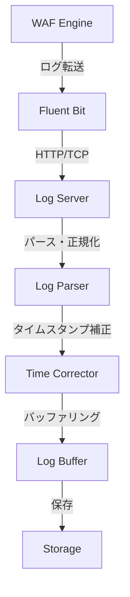
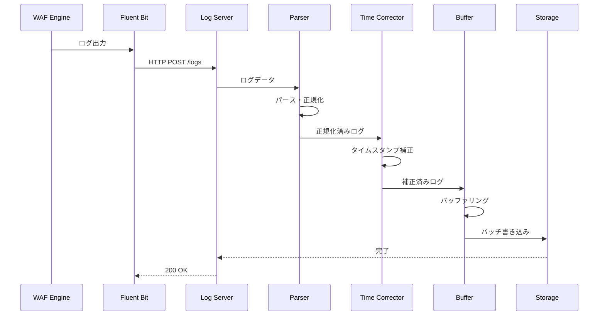
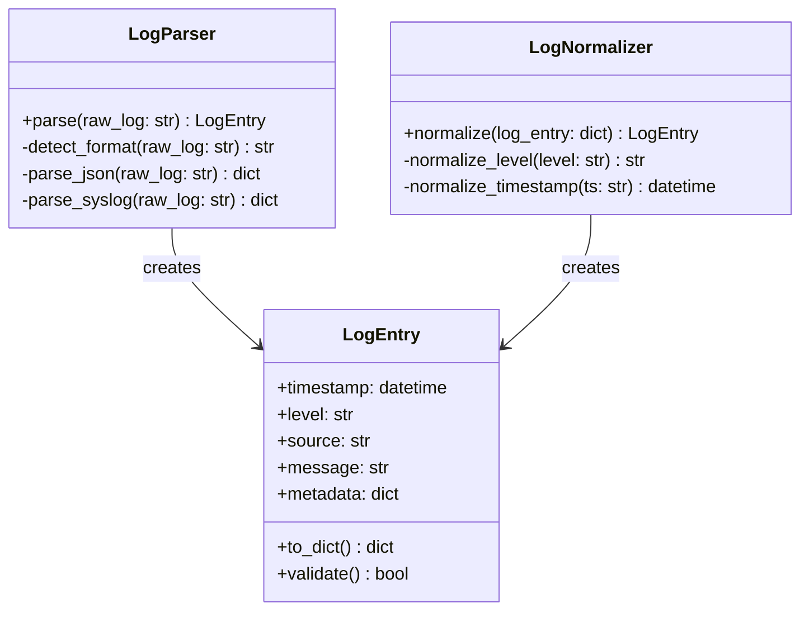
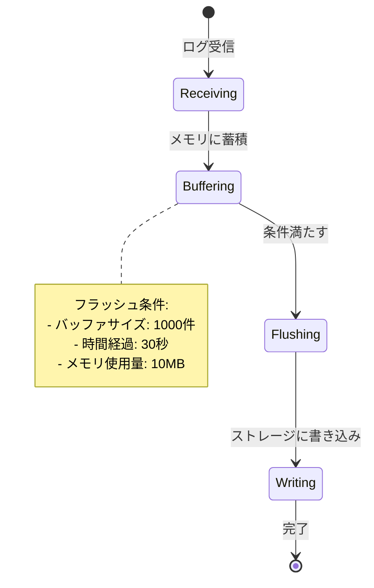

# Task 8.1: ログ収集機能実装 - 設計書

**Issue**: MWD-53  
**作成日**: 2026-02-17  
**ステータス**: In Progress

---

## 📋 目次

1. [概要](#概要)
2. [システムアーキテクチャ](#システムアーキテクチャ)
3. [ログ収集フロー](#ログ収集フロー)
4. [コンポーネント設計](#コンポーネント設計)
5. [データ構造](#データ構造)
6. [実装計画](#実装計画)
7. [テスト計画](#テスト計画)

---

## 概要

### なぜやるか

WAFエンジンから転送されるログを受信し、パース・正規化する機能が必要。

### 何をやるか

- Fluentd/Fluent Bit設定実装
- ログ受信エンドポイント実装（HTTP、TCP）
- ログパース・正規化ロジック実装
- ログタイムスタンプ補正機能実装
- ログバッファリング機能実装

### 受け入れ条件

- [ ] Fluentd/Fluent Bitが正常に動作する
- [ ] ログ受信エンドポイントが正常に動作する
- [ ] ログパース・正規化が正常に動作する
- [ ] ログタイムスタンプ補正が正常に動作する
- [ ] ログバッファリングが正常に動作する

---

## システムアーキテクチャ

### 全体構成



### 技術スタック

- **ログ収集**: Fluentd / Fluent Bit
- **受信エンドポイント**: Python (FastAPI / Flask) または Go
- **データ処理**: Python / Go
- **ストレージ**: File System（初期）/ Database（将来）

---

## ログ収集フロー

### シーケンス図



### フロー説明

1. **ログ転送**: WAFエンジンがFluentd/Fluent Bitにログを出力
2. **ログ受信**: Log ServerがHTTP/TCPでログを受信
3. **パース**: ログ形式（JSON、Syslog等）をパース
4. **正規化**: 共通フォーマットに変換
5. **タイムスタンプ補正**: タイムゾーン変換、欠損補完
6. **バッファリング**: メモリ上で一時保持
7. **永続化**: ストレージに保存

---

## コンポーネント設計

### 1. Fluent Bit設定

#### 設定ファイル構成

```
config/
├── fluent-bit.conf        # メイン設定
├── parsers.conf           # パーサー定義
└── plugins.conf           # プラグイン設定（オプション）
```

#### fluent-bit.conf 基本構成

```ini
[SERVICE]
    Flush        1
    Daemon       off
    Log_Level    info
    Parsers_File parsers.conf

[INPUT]
    Name     forward
    Listen   0.0.0.0
    Port     24224

[INPUT]
    Name     tail
    Path     /var/log/waf/*.log
    Tag      waf.*
    Parser   json

[OUTPUT]
    Name     http
    Match    *
    Host     log-server
    Port     8080
    URI      /api/logs
    Format   json
```

#### parsers.conf

```ini
[PARSER]
    Name        json
    Format      json
    Time_Key    timestamp
    Time_Format %Y-%m-%dT%H:%M:%S.%L%z

[PARSER]
    Name        syslog
    Format      regex
    Regex       ^<(?<pri>[0-9]+)>(?<time>[^ ]*) (?<host>[^ ]*) (?<ident>[^ ]*) (?<message>.*)$
    Time_Key    time
    Time_Format %b %d %H:%M:%S
```

### 2. Log Server（受信エンドポイント）

#### APIエンドポイント設計

**POST /api/logs**

リクエスト:
```json
{
  "timestamp": "2026-02-17T13:30:00.123+09:00",
  "level": "info",
  "source": "waf-engine-01",
  "message": "HTTP request blocked",
  "metadata": {
    "client_ip": "192.168.1.100",
    "request_uri": "/admin/login",
    "rule_id": "WAF-001"
  }
}
```

レスポンス:
```json
{
  "status": "success",
  "received": 1,
  "timestamp": "2026-02-17T13:30:00.456+09:00"
}
```

#### TCPエンドポイント設計

- **ポート**: 5140（Syslog互換）
- **プロトコル**: TCP
- **フォーマット**: Syslog RFC5424 / JSON

### 3. Log Parser

#### クラス設計



#### 対応するログ形式

1. **JSON形式**
   - Fluent Bit forward protocol
   - カスタムJSON

2. **Syslog形式**
   - RFC3164 (BSD Syslog)
   - RFC5424 (Syslog Protocol)

3. **プレーンテキスト**
   - タイムスタンプ付き
   - タイムスタンプなし（受信時刻を使用）

### 4. Time Corrector（タイムスタンプ補正）

#### 補正ロジック

```python
def correct_timestamp(log_entry):
    """
    タイムスタンプを補正する
    
    1. タイムゾーン情報がない場合はUTCと仮定
    2. タイムスタンプがない場合は受信時刻を使用
    3. 未来のタイムスタンプは受信時刻に補正
    4. 古すぎるタイムスタンプ（7日以上前）は警告
    """
    if log_entry.timestamp is None:
        log_entry.timestamp = datetime.now(timezone.utc)
        log_entry.metadata['timestamp_source'] = 'server'
        return log_entry
    
    # タイムゾーン情報の補完
    if log_entry.timestamp.tzinfo is None:
        log_entry.timestamp = log_entry.timestamp.replace(tzinfo=timezone.utc)
        log_entry.metadata['timezone_assumed'] = True
    
    # 未来のタイムスタンプチェック
    now = datetime.now(timezone.utc)
    if log_entry.timestamp > now + timedelta(minutes=5):
        log_entry.metadata['timestamp_corrected'] = True
        log_entry.metadata['original_timestamp'] = log_entry.timestamp.isoformat()
        log_entry.timestamp = now
    
    # 古すぎるタイムスタンプの警告
    if log_entry.timestamp < now - timedelta(days=7):
        log_entry.metadata['timestamp_warning'] = 'old_timestamp'
    
    return log_entry
```

### 5. Log Buffer（バッファリング）

#### バッファリング戦略



#### 実装方針

- **メモリバッファ**: 最大1000件または10MB
- **フラッシュタイミング**: 
  - バッファ満杯時
  - 30秒経過時
  - シャットダウン時
- **バックプレッシャー**: バッファ満杯時は新規ログを拒否（HTTP 503）

---

## データ構造

### 正規化後のログエントリ

```python
@dataclass
class LogEntry:
    """正規化後のログエントリ"""
    
    # 必須フィールド
    timestamp: datetime      # UTCタイムスタンプ
    level: str              # ログレベル (debug, info, warning, error, critical)
    message: str            # ログメッセージ
    
    # オプションフィールド
    source: Optional[str] = None          # ログソース (例: waf-engine-01)
    facility: Optional[str] = None        # ファシリティ (例: security, system)
    hostname: Optional[str] = None        # ホスト名
    process_id: Optional[int] = None      # プロセスID
    
    # メタデータ
    metadata: dict = field(default_factory=dict)
    
    # 内部管理
    received_at: datetime = field(default_factory=lambda: datetime.now(timezone.utc))
    log_id: str = field(default_factory=lambda: str(uuid.uuid4()))
```

### ストレージフォーマット

#### ファイルベース（初期実装）

```
logs/
├── 2026/
│   ├── 02/
│   │   ├── 17/
│   │   │   ├── waf-engine-01-13.log    # 13時台のログ
│   │   │   ├── waf-engine-01-14.log    # 14時台のログ
│   │   │   └── ...
```

ファイル形式: JSON Lines（1行1ログエントリ）

```jsonl
{"timestamp":"2026-02-17T13:30:00.123Z","level":"info","source":"waf-engine-01","message":"HTTP request blocked","metadata":{"client_ip":"192.168.1.100"}}
{"timestamp":"2026-02-17T13:30:01.234Z","level":"warning","source":"waf-engine-01","message":"Rate limit exceeded","metadata":{"client_ip":"192.168.1.100"}}
```

---

## 実装計画

### Phase 1: 基本構造の実装

#### 1.1 プロジェクト構造作成

```
MrWebDefence-LogServer/
├── src/
│   ├── server/          # Webサーバー
│   │   ├── __init__.py
│   │   ├── app.py       # FastAPI/Flask アプリケーション
│   │   └── routes.py    # APIエンドポイント
│   ├── parser/          # ログパーサー
│   │   ├── __init__.py
│   │   ├── log_parser.py
│   │   ├── normalizer.py
│   │   └── formats/     # 各形式のパーサー
│   │       ├── json_parser.py
│   │       ├── syslog_parser.py
│   │       └── text_parser.py
│   ├── corrector/       # タイムスタンプ補正
│   │   ├── __init__.py
│   │   └── time_corrector.py
│   ├── buffer/          # バッファリング
│   │   ├── __init__.py
│   │   └── log_buffer.py
│   └── storage/         # ストレージ
│       ├── __init__.py
│       ├── file_storage.py
│       └── db_storage.py (将来)
├── config/
│   ├── fluent-bit.conf
│   ├── parsers.conf
│   └── server.yaml
├── tests/
│   ├── unit/
│   ├── integration/
│   └── fixtures/
├── requirements.txt
├── pyproject.toml
└── README.md
```

#### 1.2 依存関係

```toml
[tool.poetry.dependencies]
python = "^3.12"
fastapi = "^0.109.0"
uvicorn = "^0.27.0"
pydantic = "^2.6.0"
python-dateutil = "^2.8.2"
pyyaml = "^6.0.1"

[tool.poetry.dev-dependencies]
pytest = "^8.0.0"
pytest-asyncio = "^0.23.0"
black = "^24.1.0"
flake8 = "^7.0.0"
mypy = "^1.8.0"
```

### Phase 2: ログ受信エンドポイント実装

#### 2.1 HTTP エンドポイント

```python
from fastapi import FastAPI, Request, HTTPException
from pydantic import BaseModel
from typing import List, Dict, Any
from datetime import datetime

app = FastAPI()

class LogEntryRequest(BaseModel):
    timestamp: str | None = None
    level: str
    source: str | None = None
    message: str
    metadata: Dict[str, Any] = {}

class LogBatchRequest(BaseModel):
    logs: List[LogEntryRequest]

@app.post("/api/logs")
async def receive_logs(request: LogBatchRequest):
    """
    ログを受信して処理する
    """
    try:
        # パース・正規化
        parsed_logs = []
        for log in request.logs:
            parsed = parser.parse(log.model_dump())
            normalized = normalizer.normalize(parsed)
            corrected = time_corrector.correct(normalized)
            parsed_logs.append(corrected)
        
        # バッファに追加
        buffer.add_batch(parsed_logs)
        
        return {
            "status": "success",
            "received": len(parsed_logs),
            "timestamp": datetime.utcnow().isoformat()
        }
    except Exception as e:
        raise HTTPException(status_code=500, detail=str(e))

@app.get("/health")
async def health_check():
    """ヘルスチェック"""
    return {
        "status": "healthy",
        "buffer_size": buffer.size(),
        "timestamp": datetime.utcnow().isoformat()
    }
```

#### 2.2 TCP エンドポイント（Syslog互換）

```python
import asyncio
import socket

async def handle_syslog_connection(reader, writer):
    """
    Syslogメッセージを受信して処理する
    """
    addr = writer.get_extra_info('peername')
    print(f"新しい接続: {addr}")
    
    try:
        while True:
            data = await reader.read(4096)
            if not data:
                break
            
            # パース
            message = data.decode('utf-8').strip()
            log_entry = syslog_parser.parse(message)
            
            # 正規化・補正
            normalized = normalizer.normalize(log_entry)
            corrected = time_corrector.correct(normalized)
            
            # バッファに追加
            buffer.add(corrected)
    
    except Exception as e:
        print(f"エラー: {e}")
    finally:
        writer.close()
        await writer.wait_closed()

async def start_tcp_server(host='0.0.0.0', port=5140):
    """TCPサーバーを起動"""
    server = await asyncio.start_server(
        handle_syslog_connection, host, port
    )
    
    async with server:
        await server.serve_forever()
```

### Phase 3: ログパーサー実装

#### 3.1 JSON パーサー

```python
class JsonLogParser:
    """JSON形式のログをパースする"""
    
    def parse(self, raw_log: str) -> dict:
        try:
            data = json.loads(raw_log)
            return {
                'timestamp': data.get('timestamp'),
                'level': data.get('level', 'info'),
                'source': data.get('source'),
                'message': data.get('message', ''),
                'metadata': data.get('metadata', {})
            }
        except json.JSONDecodeError as e:
            raise ParseError(f"Invalid JSON: {e}")
```

#### 3.2 Syslog パーサー

```python
class SyslogParser:
    """Syslog形式のログをパースする"""
    
    SYSLOG_REGEX = re.compile(
        r'^<(?P<pri>\d+)>'
        r'(?P<timestamp>\w{3}\s+\d{1,2}\s+\d{2}:\d{2}:\d{2})\s+'
        r'(?P<hostname>\S+)\s+'
        r'(?P<tag>\S+):\s*'
        r'(?P<message>.*)$'
    )
    
    def parse(self, raw_log: str) -> dict:
        match = self.SYSLOG_REGEX.match(raw_log)
        if not match:
            raise ParseError("Invalid syslog format")
        
        pri = int(match.group('pri'))
        facility = pri >> 3
        severity = pri & 0x07
        
        return {
            'timestamp': match.group('timestamp'),
            'level': self._severity_to_level(severity),
            'source': match.group('hostname'),
            'message': match.group('message'),
            'metadata': {
                'facility': facility,
                'tag': match.group('tag')
            }
        }
```

### Phase 4: バッファリング実装

```python
class LogBuffer:
    """ログをメモリ上でバッファリングする"""
    
    def __init__(self, max_size=1000, max_age_seconds=30):
        self.buffer: List[LogEntry] = []
        self.max_size = max_size
        self.max_age_seconds = max_age_seconds
        self.lock = asyncio.Lock()
        self.last_flush = datetime.now(timezone.utc)
    
    async def add(self, log_entry: LogEntry):
        async with self.lock:
            self.buffer.append(log_entry)
            
            # 自動フラッシュ条件チェック
            if self._should_flush():
                await self.flush()
    
    def _should_flush(self) -> bool:
        # サイズチェック
        if len(self.buffer) >= self.max_size:
            return True
        
        # 時間チェック
        age = (datetime.now(timezone.utc) - self.last_flush).total_seconds()
        if age >= self.max_age_seconds:
            return True
        
        return False
    
    async def flush(self):
        """バッファをストレージに書き込む"""
        if not self.buffer:
            return
        
        async with self.lock:
            logs_to_write = self.buffer.copy()
            self.buffer.clear()
            self.last_flush = datetime.now(timezone.utc)
        
        # ストレージに書き込み
        await storage.write_batch(logs_to_write)
```

### Phase 5: ストレージ実装

```python
class FileStorage:
    """ファイルベースのストレージ"""
    
    def __init__(self, base_path="logs"):
        self.base_path = Path(base_path)
    
    def _get_log_file_path(self, log_entry: LogEntry) -> Path:
        """ログファイルのパスを生成（時間別に分割）"""
        ts = log_entry.timestamp
        source = log_entry.source or 'unknown'
        
        return self.base_path / str(ts.year) / f"{ts.month:02d}" / f"{ts.day:02d}" / f"{source}-{ts.hour:02d}.log"
    
    async def write_batch(self, log_entries: List[LogEntry]):
        """ログエントリをバッチで書き込む"""
        # ファイル別にグルーピング
        grouped = {}
        for entry in log_entries:
            path = self._get_log_file_path(entry)
            if path not in grouped:
                grouped[path] = []
            grouped[path].append(entry)
        
        # ファイルごとに書き込み
        for path, entries in grouped.items():
            path.parent.mkdir(parents=True, exist_ok=True)
            
            with open(path, 'a', encoding='utf-8') as f:
                for entry in entries:
                    json.dump(entry.to_dict(), f, ensure_ascii=False)
                    f.write('\n')
```

---

## テスト計画

### Unit Tests

1. **Log Parser Tests**
   - JSON形式のパース
   - Syslog形式のパース
   - 不正なフォーマットのエラーハンドリング

2. **Normalizer Tests**
   - ログレベルの正規化
   - タイムスタンプの正規化
   - メタデータのマージ

3. **Time Corrector Tests**
   - タイムゾーン補正
   - 未来のタイムスタンプ補正
   - タイムスタンプ欠損時の補完

4. **Buffer Tests**
   - バッファリング動作
   - 自動フラッシュ
   - サイズ上限の動作

5. **Storage Tests**
   - ファイル書き込み
   - ディレクトリ作成
   - バッチ書き込み

### Integration Tests

1. **HTTP Endpoint Tests**
   - ログ受信API
   - バッチログ受信
   - エラーケース（不正なJSON等）

2. **TCP Endpoint Tests**
   - Syslogメッセージ受信
   - 接続の維持
   - 切断処理

3. **End-to-End Tests**
   - Fluent Bit → Log Server → Storage
   - 大量ログの処理
   - エラーリカバリー

---

## 非機能要件

### パフォーマンス

- **スループット**: 1000 logs/sec以上
- **レイテンシ**: 受信から保存まで100ms以内（通常時）
- **メモリ使用量**: 100MB以内（バッファ含む）

### 信頼性

- **データロス**: ゼロ（シャットダウン時もバッファをフラッシュ）
- **可用性**: 99.9%以上
- **再起動時間**: 5秒以内

### セキュリティ

- **認証**: APIキーベース（環境変数で管理）
- **暗号化**: TLS/SSL対応（オプション）
- **入力検証**: すべての入力をバリデーション

---

## 設定ファイル

### server.yaml

```yaml
server:
  host: 0.0.0.0
  http_port: 8080
  tcp_port: 5140
  workers: 4

buffer:
  max_size: 1000
  max_age_seconds: 30
  max_memory_mb: 10

storage:
  type: file
  base_path: logs
  rotation:
    by_hour: true
    max_file_size_mb: 100

logging:
  level: info
  format: json
```

---

## 運用

### 起動方法

```bash
# 開発環境
poetry run python -m src.server.app

# 本番環境
poetry run uvicorn src.server.app:app --host 0.0.0.0 --port 8080 --workers 4
```

### ログローテーション

- **時間別**: 1時間ごとに新しいファイル
- **サイズ別**: 100MB超過時に新しいファイル
- **保存期間**: 30日（設定可能）

### モニタリング

- **ヘルスチェック**: GET /health
- **メトリクス**: GET /metrics（将来）
  - 受信ログ数
  - バッファサイズ
  - エラー数

---

## 将来の拡張

1. **データベースストレージ**: PostgreSQL, TimescaleDB
2. **ログ検索**: Elasticsearch連携
3. **ログ可視化**: Grafana/Kibana連携
4. **アラート機能**: 特定パターン検出時の通知
5. **分散処理**: 複数ノードでの負荷分散

---

## 参考資料

- Fluent Bit Documentation: https://docs.fluentbit.io/
- Syslog RFC5424: https://tools.ietf.org/html/rfc5424
- FastAPI Documentation: https://fastapi.tiangolo.com/
